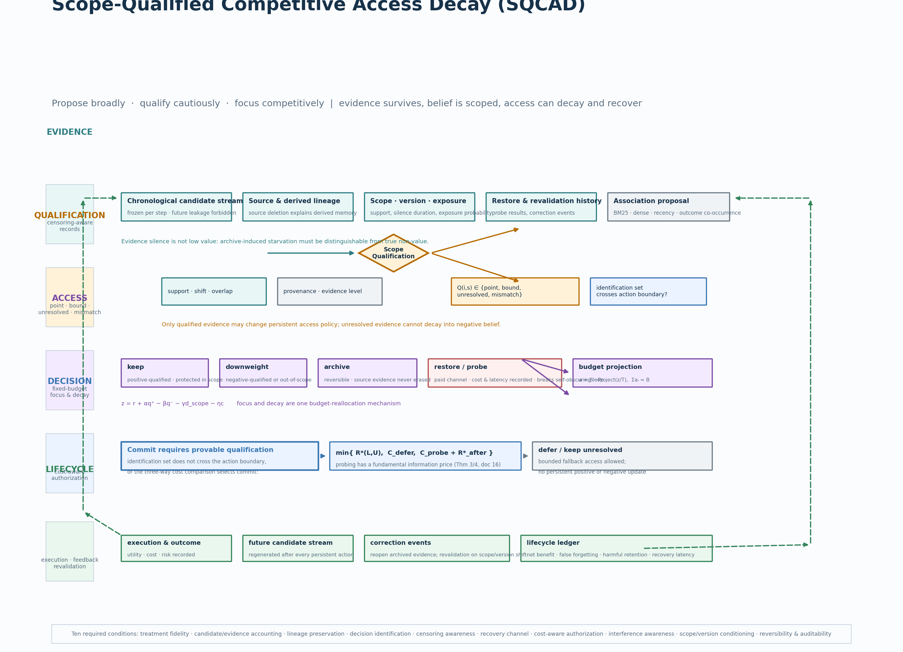

# SQCAD

**Scope-Qualified Competitive Access Decay** — evidence-governed Agent Memory under a fixed workspace budget.

[](pyproject.toml)
[](LICENSE)
[](tests/)

> **Propose broadly. Qualify cautiously. Focus competitively.**
> Access decays. Source evidence survives. Belief is scoped.



_Core design view: association proposes, scoped qualification grants persistent permission, and a fixed-budget projection turns qualification into competitive access._

## What problem this attacks

Agent Memory systems update future access from signals generated by their own trajectories — relevance, recency, frequency, co-exposure, task outcomes. Because candidate exposure, adoption and outcomes are *jointly shaped by the current policy*, a successful episode can reinforce both a useful memory and an irrelevant hitchhiker, and a low-frequency protective memory can be demoted even when its future value is high. Worse, a persistent action (archive/downweight) can *obscure the very evidence* that would later correct it — a self-reinforcing loop.

SQCAD asks the narrower, formalizable question:

> **What evidence is qualified to change a memory's persistent access policy, and how should a fixed workspace budget allocate access after that qualification?**

## Core design

Three states that are often conflated are kept separate:

1. **Evidence** — immutable source records and provenance. Silence is *not* low value: archive-induced starvation must be distinguishable from true non-value (censoring awareness).
2. **Qualification** — scoped, evidence-backed permission to change persistent access policy. The gate outputs an *identification state*, not a single score:
   $Q(i,s) \in \{\text{point},\ \text{bound},\ \text{unresolved},\ \text{mismatch}\}$.
   Associational signals (BM25, dense, recency, co-occurrence) may *propose* candidates; they never *authorize*.
3. **Access** — per-task allocation of a fixed budget. A pre-registered logit combines proposal score and qualification state:

   $$z(i,s,t) = r(i,t) + \alpha\,\mathrm{positive}(i,s) - \beta\,\mathrm{negative}(i,s) - \gamma\,\mathrm{scope\_mismatch}(i,s) - \eta\,\mathrm{cost}(i)$$

   then projects to the budget $a = B \cdot \operatorname{Project}(z/T)$, with $\sum_i a_i = B$. Focus and decay are **one** budget-reallocation mechanism — archive/downweight are reversible, and paid `restore`/`probe` channels keep the correction path open.
4. **Decision** — a persistent commit requires provable qualification: the identification set must not cross the action boundary, or the three-way comparison $\min\{R^*(L,U),\ C_{\text{defer}},\ C_{\text{probe}} + R^*_{\text{after}}\}$ selects commit.

## Evidence boundary (read this before citing)

This repository is a **research artifact with rigorous controlled evidence**, not a deployed system and not a SOTA claim:

- ✅ **Verified (strict proofs + controlled numerics):** memory-specific identification gaps — observational equivalence with opposite optimal actions, query-local causal effects insufficient for lifecycle decisions, source averages not automatically transportable (Theorems 1–2, Corollary 1); a self-obscuring lifecycle theorem: any committed policy without a recovery channel has regret $\Theta(T)$ while recovery gives $O(1/(q\rho))$ (T1, `docs/自用/01-research-gap/研究逻辑与理论证明/15-…`); reduction separation: no faithful feedback-preserving reduction to standard bandit/OPE without an evidence-availability state (T2, `16-…`); minimax probing lower bounds with matching order (P4); qualification-gated recovery of known lifecycle values under identification conditions C1–C8, with all five tested violations caught as `unresolved`/`mismatch`.
- ✅ **Verified (controlled unified-contract benchmarks):** 18-policy main table and cost contract (`results/`, gitignored, hash-frozen) — see `docs/docs_en/02_experiments.md`.
- ✅ **Verified (public data, unified contract, AutoDL GPU re-checked):** on LongMemEval-S / LoCoMo, the original SQCAD's shortcoming was evidence never entering the one-shot exposure pool; minimal fix **Guard-1** (≤1 BM25 candidate into the read pool; persistent-write authorization unchanged) raises LoCoMo official token-F1 0.0344 → 0.0455 — see `docs/docs_en/02_experiments.md`, report 19.
- ✅ **Verified (self-built benchmark + fairness audit):** SQCAD-LifecycleBench — 1,380 keep/archive counterfactual episodes, public/hidden truth separation, remote rebuild hash-identical; R1–R5/R7 defenses passed, all 13 preregistered verdicts hit; three framework changes quantified (lineage conflict → archive +8.62 significant) — see report 20.
- ⏳ **Not yet done:** official R3 reproductions of model-dependent baselines (per-baseline status in `docs/自用/03-实验证据链/15-基线开源状态与无GPU复现审计-20260813.md`); dense/RRF (official weights unavailable); R6 human anchoring; Phase B end-to-end.
- ❌ **Not claimed:** SOTA on any public benchmark; causal discovery from observational success; universal scope transport; physical deletion guarantees.

## Quick start

```bash
git clone git@github.com:Topps-2025/SQCAD.git
cd SQCAD
python -m venv .venv
# Windows: .\.venv\Scripts\Activate.ps1   |  POSIX: source .venv/bin/activate
pip install -e ".[dev]"
PYTHONPATH=src python -m pytest tests/ -q          # 360 tests, CPU-only, no API keys
```

Run a controlled smoke experiment (CPU-only, deterministic):

```bash
PYTHONPATH=src python -m sqcad.governance_baseline_simulator --seeds 5 --samples-per-environment 1000
PYTHONPATH=src python -m sqcad.unified_baseline_runner    # 18-policy unified-contract main table
PYTHONPATH=src python -m sqcad.freeze_four_piece          # regenerate the four-piece SHA-256 freeze manifest
PYTHONPATH=src python tools/render_framework_diagram.py   # re-render the architecture diagram
```

Every module is CPU-only; no GPU, model weights or API keys are required for the repository's own experiments. (Model-dependent *baseline* reproductions are a different story — see the baseline audit.)

## Repository layout

```text
SQCAD/
├── README.md
├── LICENSE
├── pyproject.toml
├── DATA_STORAGE.md                  # external D-drive database policy
├── src/sqcad/                       # core store, runners, theory and benchmarks
│   ├── causal_memory_store.py       # Evidence store: lineage, scope/version, archive/restore
│   ├── decision_identification_theory.py  # R*(L,U), commit/defer/probe comparison
│   ├── unified_baseline_runner.py   # 18-policy unified-contract main table
│   ├── unified_agent_memory_runner.py     # qualification-gated framework runner
│   ├── self_obscuring_ablation.py   # T1/T2 mechanism evidence (W0–W3)
│   ├── cost_contract_experiment.py  # lifecycle net-benefit contract
│   ├── freeze_four_piece.py         # code–config–results–reports SHA-256 freeze
│   └── ...
├── tests/                           # 360 deterministic unit/protocol checks
├── tools/                           # Gate A annotation, diagram rendering
├── docs/
│   ├── assets/                      # architecture diagram (SVG + PNG)
│   ├── docs_cn/                     # Chinese GitHub-facing docs (精炼)
│   ├── docs_en/                     # English GitHub-facing docs
│   └── 自用/                        # internal: 00-论文主体 / 01-research-gap /
│                                    #          02-历史草稿 / 03-实验证据链 (00–21)
└── results/                         # gitignored; hash-frozen and synced to external DB
```

## Baselines and comparison protocol

All main-table comparisons share one **unified contract**: the same chronological candidate stream (no future leakage), reader, prompt, context/token budget, evaluator, seeds and cost contract. Every policy is a black box that only sees the current-timepoint stream; the runner executes actions, advances time and scores future held-out QA.

Three tiers (`docs/自用/03-实验证据链/15-基线开源状态与无GPU复现审计-20260813.md` has the per-baseline detail):

| Tier | Contents | Status |
|---|---|---|
| **R1 reproducible controls** | no-memory, keep-all, FIFO/LRU, recency, fixed/frequency decay, BM25, dense, BM25+dense RRF | ✅ in-repo, CPU-only |
| **R2 structural controls** | association-only, query-local/CMI proxy, item-level causal, bundle-level, no-restore/probe, SQCAD ablations | ✅ in-repo, CPU-only |
| **R3 official systems** | SimpleMem, Oblivion, Memory Worth, FadeMem, DeMem, SAGE, MemAudit, GateMem | ⏳ official reproductions blocked without GPU/API keys; frozen commits and per-baseline paths in `docs/自用/03-实验证据链/15-基线开源状态与无GPU复现审计-20260813.md` |

Benchmarks: LongMemEval-S · LoCoMo (unified contract executed, AutoDL GPU re-checked, Guard-1 fix verified) · SQCAD-LifecycleBench (self-built, 1,380 episodes, fairness-audited) · GoodAI-LTM / MemoryAgentBench (accessibility audited).

## Documentation

- [Overview](docs/docs_en/00_overview.md) · [Method](docs/docs_en/01_method.md) · [Experiments](docs/docs_en/02_experiments.md) · [Data & baselines](docs/docs_en/03_data_and_baselines.md) · [Reproducibility & status](docs/docs_en/04_reproducibility_and_status.md)
- [Baseline audit](docs/自用/03-实验证据链/15-基线开源状态与无GPU复现审计-20260813.md) — per-baseline open-source status, CPU/no-GPU reproduction analysis
- Chinese lab record: [研究总图](docs/docs_cn/00-研究总图.md) · [实验证据链](docs/自用/03-实验证据链/00-实验报告与当前结论.md) · [研究逻辑与理论证明](docs/自用/01-research-gap/研究逻辑与理论证明/README.md)

## Citation

A manuscript is in preparation. For now, cite this repository:

```bibtex
@misc{sqcad2026,
  title  = {{SQCAD}: Scope-Qualified Competitive Access Decay for evidence-governed Agent Memory},
  author = {},
  year   = {2026},
  url    = {https://github.com/Topps-2025/SQCAD},
  note   = {Research prototype; see repository for the precise evidence boundary.}
}
```

## License

MIT — see [LICENSE](LICENSE). Large corpora, models and generated results are kept in an external database (see [DATA_STORAGE.md](DATA_STORAGE.md)) and are not redistributed here.
