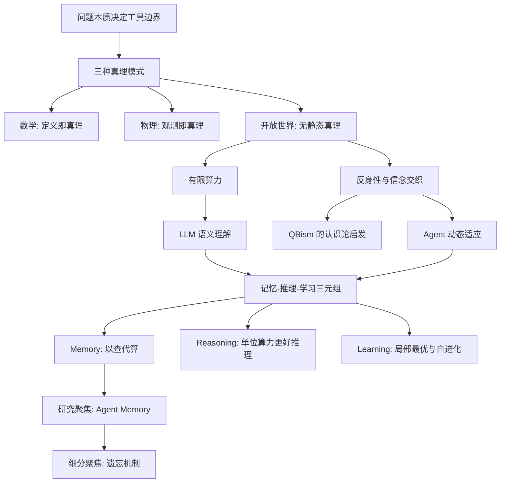

---
type: index
topic: 有限算力下，面向开放世界的智能求解范式
status: draft
---

# 研究理念图谱入口

这组笔记用于整理给老师阅读的研究理念。当前完成的是第一部分：[[01-研究背景与动机|研究背景与动机]]。

## 核心命题

> 在有限算力约束下，开放世界问题无法依靠封闭搜索和静态语料蒸馏被彻底解决。更可行的智能求解范式，是让 Agent 通过[[概念节点/Agent Memory|记忆]]、[[概念节点/推理|推理]]与[[概念节点/持续学习|学习]]形成可更新的信念结构，并在动态环境中持续适应。

## 阅读顺序

1. [[01-研究背景与动机|研究背景与动机]]
2. [[公众号论文资料/公众号论文总结|公众号论文总结]]
3. [[概念节点/三种真理模式|三种真理模式]]
4. [[概念节点/开放世界问题|开放世界问题]]
5. [[概念节点/有限算力|有限算力]]
6. [[概念节点/QBism|QBism]]
7. [[概念节点/Agent Memory|Agent Memory]]
8. [[概念节点/遗忘机制|遗忘机制]]
9. [[参考文献/第一部分参考文献|第一部分参考文献]]

## 图谱关系草图

## 后续扩展位置

- 第二部分：相关工作与现存痛点
- 第三部分：拟解决的核心研究问题
- 第四部分：可能的技术路线与实验设计
