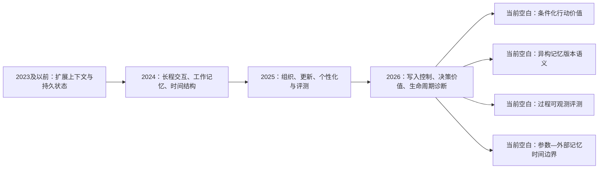

# 第二部分图谱入口：从 LLM 到 Agent，再到 Agent Memory

本部分先解释 LLM、Agent 与 Agent Memory 的系统演进，再依次梳理整体研究方向、已存记忆的生命周期治理与选择性遗忘、该治理方向的未覆盖问题及其原文证据。重点覆盖 2024—2026 年；早期 LLM Agent 和持久状态工作作为问题起点保留。

## 核心命题

> 当任务从单次语言生成变为长期环境中的感知—推理—行动闭环时，Agent 需要显式状态将历史经验、外部证据和当前决策连接起来；Agent Memory 的演进不是简单地从“记得更多”转向“忘得更多”，而是从扩展上下文，经过组织、更新和个性化，进一步走向可维护、可治理的长期状态。

## 核心阅读主线（六步）

1. [[01-从 LLM 到 Agent 再到 Agent Memory|从 LLM 到 Agent 再到 Agent Memory]]：解释为什么单独 LLM 不足以承担长期行动系统，以及 Memory 在 Agent 中承担的状态功能。
2. [[02-Agent Memory 整体工作方向与核心痛点|Agent Memory 整体工作方向与核心痛点]]：梳理写入、组织、更新、检索、利用、治理和评测分别解决什么问题。
3. [[03-Agent Memory 选择性记忆管理：存量管理与读写过滤|Agent Memory 选择性遗忘机制：四类工作方向、核心机制与能力边界]]：按自适应保留、压缩巩固、读时控制和生命周期评测四个方向，逐一梳理背景、论文机制与共同能力边界。
4. [[04-Agent Memory 选择性记忆管理的未覆盖问题与研究路径|Agent Memory 选择性遗忘机制的未覆盖问题与研究路径]]：仅从核心遗忘机制语料出发，界定条件化行动价值、管理—读取闭环、非平稳低频关键记忆与操作级评测等未覆盖问题。
5. [[05-原文证据索引|原文证据索引]]：回到论文摘要、引言、结论与作者明确边界，核对前述判断的直接依据。
6. [[06-论文速览与研究地图|论文速览与研究地图]]：将 R1–R45 统一整理为来源等级、方向、动机、机制、结论、边界和原文位置，并把文献事实收束为可证伪的四项研究缺口。

## 概念与书目补充

1. [[概念节点/Agent Memory 的存储-检索范式|Agent Memory 的存储-检索范式]]
2. [[概念节点/遗忘决策困境|遗忘决策困境]]
3. [[概念节点/适度遗忘|适度遗忘]]
4. [[概念节点/记忆效用治理|记忆效用治理]]
5. [[参考文献/第二部分参考文献|近年 Agent Memory 扩展书目]]

## Agent Memory 的阶段推进图

## 各阶段：问题、回应与遗留边界

| 阶段 | 重点工作 | 对上一阶段的回应 | 留给下一阶段的问题 |
| --- | --- | --- | --- |
| 2024 | HiAgent、MemoryBank、HippoRAG、LoCoMo | 从外置存储推进到子目标工作记忆、图访问和长程验证。 | 记忆如何组织、更新并表示时间/主体/例外。 |
| 2025 | Mem0、A-MEM、RMM、MemoryOS、Zep、LongMemEval、MemBench | 用事实 CRUD、关联笔记、多粒度反思、层级更新和时间图谱回应组织问题。 | 异构记忆冲突、版本与作用域如何统一治理。 |
| 2026 | SimpleMem、SAGE、Oblivion、Yuan et al.、FadeMem、Memory Worth、DeMem、ReMe | 将记忆推进到写入门控、读写控制、检索诊断、结果/决策导向价值和程序经验精炼。 | 非平稳下的行动边际价值、跨类型版本语义、完整生命周期评测，以及参数—外部记忆的时间边界。 |
| 工程系统案例 | EverOS / EverMemOS [R43] | 将可编辑源数据、类型化轨道、作用域隔离、异步巩固、检索索引与审计状态整合为可运行系统。 | 需要将工程功能与统一语义、行动因果贡献及受控评测严格区分。 |

## 选择性遗忘与生命周期管理的当前前沿

遗忘是生命周期管理中的选择性保留与状态退出操作，而非整个研究对象。当前前沿集中于：

1. 在时间、主体、任务和检索策略变化时，如何估计记忆对行动的边际贡献，而非只记录结果共现。
2. 如何让事实、偏好、情景、关系和技能具有不同但可追溯的更新、冲突和跨层迁移语义。
3. 如何用同一条可控长期轨迹观察写入、更新、检索、采用、行动、遗忘及其结果。
4. 如何区分参数化知识与外部记忆的增量价值，并在历史任务中防止参数化未来知识造成前视偏差。

## 与第三部分的衔接

第三部分聚焦的是已存外部记忆的“选择性保留—读时过滤—行动归因”问题，而非 Agent Memory 的全部研究方向。它若使用“认知自由能/因果叙事图”，应服务于第四节所界定的“条件化保留价值”与“管理—读取闭环”问题，并通过过程级评测接受检验。详见 [[04-Agent Memory 选择性记忆管理的未覆盖问题与研究路径|Agent Memory 选择性遗忘机制的未覆盖问题与研究路径]] 与 [[../03-核心问题与框架设计/01-核心研究问题与具体设想|核心研究问题与具体设想]]。
