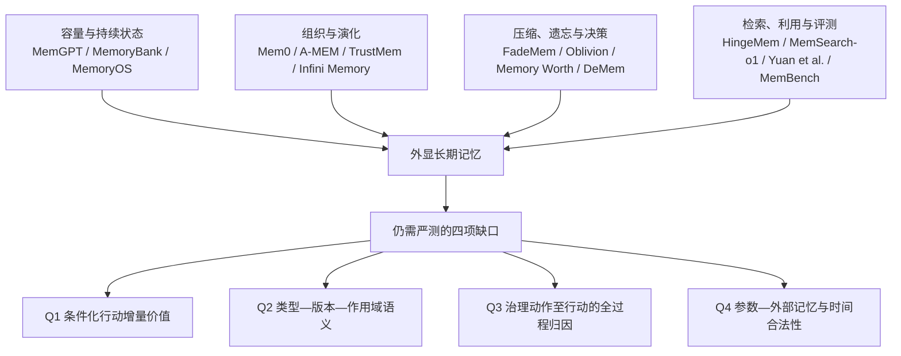

# Agent Memory 论文速览与研究地图：从文献事实到可检验痛点

> 阅读范围：本页覆盖 [[05-原文证据索引]] 中的 R1–R45。它不是第二次“泛综述”，而是将每篇文献统一压缩为“证据等级—方向—动机—机制—结论—边界—原文定位”的文献卡，并将卡片收束为可比较的研究缺口。
>
> 证据等级：**A**＝已核验的同行评议正式论文/综述；**B**＝arXiv 预印本或本轮未进一步核验正式出版状态的论文；**C**＝技术项目、工程文档或相邻领域证据。等级只限定可主张范围，不等于论文质量排序。除非在官方来源明确核实，本页不声称任何论文“获奖”或“最佳论文”。

## 0. 先读这张图：相关工作究竟已经解决了什么

### 0.1 四个痛点的“已解决部分—剩余问题—可证伪设计”

| 痛点 | 现有工作已解决的部分 | 不能再使用的过强表述 | 仍可成立的精确问题 | 最小可证伪实验 |
| --- | --- | --- | --- | --- |
| Q1：保留/退出价值 | FadeMem 已用相关性、频率、时间做差异衰减；Oblivion 已做不确定性门控和响应贡献强化；Memory Worth 已将结果反馈写入每条记忆；DeMem 已以决策充分性定义压缩边界。 | “现有遗忘只看时间/频率”“还没有决策导向记忆”。 | 在任务、主体、时间、候选集和预算改变时，单条外部记忆被保留/降权/归档的**干预式行动增量**能否稳定估计？ | 同一 episode 中对候选记忆做受控 keep / suppress / archive 干预；比较任务效用、关键路径保留和成本，而非只比较共现成功率。 |
| Q2：异构更新与撤回 | Mem0、A-MEM、PREMem、TrustMem、Infini Memory 与 MIRIX 已分别覆盖 CRUD、动态链接、写前关系、转移核验、主题修订和多类型记忆。 | “异构记忆不存在”“没有更新/删除机制”。 | 事实替代、偏好分段、情景证据保留、技能分叉在**版本、主体、时间、权限与作用域**上是否可用统一且可审计的状态语义表达？ | 构造冲突/撤回轨迹；检查源记录、摘要、向量索引、缓存和导出副本的状态传播，并测试错误删除、恢复和跨作用域泄漏。 |
| Q3：评测与归因 | LoCoMo、LongMemEval、MemBench、MemoryAgentBench 已提供长期评测；Yuan 等已分开诊断检索和利用。 | “没有长期记忆基准”“不能区分检索与利用”。 | 能否把写入、版本更新、检索暴露、模型采纳、计划/工具调用、状态退出与最终行动连成同一可审计日志？ | 记录每一步 id、候选集、动作理由与结果；将失败分类为未写入、未检索、未采用、过度治理、索引残留或执行失败。 |
| Q4：参数—外部边界与时间 | 参数/非参数记忆、Adaptive-RAG 与 FLARE 已讨论何时检索；数据污染研究揭示评测风险；时间截断模型提供控制思路。 | “何时检索未被研究”“外部记忆一定优于模型参数”。 | 在给定认知截止点下，外部证据对已参数化知识的**可审计增量价值**是什么，如何排除显式未来材料和参数化前视的混淆？ | 所有证据带 `available_at`；在时间隔离数据上同时报告无记忆、允许检索、禁止未来证据及不同模型版本；将结果表述为历史决策支持而非无偏预测。 |

### 0.2 对本研究的收束性定位

最稳妥的主张不是另造一个泛化的“遗忘公式”，而是：**以可追溯的条件变量和过程日志，把外部记忆的状态动作与行动后果联系起来；在同一预算下检验它是否优于关联式治理、决策压缩、衰减控制与自适应检索基线。**

对应的直接比较对象是 Memory Worth（关联式结果反馈）、DeMem（决策充分性压缩）、FadeMem/Oblivion（衰减与访问控制）、TrustMem/Infini Memory（维护可信性）、Yuan 等（检索—利用诊断）和 HingeMem/MemSearch-o1（自适应检索）。这一定义将“自由能/叙事图”限制为可消融的工程正则，而非脑科学因果理论。

## 1. 核心阅读优先级

| 优先级 | 论文 | 为什么先读 | 对论文主线的作用 |
| --- | --- | --- | --- |
| P0 | R17 Memory Worth、R18 DeMem、R16 FadeMem、R13 Oblivion | 分别代表关联反馈、决策压缩、差异衰减和访问控制。 | 约束 Q1 的新颖性与基线。 |
| P0 | R15 Yuan et al.、R19 LoCoMo、R20 LongMemEval、R21 MemBench | 给出诊断与长期评测设计。 | 约束 Q3 的指标和失败归因。 |
| P0 | R33 TrustMem、R34 Infini Memory、R6 Mem0、R7 A-MEM | 代表更新、证据与持续维护。 | 约束 Q2 的状态/谱系设计。 |
| P1 | R31 HingeMem、R32 MemSearch-o1、R35–R37 | 自适应检索和参数/外部记忆的强相邻基线。 | 避免将 Q3/Q4 错写为“从未研究”。 |
| P2 | R1、R2、R4、R5、R14、R23、R24 | 建立系统演进与术语边界。 | 支撑相关工作叙事，不承担核心创新证据。 |

## 2. 论文卡：系统演进、容量与组织

### R1. MemGPT（2023）

- **来源与权威性：B。** arXiv:2310.08560；本轮使用本地 PDF。未核实获奖信息。
- **方向：** `虚拟上下文管理；层级存储；分页；多会话记忆`。用 OS 式层级与函数调用，让有限上下文模型按需在上下文与外部存储间搬运信息。
- **摘要核心、动机与机制：** 固定窗口限制长文档与长对话；方法将 prompt 作为主存、外部存储作为磁盘，由 Agent 读写和替换上下文。
- **解决痛点与结论：** 直接解决“窗口容量/上下文搬运”，在文档分析与多会话聊天中报告改善；不以单条记忆的行动价值、跨作用域版本或删除传播为目标。
- **原文定位：** PDF p.1，Abstract 与 §1 Introduction；PDF p.2，§2 MemGPT。

### R2. Generative Agents（2023）

- **来源与权威性：A。** UIST 2023，ACM DOI:10.1145/3586183.3606763；未核实获奖信息。
- **方向：** `memory stream；反思；规划；社会模拟`。将自然语言经验流、反思和动态检索接入行为规划。
- **摘要核心、动机与机制：** 长期一致的社会行为需要从不断增长的经历中检索相关事件、形成高层反思并据此规划；记忆排序综合相关性、近因性和重要性。
- **解决痛点与结论：** 证明记忆流能支持沙盒中个体与群体行为；但排序信号不等于干预式行动归因，也未评测长期撤回/跨作用域冲突。
- **原文定位：** PDF p.1，Abstract；PDF p.2，§1 Introduction 与架构概述。

### R3. HiAgent（2024）

- **来源与权威性：B。** arXiv:2408.09559；本轮书目未核验正式出版状态。
- **方向：** `分层工作记忆；子目标；长程任务`。以子目标为单位组织、压缩和替换工作记忆。
- **摘要核心、动机与机制：** 长程任务中的完整轨迹会超过上下文；系统为子任务维护层级工作记忆并以摘要传递已完成观察。
- **解决痛点与结论：** 解决在线任务上下文膨胀与子目标切换；它主要处理工作记忆，不是外部库中已存记忆的可撤回生命周期治理。
- **原文定位：** 本地 PDF p.1，Abstract；p.1–2，§1 Introduction（具体实验页码应在精读时补卡）。

### R4. MemoryBank（2024）

- **来源与权威性：A。** AAAI 2024，DOI:10.1609/aaai.v38i17.29946；未核实获奖信息。
- **方向：** `长期陪伴；人格建模；遗忘曲线；时间—重要性`。
- **摘要核心、动机与机制：** 长期对话需要持续召回、更新并从历史交互中理解用户人格；引入记忆更新和遗忘机制调节保留。
- **解决痛点与结论：** 是时间/重要性治理的早期基线，支持长期陪伴；未把条件化行动价值、版本作用域或参数—外部重叠设为优化目标。
- **原文定位：** 官方论文 Abstract 与 §1 Introduction；详见 [[05-原文证据索引#R4. MemoryBank (2024)|R4 原文摘录]]。

### R5. MemoryOS（2025）

- **来源与权威性：A。** EMNLP 2025，ACL Anthology；未核实获奖信息。
- **方向：** `层级个人记忆；存储—更新—检索—生成`。
- **摘要核心、动机与机制：** 固定窗口与不足的记忆管理影响长期个性化；用短期、中期、长期个人记忆及四模块协同维护。
- **解决痛点与结论：** 解决分层整合与动态更新；但不同层、不同类型条目的统一来源/版本/权限语义仍需额外定义与验证。
- **原文定位：** ACL 论文页 Abstract 与 §1；本地书目 [[05-原文证据索引#R5. MemoryOS (2025)|R5]]。

### R6. Mem0（2025）

- **来源与权威性：B。** arXiv:2504.19413；本轮读取到的本地副本损坏，核心表述以 arXiv 摘要和证据索引为准；未核实获奖信息。
- **方向：** `事实抽取；CRUD；巩固；生产级长期记忆`。
- **摘要核心、动机与机制：** 多会话中固定窗口难维持一致性；从对话提取显著事实，执行 ADD/UPDATE/DELETE/NOOP 等巩固与检索操作。
- **解决痛点与结论：** 是高效率事实记忆和 CRUD 的强工程基线；不能据此推断已完整处理派生索引删除、条件冲突或外部证据的增量价值。
- **原文定位：** arXiv Abstract、§1（PDF 页码待用完整副本复核）；[[05-原文证据索引#R6. Mem0 (2025)|R6]]。

### R7. A-MEM（2025）

- **来源与权威性：B。** arXiv:2502.12110；本轮使用本地 PDF；未核实获奖信息。
- **方向：** `Zettelkasten；动态索引；链接；记忆演化`。
- **摘要核心、动机与机制：** 预定义结构和固定访问流程不适应开放任务；为新记忆生成含上下文、关键词和标签的笔记，与历史项动态连边，并允许新经验更新旧项表示。
- **解决痛点与结论：** 解决记忆组织与演化，报告六个底座模型上的改进；作者同时指出组织质量受底座模型影响，且当前只处理文本。
- **原文定位：** PDF p.1，Abstract；p.1–2，§1；p.9，§5 Conclusions 与 §6 Limitations。

### R8. SimpleMem（2026）

- **来源与权威性：B。** arXiv:2601.02553；本轮使用本地 PDF；未核实获奖信息。
- **方向：** `语义压缩；在线合成；意图感知检索；token 效率`。
- **摘要核心、动机与机制：** 全历史保留冗余高、迭代推理过滤成本高；三阶段为结构化压缩、会话内语义合成、按意图动态决定检索范围。
- **解决痛点与结论：** 报告 LoCoMo 平均 F1 提升 26.4%、推理 token 最多降至 1/30；其“高下游效用”是压缩/检索准则，不能直接当作单条状态动作的因果证据。
- **原文定位：** PDF p.1，Abstract 与 §1；p.2，§2 Architecture。

### R9. Reflective Memory Management（2025）

- **来源与权威性：A。** ACL 2025，ACL Anthology；未核实获奖信息。
- **方向：** `个性化对话；前瞻—回溯反思；多粒度记忆`。
- **摘要核心、动机与机制：** 长期个性化需要在构建和检索两个阶段反思；以多粒度记忆和引用证据优化检索。
- **解决痛点与结论：** 直接针对长期个性化下的记忆管理；与本研究的差异应落在状态退出价值或可审计谱系，而不能声称“没有反思式治理”。
- **原文定位：** ACL 论文页 Abstract、§1；[[05-原文证据索引#R9. Reflective Memory Management (2025)|R9]]。

### R10. Zep / Graphiti（2025）

- **来源与权威性：B。** arXiv:2501.13956；未核实正式出版状态。
- **方向：** `时间知识图谱；事实演化；Agent Memory`。
- **摘要核心、动机与机制：** 用时间图谱组织动态事实和关系，以便跨时间查询与更新。
- **解决痛点与结论：** 是时间结构化记忆的直接比较路线；时间图存在不代表自动完成来源、作用域、撤回副本与行动价值治理。
- **原文定位：** arXiv Abstract、§1；[[05-原文证据索引#R10. Zep / Graphiti (2025)|R10]]。

### R38–R42. Agent 演进背景组

| 文献 | 来源与方向 | 摘要核心、痛点与结论 | 原文定位 |
| --- | --- | --- | --- |
| R38 LLM Agent Survey（2024） | **A**，Frontiers of Computer Science；`Agent profile/memory/planning/action`。 | 给出 LLM Agent 统一框架，说明单一 LLM 需和规划、记忆、工具和行动接口组合；仅为领域框架，不是特定记忆机制证据。 | Springer Abstract 与 framework sections；[[05-原文证据索引#R38. LLM Agent Survey (2024)|R38]]。 |
| R39 Rise and Potential（2025） | **A**，Science China Information Sciences；`Agent 系统综述`。 | 综述语言模型如何借助规划、记忆、工具和环境交互成为可执行系统；用于 LLM→Agent 背景。 | 期刊 Abstract；[[05-原文证据索引#R39. LLM Agent Survey: Rise and Potential (2025)|R39]]。 |
| R40 ReAct（2023） | **A**，ICLR；`reasoning–acting loop`。 | 交替生成推理和动作、利用环境反馈更新计划；解释行动闭环，而不解决持久外部记忆治理。 | OpenReview/arXiv Abstract、§1；[[05-原文证据索引#R40. ReAct (2023)|R40]]。 |
| R41 Reflexion（2023） | **A**，NeurIPS；`verbal reinforcement；episodic memory`。 | 将失败反馈语言化并存入情景缓冲以改善后续尝试；仍不是可撤回外部知识库的版本治理。 | 论文 Abstract、§1；[[05-原文证据索引#R41. Reflexion (2023)|R41]]。 |
| R42 Voyager（2023） | **B**，本轮书目以 arXiv:2305.16291 为准；`程序技能库；具身终身学习`。 | 自动课程、可执行代码技能库和执行反馈支持 Minecraft 探索与技能复用；说明程序性记忆的价值。 | 本地 PDF p.1，Abstract；p.2，§1。 |

## 3. 论文卡：写入、维护、遗忘与决策

### R11. SAGE（2026）

- **来源与权威性：B。** arXiv:2605.30711；未核实获奖/正式出版状态。
- **方向：** `新颖性门控；ADD/NOOP/merge；写入控制`。
- **摘要核心、动机与机制：** 新事实进入库时应添加、合并还是忽略；将其设为随记忆几何变化的自适应新颖性检测。
- **解决痛点与结论：** 直接缓解无差别写入成本与冗余；按原文限制，评测集中于英文 LoCoMo，且框架不输出 DELETE 或压缩，因此不能用它覆盖退出闭环。
- **原文定位：** arXiv Abstract、§1、§6 Limitations；[[05-原文证据索引#R11. SAGE (2026)|R11]]。

### R12. ReMe（2026）

- **来源与权威性：A。** Findings of ACL 2026；未核实获奖信息。
- **方向：** `程序经验；失败触发；对比洞见；效用精炼`。
- **摘要核心、动机与机制：** 反对静态追加式经验库；从成功模式、失败触发和对比洞见蒸馏可复用程序经验，并按上下文和效用精炼。
- **解决痛点与结论：** 缓解“记住但不会用”与经验池膨胀；效用在任务/用户/工具漂移下是否仍有效，仍需条件化评测。
- **原文定位：** ACL Anthology Abstract、§1；[[05-原文证据索引#R12. ReMe (2026)|R12]]。

### R27. MEM1（2025）

- **来源与权威性：B。** arXiv:2506.15841；未核实正式出版状态。
- **方向：** `端到端强化学习；固定内部状态；巩固与推理协同`。
- **摘要核心、动机与机制：** 全历史拼接不随相关性变化；每轮以 RL 更新固定大小的共享内部状态，兼顾推理和巩固。
- **解决痛点与结论：** 说明记忆巩固可由推理驱动；但内部状态不可逐条寻址、溯源和撤回，故不是外部版本化治理的替代。
- **原文定位：** arXiv Abstract、§1；[[05-原文证据索引#R27. MEM1 (2025)|R27]]。

### R29. PREMem（2025）

- **来源与权威性：A。** Findings of EMNLP 2025；未核实获奖信息。
- **方向：** `写前推理；事实/经验/主观记忆；跨会话关系`。
- **摘要核心、动机与机制：** 将推理负担从回答期前移到存储期；抽取细粒度记忆并显式建立延伸、转变、蕴含等跨会话关系。
- **解决痛点与结论：** 降低响应时的推理依赖；未以来源、撤回和时间作用域来治理这些推断关系。
- **原文定位：** ACL Anthology Abstract、§1；[[05-原文证据索引#R29. PREMem (2025)|R29]]。

### R33. TrustMem（2026）

- **来源与权威性：B。** arXiv:2606.25161；未核实正式出版状态。
- **方向：** `可信巩固；转移验证；coverage/preservation/faithfulness`。
- **摘要核心、动机与机制：** 写、改、删会遗漏信息、腐化旧记忆或写入无依据内容；以 Memory Transition Verifier 评估转移，再以偏好学习优化巩固。
- **解决痛点与结论：** 直接覆盖局部更新可信性，是 Q2/Q3 的近邻强基线；其验证并不自动给出所有类型、主体和时间作用域的统一语义。
- **原文定位：** arXiv Abstract、§1；[[05-原文证据索引#R33. TrustMem (2026)|R33]]。

### R34. Infini Memory（2026）

- **来源与权威性：B。** arXiv:2606.10677；未核实正式出版状态。
- **方向：** `主题文档；证据聚合；事实修订；迭代工具读取`。
- **摘要核心、动机与机制：** 孤立片段/摘要难以聚合证据和修订事实；把记忆维护为主题化文档，并迭代检查证据。
- **解决痛点与结论：** 强化持续事实维护和跨会话证据；但冲突为何共存、如何撤回、修订是否改变行动，仍是独立可测问题。
- **原文定位：** arXiv Abstract、§1；[[05-原文证据索引#R34. Infini Memory (2026)|R34]]。

### R13. Oblivion（2026）

- **来源与权威性：B。** arXiv:2604.00131；本轮使用本地 PDF；未核实获奖信息。
- **方向：** `可访问性衰减；不确定性门控；读写解耦；分层记忆`。
- **摘要核心、动机与机制：** “始终检索”和扁平存储会导致干扰与时延；读路径依据不确定性和缓冲充分度决定是否检索，写路径只强化形成回答所贡献的记忆，未用硬删除而是降低可访问性。
- **解决痛点与结论：** 报告在静态与动态长程基准上改善，明确说明遗忘不只是时间/频率；“响应贡献”仍不同于受控干预下的行动因果贡献。
- **原文定位：** PDF p.1，Abstract 与 §1；p.2，§1 Contributions、§2 Overview。

### R14. HippoRAG（2024）

- **来源与权威性：A。** NeurIPS 2024；未核实获奖信息。
- **方向：** `图结构长期记忆；多跳检索；神经启发`。
- **摘要核心、动机与机制：** 用知识图/关联式检索提升多跳信息访问，作为 RAG 与长程记忆的结构化路线。
- **解决痛点与结论：** 是图检索和多跳访问基线；图本身不提供记忆状态退出的价值准则、来源传播或时间合法性。
- **原文定位：** 会议论文 Abstract、方法章节；[[05-原文证据索引#R14. HippoRAG (2024)|R14]]。

### R16. FadeMem（2026）

- **来源与权威性：B。** arXiv:2601.18642；本轮使用本地 PDF `2601.18642v2.pdf`；未核实获奖信息。
- **方向：** `双层记忆；自适应指数衰减；相关性/频率/时间；冲突融合`。
- **摘要核心、动机与机制：** 全保留或全丢弃过于刚性；采用由语义相关性、访问频率和时间模式调制的差异衰减，辅以冲突消解和融合。
- **解决痛点与结论：** 报告多跳推理与检索改善并减少 45% 存储；其信号是条件访问的代理，不是对非平稳任务下单条行动效用的反事实估计。
- **原文定位：** 本地 PDF p.1，Abstract 与 §1（详见 [[05-原文证据索引#R16. FadeMem (2026)|R16]]；后续精读应补方法/结果实页）。

### R17. When to Forget / Memory Worth（2026）

- **来源与权威性：B。** arXiv:2604.12007；本轮使用本地 PDF；未核实获奖信息。
- **方向：** `结果反馈；两计数器；条件成功概率；弃用`。
- **摘要核心、动机与机制：** 记忆系统缺少轻量、持续的质量治理指标；为每条被检索记忆累计成功/失败计数，估计其被取回时的条件成功概率，并用于信任、抑制和弃用。
- **解决痛点与结论：** 在平稳检索与最低探索条件下给出收敛论证，并报告合成环境与文本微实验结果；作者明确说该量是**关联而非因果**，这正是 Q1 的最直接起点。
- **原文定位：** PDF p.2，Abstract 与 §1 Introduction；需精读理论节和实验节时补 PDF 实页。

### R18. DeMem（2026）

- **来源与权威性：B。** arXiv:2605.10870；本轮使用本地 PDF；未核实获奖信息。
- **方向：** `决策中心率失真；安全遗忘边界；K 槽在线记忆；认证分裂`。
- **摘要核心、动机与机制：** 记忆价值取决于能否在固定预算下保留会改变决策的历史区分，而非描述保真；将历史映射到 K 个运行时记忆状态，仅在共享状态被认证为会产生决策冲突时再分裂。
- **解决痛点与结论：** 给出安全合并边界与近极小极大遗憾保证，并在合成和长程对话上报告同预算增益；它是决策充分性强基线，但其理论隔离的是答案时 K 槽瓶颈，且需配合来源、时间与作用域治理。
- **原文定位：** PDF p.1，Abstract；p.2，§1 Contributions；p.50–51，§F Scope and Limitations。

### R43. EverOS / EverMemOS（2026）

- **来源与权威性：C。** 开源软件与技术文档，非正式论文证据；官方 `CITATION.md`（本轮记录）称技术论文在准备中。
- **方向：** `local-first；Markdown 源记录；SQLite/LanceDB 派生索引；作用域；弃用`。
- **摘要核心、动机与机制：** 以用户/Agent/共享知识等类型和作用域组织持久记忆，源文件可编辑、索引派生，并提供异步巩固、检索与审计功能。
- **解决痛点与结论：** 可作为实现 Q2/Q3 的工程参照，尤其是“源记录—派生索引—逻辑弃用”；不得将其当作同行评议性能或普适因果结论。
- **原文定位：** 项目文档与 release 说明，非分页；[[05-原文证据索引#R43. EverOS / EverMemOS (2026; open-source software and technical documentation)|R43]]。

## 4. 论文卡：检索、利用、基准与理论边界

### R15. Retrieval vs. Utilization Diagnosis（2026）

- **来源与权威性：A。** ICLR 2026；本轮使用本地 PDF；未核实获奖信息。
- **方向：** `检索—利用诊断；3×3 因子设计；失败分类`。
- **摘要核心、动机与机制：** 端到端准确率难区分写入、检索和模型使用的贡献；交叉 raw chunks/Mem0-style facts/MemGPT-style summaries 与 cosine/BM25/hybrid rerank，并检查检索相关性、利用与失败位置。
- **解决痛点与结论：** LoCoMo 上检索方法带来约 20 个点的平均准确率跨度，而写入策略为 3–8 点；但实验仅一个模型、一个基准、固定 k=5，且没有跟踪遗忘/行动后果。
- **原文定位：** PDF p.1，Abstract 与 §1；p.2，§2 Method；p.3，§3 Results；p.4，§4 Discussion and Limitations。

### R19–R24. 基准与综述组

| 文献 | 来源与方向 | 摘要核心、痛点与结论 | 原文定位 |
| --- | --- | --- | --- |
| R19 LoCoMo（2024） | **A**，ACL 2024；`超长多会话对话；时间/因果动态`。 | 600 轮、平均约 16K token、最长 32 会话，评测问答、事件总结和多模态生成；能施加长程压力，却不能单独归因写入、检索、采用、治理或行动。 | ACL Abstract、§1；[[05-原文证据索引#R19. LoCoMo (2024)|R19]]。 |
| R20 LongMemEval（2024） | **B**，arXiv:2410.10813；`抽取；跨会话推理；时间；更新；拒答`。 | 建立长期聊天五能力评测；覆盖时间和知识更新，但不标注单次状态动作的因果贡献。 | arXiv Abstract、§1；[[05-原文证据索引#R20. LongMemEval (2024)|R20]]。 |
| R21 MemBench（2025） | **B**，arXiv:2506.21605；`事实/反思；参与/观察；效能效率容量`。 | 以多场景、多层次和多指标补足评测覆盖；仍需过程日志来判断退出、删除或恢复到底在哪里失败。 | 本地 PDF p.1，Abstract 与 §1；p.2，任务和指标；p.8，§5 Conclusion。 |
| R22 MemoryAgentBench（2025） | **B**，arXiv:2507.05257；`检索；测试时学习；长程理解；选择性遗忘`。 | 已将选择性遗忘列为核心能力，故不能写“没有遗忘基准”；可扩展的是操作级审计与参数—外部控制。 | arXiv Abstract、§1；[[05-原文证据索引#R22. MemoryAgentBench (2025)|R22]]。 |
| R23 Agent Memory Survey（2025） | **A**，ACM TOIS；`记忆机制系统综述`。 | 汇总“是什么、为何需要、如何设计和评测”记忆模块；只能支撑术语与版图，不能作为任一算法有效性的实证。 | ACM Abstract/taxonomy；[[05-原文证据索引#R23. Agent Memory Survey (2025)|R23]]。 |
| R24 Rethinking Memory（2025） | **B**，arXiv:2505.00675；`参数/上下文记忆；六类操作`。 | 将记忆分为参数化与上下文形式，并把操作划为巩固、更新、索引、遗忘、检索、压缩；支持 Q4 的概念边界，不测时间泄漏或外部记忆增量。 | 本地 PDF p.1，Abstract 与 §1；p.2，操作与功能类型。 |

### R28、R30–R32：组合、异构记忆与自适应检索

| 文献 | 来源与方向 | 摘要核心、痛点与结论 | 原文定位 |
| --- | --- | --- | --- |
| R28 FraCom（2025） | **A**，EMNLP 2025；`fragment-then-compose；命题—论元图`。 | 历史摘要可能混入冗余；先切分为谓词和论元，再在检索时按需组合跨会话信息。它是灵活组合的强基线，不规定可撤回版本/来源。 | ACL Abstract、§1；[[05-原文证据索引#R28. FraCom (2025)|R28]]。 |
| R30 MIRIX（2025） | **B**，arXiv:2507.07957；`六类记忆；多 Agent 协同`。 | Core、Episodic、Semantic、Procedural、Resource 与 Knowledge Vault 类型化管理；否定“异构类型不存在”，但未证明其共享版本/冲突语义。 | arXiv Abstract、§1；[[05-原文证据索引#R30. MIRIX (2025)|R30]]。 |
| R31 HingeMem（2026） | **A**，ACM Multimedia 2026；`边界超边；查询自适应深度`。 | 用人物、时间、地点、主题边界形成超边，按查询决定检索内容和深度；因此 Q3 不应被简化为“固定 top-k 检索问题”。 | arXiv Abstract、§1；[[05-原文证据索引#R31. HingeMem (2026)|R31]]。 |
| R32 MemSearch-o1（2026） | **A**，ACL 2026；`推理对齐增长；贡献回溯；memory dilution`。 | 从查询种子增长细粒度片段，再按贡献函数回溯重组路径，缓解推理—搜索累积的稀释；不等同于长期外部记忆的撤回和非平稳行动价值。 | ACL Abstract、§1；[[05-原文证据索引#R32. MemSearch-o1 (2026)|R32]]。 |

### R25、R26、R35–R37：参数化知识、检索时机与时间控制

| 文献 | 来源与方向 | 摘要核心、痛点与结论 | 原文定位 |
| --- | --- | --- | --- |
| R25 Data Contamination（2024） | **A**，Findings of ACL 2024；`污染检测；可信评测`。 | 大规模训练语料可显式/隐式包含测试数据，性能会被污染抬高；是 Q4 的相邻风险证据，不证明所有 Agent Memory 历史任务均有前视。 | ACL Abstract、§1；[[05-原文证据索引#R25. LLM Data Contamination (2024)|R25]]。 |
| R26 Talkie（2026） | **C**，技术项目；`历史截止预训练；vintage LM`。 | 用历史截止语料构造可控时间截断模型；适合作为时间隔离方法学参照，不能作为同行评议 Agent Memory 方案。 | 项目页，非分页；[[05-原文证据索引#R26. Talkie (2026; technical project)|R26]]。 |
| R35 Parametric vs. Non-Parametric（2023） | **A**，ACL 2023；`参数/检索记忆；长尾事实`。 | 模型对低流行度事实薄弱，必要时检索非参数记忆可提高性能并降低成本；仅覆盖回答时是否检索，不治理外部库写入、撤回和历史可得性。 | ACL Abstract、§1；[[05-原文证据索引#R35. Parametric vs. Non-Parametric Memory (2023)|R35]]。 |
| R36 Adaptive-RAG（2024） | **A**，NAACL 2024；`查询复杂度；无检索/单步/迭代检索`。 | 不同复杂度问题需要不同检索策略；反驳“何时检索没有研究”，但对象不是持续 Agent 记忆库。 | ACL Abstract、§1；[[05-原文证据索引#R36. Adaptive-RAG (2024)|R36]]。 |
| R37 FLARE（2023） | **A**，EMNLP 2023；`生成中主动检索`。 | 在生成过程中决定何时、检索什么，改进单次 retrieve-and-generate；同样不是外部记忆生命周期治理。 | ACL Abstract、§1；[[05-原文证据索引#R37. FLARE (2023)|R37]]。 |

### R44–R45：Machine Unlearning（边界而非基线替代）

| 文献 | 来源与方向 | 摘要核心、痛点与结论 | 原文定位 |
| --- | --- | --- | --- |
| R44 SISA / Machine Unlearning（2021） | **A**，IEEE S&P；`分片/隔离/切分/聚合训练`。 | 限制训练样本在训练过程的影响以降低删除后重训开销；治理对象是参数化行为，不是可寻址外部记忆条目。 | arXiv Abstract；[[05-原文证据索引#R44. Machine Unlearning / SISA (2021)|R44]]。 |
| R45 Approximate Unlearning in LLMs（2023） | **B**，arXiv:2310.02238；`近似参数遗忘`。 | 通过微调削弱模型生成/回忆指定训练内容，而不从头训练；不会自动删除外部数据库、索引或缓存。 | arXiv Abstract；[[05-原文证据索引#R45. Who's Harry Potter? Approximate Unlearning in LLMs (2023)|R45]]。 |

## 5. 文献卡缺口清单与下一步

1. **可立即写进相关工作：** 本页所有卡片均已可用于“研究方向—机制—边界”的对比，尤其是 R13、R15–R18、R33–R37。
2. **需要完整 PDF 精读才可做强结论：** R6 本地副本损坏；非本地预印本文献目前以作者摘要和引言为依据，不能补写页码或实验细节。
3. **页码使用规则：** 已有本地 PDF 的条目优先标为 `PDF p.x`；仅有官方网页或 arXiv 摘要的条目暂标 `Abstract/§1`，待下载正式版本后再补 PDF 实页。不要将网页行号或本笔记行号伪装成论文页码。
4. **投稿前复核：** 对 2026 年预印本、会议状态、版本号、作者顺序、奖项以及所有“优于/SOTA”措辞逐条回到 DOI、ACL Anthology、OpenReview 或出版商页面复核。

## 6. 与其他材料的连接

- 生命周期主线、五类工作方向与能力边界：[[03-Agent Memory 选择性记忆管理：存量管理与读写过滤]]。
- 将本页四项缺口转为研究问题与实验：[[04-Agent Memory 生命周期治理的未覆盖问题与研究路径]]。
- 原文摘录、稳定链接与证据边界：[[05-原文证据索引]]。
- 全部书目信息：[[参考文献/第二部分参考文献]]。
