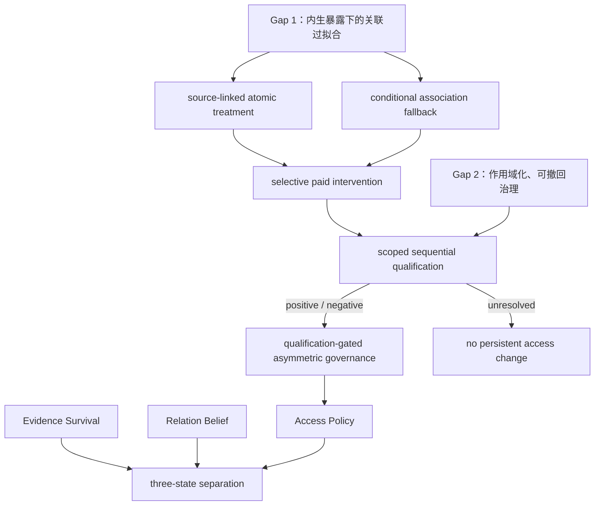
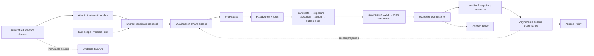

# 第三部分图谱入口：Introduction 与最小框架标准

> `07-Introduction规范稿.md` 是 Introduction 唯一标准稿；`08-作业二-SQCAD完整方案-20260808.md` 是与 Introduction 并列的作业二正式稿，涵盖 Introduction 之后的 Method、数据、基线、消融和 Go/No-Go。框架图统一放在本目录的 `框架图/`，草稿与实验记录放在 `../07-杂项草稿与实验记录/`，历史版本放在 `归档-旧版草稿-20260806/`。

## 当前进度

- **已完成：** Introduction；正式 v2 失败反例；v3 固定协议下的 420 worlds/5460 rows 模块挑战；正式实验报告；已有工作覆盖矩阵；最小全流程图和核心机制图；Method/数据/基线/消融方案收缩。
- **当前唯一正向机制证据：** qualification-gated access governance 相对 fixed decay 的 Utility Δ 为 +0.2352 ± 0.0228，FF-regret reduction 为 +0.1165；代价是平均多保留约 32.6% 热索引记忆，且 risk-weighted harm 略差。
- **已删除：** group hierarchy、PathBundle、BCPS 组到项搜索、adaptive budget cap、sentinel、item veto、contextual effect、semantic bins，以及“causal probe/recovery 提高性能”的主张。
- **公开 treatment 证据：** LongMemEval-S 470 题重跑逐题一致；full-session BM25 Recall-all@5=0.8298，高于 turn-max 0.8000，factor/rule/relation sidecar 无稳定增量。因此核心默认 raw session/turn/span pointer，人工 Gate A 只约束可选 semantic decomposition 主张。
- **尚未完成：** 统一 reader/candidate/budget 的动态公开 benchmark、真实微干预校准；因此不能声称真实 Agent Memory SOTA、因果 probing 性能收益或更强压缩。

## 两个 Research Gaps

1. **Trajectory-Conditioned Associational Overfitting**：candidate、exposure、adoption 和 outcome 由策略与任务条件共同生成，历史成功共现不能直接解释为可迁移贡献；
2. **Scoped Recoverable Governance**：局部效应、不确定性和作用域尚需映射为风险敏感、可撤回的访问动作，同时保存来源和恢复路径。

## 当前核心命题

> 在内生的 Agent Memory 生命周期中，什么证据有资格改变一条记忆未来的可访问性？

最终框架的回答是：

- source-linked session/turn/span handle 决定“测试什么”，但不是因果真理；
- cheap association 只负责 shortlist 和当前低风险条件访问；
- 付费微干预才可能更新 scoped causal belief；
- sequential qualification 输出 positive、negative 或 unresolved；
- unresolved 没有权限改变 persistent access；
- qualified evidence 才能在非对称错误成本下驱动 protect、veto、downweight、archive 或 recovery；
- Evidence Survival、Relation Belief 和 Access Policy 分离保存。

系统契约：

> 结构决定“测试什么”，付费干预决定“什么获得资格”，风险与作用域决定“未来如何访问”；任何派生状态不得覆盖原始证据。

## 阅读顺序

1. [[07-Introduction规范稿|Introduction 规范稿]]
2. [[08-作业二-SQCAD完整方案-20260808|作业二正式方案（Introduction 之后）]]
3. [[../07-杂项草稿与实验记录/00-最新版框架完整设计与实验方案|已验证 v3 基线技术规范]]
4. [[../07-杂项草稿与实验记录/02-Introduction之后的框架设计与实验执行方案-20260807|老师审阅版历史方案]]
5. [[../07-杂项草稿与实验记录/03-已有工作-Gap-模块-证据-裁决审计矩阵-20260807|已有工作与模块裁决矩阵]]
6. [[../04-数据与实验/实验报告/最小框架挑战正式实验报告-v3|正式 v3 实验报告]]
7. [[框架图/11-SQCAD-Full-Framework.png|SQCAD 全流程图]]
8. [[框架图/12-SQCAD-Core-Mechanism.png|SQCAD 核心机制图]]
9. [[../07-杂项草稿与实验记录/01-当前进度与下一上下文交接-20260807|当前交接与未完成门槛]]
10. [[参考文献/第三部分参考文献|第三部分参考文献]]
11. `归档-旧版草稿-20260806/`（仅供历史追溯）

## Research Gap—方法—状态关系

## 最小全流程

## 贡献边界

已有工作已覆盖多信号衰减、accessibility decay、结果反馈、决策压缩、结构化记忆、局部因果干预、事后归因和长期 causal probing。因此不再使用“因果人无我有”“首次访问衰减”“首次恢复”或“首次预算优化”。当前可能成立的新意仅是：

> 把有作用域的序贯资格规定为改变 persistent access policy 的必要权限，并以 v2/v3 反例说明 unresolved evidence 不应驱动遗忘。

这个新颖性表述在完成 CMI、Trivium 等最接近工作的全文/代码级核对前仍不得使用 `first`。
