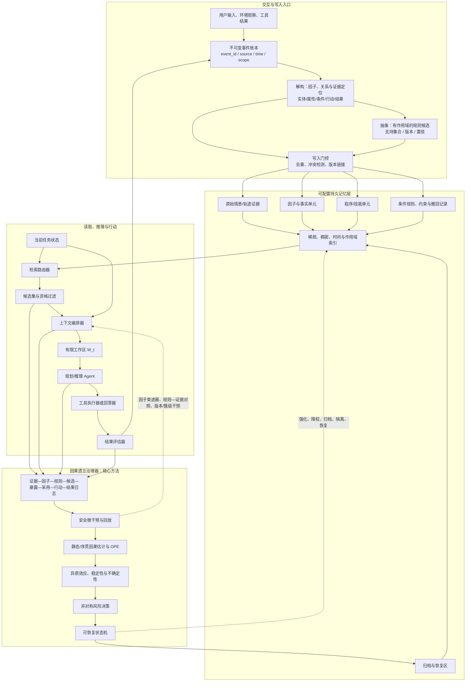
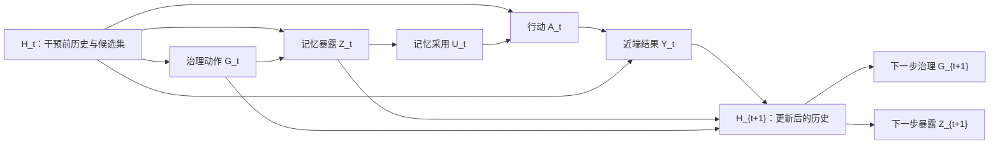
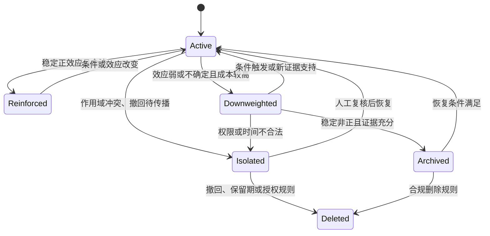

# 核心研究问题与具体设想：序贯因果推断驱动的 Agent Memory 遗忘治理

## 0. 研究定位与论证边界

本部分承接第二部分的“大方向二—已存记忆本体减负”，进一步聚焦其“状态减负”子方向：记忆写入后，系统如何在后续交互中选择强化、保留、降权、归档、隔离、恢复或删除。第二部分已经确认，现有 Agent Memory 工作并非只依赖时间：FadeMem 综合时间、访问频率和语义相关性实施差异化衰减，Oblivion 将遗忘实现为可再激活的访问衰减，Memory Worth 将被检索记忆与成功/失败反馈相关联，DeMem 则从决策失真而非文本保真度界定压缩边界 [@Wei2026FadeMem; @Rana2026Oblivion; @Simsek2026MemoryWorth; @Zou2026DeMem]。因此，本文不能把“引入任务结果”或“避免硬删除”本身写成创新。

真正需要回答的是：上述价值信号多由当前写入、检索、提示编排和行动策略内生生成，而且记忆单元往往以未经分解的轨迹片段或摘要出现。被频繁暴露的记忆更容易与结果共同出现，较难任务中的保护性记忆则可能反复与失败共同出现；历史上的成功共现和失败共现均不能单独识别某条记忆，或其中某个属性、条件和机制成分，对计划、工具调用或结果的反事实增量。若治理器据此持续强化“成功记忆”并压低“失败记忆”，它可能越来越适合历史轨迹，却在任务分布、用户、工具或规则改变后失去样本外能力。

本研究据此提出一个**待验证的算法框架**，而不是已经成立的因果结论：在完整的 Agent Memory 工程系统中，将候选、暴露、采用、行动、结果和状态迁移写入可审计日志；在安全环境中实施小概率遮蔽或版本替换；用序贯因果推断与离线策略评估估计记忆暴露及治理策略的条件化效应；再以跨环境稳定性、估计不确定性和非对称误删代价选择可恢复状态动作。

> **一句话论文主张（实验前版本）：** 在完整的 Agent Memory 生命周期系统中，以可审计的记忆暴露干预和序贯因果效应估计替代成功/失败共现评分，并用跨环境稳定性与非对称误删风险驱动可恢复遗忘。

这一主张的边界有三点。第一，研究对象是外显、可寻址、可更新的 Agent Memory，不是 LLM 参数遗忘。第二，完整记忆系统是保证实验闭环的工程底座，核心方法贡献只位于**因果遗忘治理器**。第三，“因果”依赖明确干预、识别假设和可诊断的估计协议；仅把相关性分数改名为因果价值，或让 LLM 解释某条记忆为何重要，均不构成因果识别。

## 1. 术语与对象账本

| 规范术语 | 本文定义 | 不与其混用的概念 |
| --- | --- | --- |
| 外显记忆单元 $m_i$ | 具有唯一标识、内容、来源、时间、作用域和版本谱系的可寻址记录。 | 模型参数中的隐式知识。 |
| 解构（decomposition） | 将整体轨迹或记忆片段分解为实体、属性、成分、条件、行动与结果等候选因子，并保留其证据定位。 | 已被验证的因果结论。 |
| 抽象（abstraction） | 将多个具有相似结构且作用域可对齐的因子或关系提升为可复用的概念/规则，并显式保留适用条件。 | 无条件的概念泛化或文本摘要。 |
| 因果因子 | 可被单独遮蔽、替换或成组干预，并可能改变结果的解构成分。 | 仅与结果同时出现的属性。 |
| 抽象规则 | 经跨情境证据和效应稳定性检验后形成的条件化规则，具有来源谱系、作用域和置信信息。 | 解构器生成的待验证假设。 |
| 工作区 $W_t$ | 当前决策步实际提供给 Agent 的有限上下文，包括任务状态、工具观察和暴露记忆。 | 永久性的“短期记忆库”。 |
| 记忆暴露 $Z_{t,i}$ | 候选记忆 $m_i$ 是否进入第 $t$ 步工作区。 | 仅被检索为候选、仅被模型复述。 |
| 记忆采用 $U_{t,i}$ | 暴露记忆是否可观测地改变计划、工具参数、答案证据或行动。 | 语言模型事后声称“使用了该记忆”。 |
| 治理动作 $G_{t,i}$ | `reinforce / keep / downweight / archive / isolate / restore / delete` 中的状态迁移。 | 单轮检索排序。 |
| 条件化因果价值 | 在给定历史与环境条件下，改变记忆暴露或治理动作对近端结果或长期策略价值的反事实增量。 | 成功率、访问次数、相似度或重要性分数。 |
| 可恢复遗忘 | 先降低默认可访问性或移入归档，并保留谱系与恢复指针。 | 不可逆物理删除。 |
| 因果遗忘治理器 | 负责日志、干预、效应估计、风险决策和状态迁移的可插拔模块。 | 整套 Agent Memory 系统。 |

## 2. Introduction 初稿

对应的证据边界版英文稿见 [[07-English-Introduction-Draft|English Introduction Draft]]。英文版本锁定了 decomposition、abstraction、component bundle、sequential causal governance 和 reversible forgetting 的规范术语，并将尚未完成的公开端到端/SOTA 主张保留为显式证据缺口。

### 第 1 段：研究对象与重要性

外部记忆使语言模型 Agent 能够跨交互保存任务状态、用户约束、环境事实和可复用经验，从而突破单次上下文的时长与容量限制。然而，持续追加的记忆同时扩大候选集合、检索噪声、提示成本和冲突密度，使系统必须对已存记忆实施生命周期治理。近期方法已经将治理从固定窗口扩展到差异化衰减、访问控制、结果反馈、决策压缩和程序经验精炼 [@Wei2026FadeMem; @Rana2026Oblivion; @Simsek2026MemoryWorth; @Zou2026DeMem; @Cao2026ReMe]。因此，遗忘不宜被简化为删除旧记录，而应被定义为在资源约束下调节记忆未来影响力的状态决策。

### 第 2 段：现有方法为何有效

现有状态治理主要从 Agent 自身轨迹提取低成本代理信号。时间和访问频率近似一条记忆持续被需要的程度，语义相关性控制其对当前查询的匹配，成功/失败反馈则将下游结果回传到记忆状态。这些机制具有明确工程优势：它们无需为每条记忆重复运行昂贵反事实实验，能够在线更新，并可直接接入现有检索栈。DeMem 进一步表明，记忆压缩不必维持文本级描述保真，而可围绕决策区分是否仍然可达来定义 [@Zou2026DeMem]。但整体轨迹、事实摘要和程序经验仍可能把因果变量与情境表面特征绑定在同一表示中。本文因而保留时间、频率、相关性和结果反馈作为特征与强基线，同时增加“整体记忆 treatment”和“因子级 treatment”的对照。

### 第 3 段：从轨迹关联到因果识别的技术缺口

困难在于，这些信号由当前系统策略内生生成，且整体记忆单元未必是可解释、可干预的因果单元。记忆只有先被候选、检索和暴露，才有机会与成功或失败共同出现；任务难度、候选集合、检索器、基础模型、提示位置、工具状态和同时暴露的其他记忆又共同影响最终结果。由此，成功任务中的旁观记忆可能被错误强化，困难任务中降低损失但未扭转成败的保护性记忆可能被错误抑制；即使整体记忆具有增量，也无法直接判断其中哪一部分应被保留。经典因果推断为处理选择偏差、异质处理效应和时间变化混杂提供了潜在结果、边际结构模型、双重稳健估计与交叉拟合等工具 [@Pearl2009Causality; @HernanRobins2020WhatIf; @Robins2000MSM; @BangRobins2005DoublyRobust; @Chernozhukov2018DML]；因果表征学习与因果模型抽象则分别讨论可寻址因素和跨层机制的构造 [@Scholkopf2021CausalRepresentation; @BeckersHalpern2019AbstractingCausalModels]；离线策略评估则研究如何由日志策略估计替代策略的价值 [@SwaminathanJoachims2015CRM; @JiangLi2016DROPE; @ThomasBrunskill2016OffPolicy]。但这些方法尚未被统一为面向可寻址 Agent Memory 的“轨迹解构—因子暴露—概念抽象—行动结果—状态迁移”问题。

### 第 4 段：从局部效应到安全治理的技术缺口

即使能够估计某个因子在历史任务上的平均或局部效应，该估计也不足以自动决定遗忘或抽象。记忆的作用可能随任务族、主体、时间和工具版本改变；低频安全约束的平均效应可能接近零，但误删代价远高于保留成本；错误的概念继承还可能把局部规律过度推广到未验证对象。异质效应估计、跨环境不变性、因果模型抽象与因果数据融合为描述条件差异、跨层映射和可迁移边界提供了方法依据 [@WagerAthey2018CausalForest; @NieWager2021RLearner; @Peters2016InvariantPrediction; @BeckersHalpern2019AbstractingCausalModels; @BareinboimPearl2016DataFusion]，但现有 Agent Memory 治理尚缺少把因子抽象的证据覆盖、效应异质性、跨环境稳定性、估计不确定性、非对称误删风险和可恢复状态迁移统一起来的决策接口。

### 第 5 段：本文拟议方法

为回应上述缺口，本文拟构建一个序贯因果遗忘治理器。系统首先记录每一步的候选记忆、日志策略概率、实际暴露、采用证据、行动和结果，并在可回放或可自动判分的安全任务中执行小概率遮蔽、版本替换和簇级干预。随后，静态双重稳健估计用于验证单步记忆暴露效应，边际结构模型或序贯双重稳健离线策略评估用于处理“过去暴露影响未来状态和检索”的时间变化混杂。最后，治理器依据条件效应、跨环境稳定性、置信区间和非对称损失，在强化、保留、降权、归档、隔离与恢复之间迁移；物理删除仅由撤回、权限或保留期规则触发。本文将在公开长期记忆基准与具有反事实真值的可控模拟器上，分别检验端到端效用、因果估计质量、样本外泛化、错误遗忘风险和资源成本。

### 第 6 段：Contributions 占位

> [待实验后回填] 最终贡献只能写入被实现和消融支持的模块，不预先声称性能领先或获得因果保证。候选贡献顺序为：问题形式化；序贯估计与安全干预协议；风险敏感的可恢复治理策略；公开基准与可控因果真值上的验证。

## 3. 两个交叉领域 Research Gaps

以下缺口限定于本项目已核验的 Agent Memory 状态减负、因果推断与离线策略评估文献，不声称穷尽所有未公开系统或同时期工作。这里的“尚未”指尚未在同一问题定义、算法接口和评测协议中得到系统化验证，而不是断言任一相邻方法无法被迁移。

### Gap 1：因果可寻址性与序贯记忆效应的识别缺口

> **Agent Memory 遗忘方法已利用时间、频率、语义相关性、结果反馈和决策失真实施状态减负，但其治理单元通常是未经解构的轨迹片段、摘要或经验整体；这些单元的暴露机会又由当前检索与治理策略内生生成。现有因果推断、因果表征学习与离线策略评估虽分别提供处理分配、可寻址因素、时间变化混杂和反事实策略价值的工具，却尚未被系统化为面向 Agent Memory 的“轨迹解构—因子暴露—采用—行动—结果—状态迁移”估计问题。**

这个 Gap 关心的是**记忆价值能否在合适的表示粒度上被可信识别**。它不等同于“现有工作没有任务反馈”，因为 Memory Worth 和 ReMe 已使用结果信号；也不等同于“使用双重稳健估计即可解决”，因为 Agent Memory 中的处理是随时间变化的暴露与状态动作，多条记忆之间还可能存在替代或协同。需要先将整体经验分解为带证据定位的候选因子，再明确因子级 estimand、日志策略、干预前协变量和序贯识别假设，并用可控真值检验区分解构误差与估计偏差。

### Gap 2：因果抽象与证据保留型样本外治理缺口

> **现有方法通常优化历史平均任务效用或存储/决策压缩，但历史平均相关性或局部因果效应不足以支持非平稳环境中的安全抽象与遗忘；仍缺少将因果因子的概念层级、抽象规则的适用范围、证据覆盖、异质效应、跨环境稳定性、估计不确定性、非对称误删风险和可恢复状态迁移统一起来的 Agent Memory 治理策略。**

这个 Gap 关心的是**已识别的因果成分能否被安全抽象并转化为生命周期动作**。一条只对特定主体或工具版本有效的记忆不应被抽象为无条件规则；一条效应不确定但误删代价极高的记忆也不应因均值接近零而退出；原始证据不能因抽象完成而不可恢复。相应方法必须把“因子是什么”“规则在哪些条件下成立”“证据覆盖是否充分”“是否有任务增量”“估计是否可靠”“错误动作代价多大”和“动作是否可恢复”分开建模。

### 两个 Gap 的逻辑关系

Gap 1 是估计问题，Gap 2 是决策问题。若 Gap 1 未解决，治理器可能在有偏信号上优化；若 Gap 2 未解决，即使局部效应估计准确，也可能在分布漂移和高风险条件下做出不可恢复的错误动作。

## 4. 研究问题与可证伪假设

### 4.1 Research Questions

- **RQ1（表示）：** 证据锚定的解构—抽象能否将整体轨迹转化为具有来源、条件和作用域的可干预组件束，并在表面情境变化时保留真正有效条件而不提升偶然特征？
- **RQ2（识别）：** 在候选集、任务难度和日志策略共同影响组件束暴露的条件下，序贯因果估计能否比成功/失败共现更准确地恢复其条件效应？
- **RQ3（泛化）：** 跨时间、任务族、主体和工具版本的稳定性约束，能否让条件规则只在其证据支持的作用域内激活，从而减少对历史交互轨迹的过拟合并改善 OOD 任务表现？
- **RQ4（治理与系统）：** 将证据覆盖、估计不确定性与非对称错误成本纳入可恢复状态机，能否减少低频关键记忆的错误遗忘，同时在固定模型、检索器和资源预算下改善任务效用—存储—token—延迟的帕累托前沿？

### 4.2 Hypotheses

- **H1（解构）：** 在具有已知潜在机制的模拟器中，证据锚定的因子组件束相较未经解构的轨迹单元，具有更高的因果条件覆盖率与更低的表面特征误提升率；若无法达到，不将“解构”视为有效模块。
- **H2（抽象）：** 在保持因果条件不变、替换实体名称/描述/无关属性的环境中，带作用域和来源证据的条件规则相较摘要式压缩或无证据规则具有更高的规则适用校准、证据可追溯率和 OOD 任务效用。
- **H3（识别）：** 在具有已知反事实真值的模拟器中，序贯双重稳健估计相较成功共现、朴素差值和静态结果回归具有更低的策略价值偏差或更高的效应符号准确率。
- **H4（泛化）：** 仅用历史平均效应进行治理会在环境切换时产生更高的错误遗忘或错误保留；加入条件异质性、跨环境稳定性和受证据约束的抽象后，worst-group 与 Temporal OOD 指标改善。
- **H5（风险）：** 在相同平均保留率下，非对称损失、置信区间保护和可恢复归档可降低 rare-critical violation，并在漂移反转时提高恢复成功率；该收益与存储成本的权衡必须通过帕累托前沿报告。

若 H1/H2 不成立，则“解构—抽象提高因果可寻址性或样本外泛化”的主张不成立；若 H3 不成立，则“因果推断”不构成方法贡献；若 H4/H5 不成立，则“提高未来任务泛化与安全遗忘”的主张不成立；若仅合成任务有效而公开基准无效，则该方案只能被定位为诊断协议，而非有竞争力的 Agent Memory 方法。

## 5. 完整 Agent Memory 工程架构

### 5.1 设计原则：工作流完整，但存储结构可配置

参考流程图只提示系统图需要展示候选生成、状态判断、存储、更新和衰减等工程环节；它不规定本文必须采用“短期/长期二分”、单一 importance score 或固定的融合顺序。本研究采用模块化事件驱动架构：**工作区是每一步临时组合的运行时上下文，长期库则按任务需要配置记忆类型、索引和版本关系。** 因此，事实、情景、程序或约束记忆可以共用物理存储而通过类型和作用域区分，也可以部署为独立后端；这些选择属于系统实现变量，不是论文的核心创新。

其中，解构—抽象模块是连接“原始轨迹”与“因果治理”的表示接口，而不是额外规定一套记忆分层：解构将事件拆为带来源定位的实体、属性、条件、行动、结果与关系候选；抽象仅在跨情境证据、作用域和条件效应满足要求时，将这些候选提升为可复用的条件规则。原始证据、因子与规则以谱系链接共存，均可被检索、审计、归档或恢复。故图中的三者是逻辑对象而非固定物理层，具体后端可以合表或拆分。

这里的解构与抽象应被视为一个联合的表示构造接口，而不是两个彼此独立的“智能能力”：解构首先提供可干预的候选单元，抽象再在证据覆盖、关系模板、作用域和历史支持的约束下建立可复用规则。若缺少解构，规则无法准确指向原始证据和具体 treatment；若缺少抽象，系统只能在表面轨迹或局部因子上治理，难以检验条件的跨情境复用。联合表示的因果资格仍需通过“来源完备性 → 处理定义与 overlap → 微干预/回放 → 效应稳定性与风险门控”的顺序获得，不能由抽取置信、语言模型解释或语义相似度直接授予。形式化边界与可证伪条件见 [[06-解构抽象能力的学术化界定与因果架构融合|解构—抽象能力的学术化界定]]。

### 5.2 系统数据面与控制面

图中底座负责生成可比较的候选与完整行为日志；治理器不替代写入器、检索器或 Agent，而通过明确接口观察并调节记忆状态。解构器生成的是待验证候选，抽象器生成的是有来源和作用域的规则候选；两者均不因语言模型自述而获得“因果”地位。只有在安全干预、条件效应估计和稳定性诊断之后，治理器才允许它们影响默认暴露或被激活为规则。这样可以固定底座，仅替换治理策略，避免将检索器、上下文长度或额外 LLM 调用带来的收益误归因于因果遗忘。

LongMemEval-S 的表示对照进一步约束了部署方式：无监督因子句、关键词规则及二者拼接均显著低于完整 session BM25。因此，第一版实现必须采用**原始证据主索引 + 因子/规则 sidecar 索引**，候选生成取两路并集并保留 `evidence_id` 回退路径；在证据覆盖和任务增量得到验证前，解构—抽象只能扩展检索键或提供治理特征，不能覆盖或替换原始证据。该双通道设计是实验支持的工程修正，而不是参考图规定的固定分层。

### 5.3 核心数据结构

| 对象 | 最小字段 | 工程目的 |
| --- | --- | --- |
| `MemoryRecord` | `memory_id, content_ref, type, source_id, created_at, available_at, valid_from/to, subject_scope, task_scope, version_parent, status, restore_ptr` | 保证可寻址、时间合法、版本可追踪和可恢复。 |
| `EvidenceRecord` | `evidence_id, event_id, content_span/ref, source, time, scope, hash` | 以不可变来源锚定后续因子和规则，禁止无来源抽象。 |
| `FactorRecord` | `factor_id, evidence_id, factor_type, normalized_form, relations, extractor_version, confidence, status` | 将整体经验变为可单独暴露/替换的候选成分；不把抽取结果直接解释为因果事实。 |
| `AbstractRule` | `rule_id, relation_template, factor_ids, support_set, scope, rule_version, evidence_coverage, stability, status` | 表示有条件、可证伪的规则候选；只在满足证据和效应门槛后激活。 |
| `RetrievalCandidate` | `decision_id, memory_id, lexical_score, dense_score, eligibility, rank, candidate_probability` | 记录进入候选集的机会，区分未候选与未暴露。 |
| `ExposureLog` | `decision_id, component_id, evidence_bundle_id, z, logging_propensity, prompt_position, policy_version` | 支撑因子/规则组件束的 IPW、DR 和 OPE；概率必须由日志策略真实输出。 |
| `AdoptionLog` | `plan_diff, cited_evidence, tool_arg_diff, action_change` | 作为机制诊断，不把模型自述当作唯一采用证据。 |
| `OutcomeLog` | `proximal_reward, terminal_reward, constraint_violation, cost, evaluator_version` | 同时保存近端与长期结果，避免只看任务成败。 |
| `GovernanceTransition` | `old_status, action, new_status, reason, estimate_version, confidence, rollback_token` | 审计每次状态迁移并支持回滚。 |

### 5.4 工作区与长期库的关系

工作区 $W_t$ 是一个预算受限的运行时视图，而不是由“重要性阈值”永久决定的短期记忆层。它由任务状态、最近观察、工具输出和经过资格过滤的长期记忆共同组成。长期库也不必只有一种固定层次；类型、时间、主体、权限和状态均可作为正交元数据。规则进入工作区时应按风险与预算携带最小充分来源证据或可验证引用，避免高层抽象脱离可追溯事实。这样，某条被归档的规则在罕见条件触发时可以恢复到工作区，而某条高频但已过期的事实即使仍在持久库中也不会默认暴露。

## 6. 因果遗忘治理器

### 6.1 序贯问题定义

在决策步 $t$，令 $H_t$ 表示干预前历史，包括任务状态、过去观察、过去记忆暴露、过去行动与结果、当前候选集及记忆状态。系统先执行治理动作 $G_t$，再由检索与上下文策略产生记忆暴露向量 $Z_t$，Agent 形成行动 $A_t$，环境返回近端结果 $Y_t$ 并进入 $H_{t+1}$。治理问题不是一次性二元处理，而是一个序贯策略：

$$
H_t \rightarrow G_t \rightarrow Z_t \rightarrow U_t \rightarrow A_t \rightarrow Y_t \rightarrow H_{t+1}.
$$

本研究至少区分两个 estimand：

1. **近端暴露效应**：在给定 $H_t$ 下，暴露或遮蔽一条记忆/记忆簇对本步计划、行动或结果的条件平均处理效应；
2. **长期治理策略价值**：在时间范围 $T$ 内，目标治理策略 $\pi_g$ 相对于日志策略 $\pi_b$ 对累计任务效用、风险与资源成本的影响。

静态 CATE 适合第一阶段验证单步暴露是否有增量，但不能替代第二个问题。因为早期降权会改变后续候选集和检索概率，过去暴露也会改变 Agent 的后续状态；若只对最终日志做一次性回归，就会忽略时间变化混杂。

### 6.2 因果结构与时间变化混杂

关键难点在于 $H_{t+1}$ 同时是过去处理的结果和未来处理—结果关系的混杂变量。例如，某条记忆在 $t$ 时刻被暴露后可能改变工具状态与后续查询，使它在 $t+1$ 更容易再次被检索。直接把 $H_{t+1}$ 当作普通协变量回归可能阻断过去处理的一部分效应；完全不控制又会混淆未来处理。边际结构模型、g-formula 和序贯双重稳健/OPE 方法因此比一次性 CATE 更符合长期治理问题 [@Robins2000MSM; @HernanRobins2020WhatIf; @JiangLi2016DROPE]。

### 6.3 识别假设与可诊断边界

- **一致性：** 记录的处理版本必须明确；“暴露”需固定内容版本、位置范围和上下文编排规则。
- **序贯可交换性：** 给定每一步的干预前历史，日志策略之外不存在同时影响当前处理与潜在结果的未记录因素。为降低该假设压力，需要记录候选集、任务难度、模型/工具版本和随机种子，并在安全环境执行随机微干预。
- **Positivity / overlap：** 对需要比较的历史状态，日志策略必须以非零概率执行相应暴露或状态动作。无重叠区域只允许保守治理，不能外推因果价值。
- **干扰边界：** 同一工作区中的多条记忆可能替代或协同，违反单元间无干扰。第一版以语义簇为 treatment，关键记忆对执行二阶遮蔽；单条结果仅解释为给定候选集合的局部效应。
- **结果可测量：** 自动评分、工具结果和约束违反优先于 LLM 自评；采用与最终结果需分层记录。
- **可迁移边界：** 在已观测环境中稳定不等于对任意未来环境不变。跨环境稳定性是稳健偏好和压力测试，不是无条件 transportability 保证 [@Peters2016InvariantPrediction; @BareinboimPearl2016DataFusion]。

### 6.4 估计路径

第一阶段在可控数据中估计单步暴露效应：记录 propensity，以 outcome regression、IPW 和 cross-fitted doubly robust estimator 进行比较 [@BangRobins2005DoublyRobust; @Chernozhukov2018DML]；再用 causal forest 或 R-learner 描述任务、主体、时间与记忆类型上的效应异质性 [@WagerAthey2018CausalForest; @NieWager2021RLearner]。

第二阶段处理治理序列：使用 stabilized IPW 的边际结构模型作为透明基线，再以 sequential DR / DR-OPE 估计目标治理策略价值 [@Robins2000MSM; @JiangLi2016DROPE; @ThomasBrunskill2016OffPolicy]。若日志来自 bandit 式单步选择，可将 counterfactual risk minimization 作为倾向加权和方差控制基线 [@SwaminathanJoachims2015CRM]。所有方法均需报告 overlap、有效样本量、权重尾部和置信区间；“双重稳健”不能被表述为两个辅助模型均错时仍然无偏。

### 6.5 安全微干预与影子回放

治理器只在可自动判分、可回滚且不影响真实用户权益的环境中探索：

1. **单条遮蔽：** 固定其他候选、提示模板和随机设置，移除某条记忆；
2. **版本替换：** 在合法的新旧版本之间切换，识别时间有效性与作用域效应；
3. **簇级遮蔽：** 对近重复或共同表达同一约束的记忆成组处理，减少替代效应；
4. **影子回放：** 主线程执行保守策略，离线分叉执行候选处理，仅使用可验证结果更新估计器；
5. **受限探索：** 对安全规则、权限和不可逆行动设置禁止遮蔽清单；positivity 不能作为扩大操作权限的理由。

### 6.6 风险敏感的可恢复状态机

状态决策最小化任务风险、资源成本与治理成本：

$$
g^*(x,m)=\arg\min_g\;\mathbb E[L_{task}(g,\tau,x)\mid\mathcal D]
+\lambda C_{resource}(g)+\eta C_{governance}(g).
$$

其中错误遗忘和错误保留具有不同代价。在安全约束、一次性例外和低频高损失任务中，$C_{false\text{-}forget}>C_{false\text{-}retain}$；在低风险、高冗余且预算紧张的场景中可相反。负因果效应最多支持降权或归档，不独立授权物理删除；删除由撤回、权限、保留期和法律规则控制，并必须传播到索引、摘要、缓存与派生记录。

### 6.7 自由能的降级定位

认知自由能可作为近似等效候选之间的结构复杂度正则：在因果价值和合法性近似相同的条件下，优先保留维护成本更低、冲突更少且解释当前观察所需的表示。它不能替代处理定义、干预数据或因果估计，也不能因为一条路径与既有叙事一致就赋予其因果地位。实验中设置“无自由能正则”与普通复杂度正则对照；若其对效用—成本前沿无独立增益，应从最终方法删除。

## 7. 工程实现要点

### 7.1 服务与接口边界

- `ingest(event) -> event_id`：事件先写不可变账本，再异步抽取候选，避免抽取失败导致原始证据丢失。
- `upsert_memory(candidate, provenance) -> memory_id/version_id`：去重和冲突检测不覆盖原记录，而是建立版本与作用域关系。
- `retrieve(query_state, budget) -> candidates + probabilities`：返回完整候选及进入候选集的概率/规则版本，而不只返回 top-k 文本。
- `compose(candidates, policy) -> workspace + exposure_log`：在真正调用 Agent 前原子化写入 exposure 和 propensity。
- `evaluate(trajectory) -> outcomes`：结果评估器版本化；自动规则、环境 reward 与 LLM judge 分列。
- `govern(memory_id, action, evidence) -> transition_id`：状态迁移采用 compare-and-swap，记录估计器版本、置信区间和 rollback token。

### 7.2 一致性、缓存与恢复

- 每个决策使用 `decision_id` 贯穿候选、暴露、计划、工具调用、结果和治理日志。
- 检索索引采用异步更新时，状态变更先写主记录，再由 outbox 传播；评测记录索引延迟与残留暴露。
- 归档不删除内容，只移出默认热索引并保留冷存储指针、校验和及版本谱系。
- 恢复动作必须重新验证来源、权限、`valid_from/to` 和派生摘要，不能只把旧向量重新插入索引。
- 删除采用 tombstone 与传播确认；只有所有派生索引、缓存和摘要均确认后，才计为撤回完成。

### 7.3 可复现配置

固定基础模型、提示模板、embedding、retriever、reranker、top-k、工作区 token、存储预算、工具版本和随机种子。所有治理策略接收相同的候选记忆流；否则无法区分收益来自更好的记忆治理，还是更强写入/检索底座。每次运行保存代码 commit、数据 release/hash、模型版本、策略版本和 evaluator 版本。

## 8. 数据、基线、指标与消融的主线

详细实验蓝图见 [[03-因果推断驱动的Agent Memory遗忘框架论文方案|因果遗忘框架论文方案]]，可获取性与数据卡要求见 [[02-Agent Memory遗忘评测基准、基线与数据选择方案|遗忘评测基准、基线与数据选择方案]]。本节仅固定与两个 Gap 的对应关系。

| 论证目标 | 数据/设置 | 关键基线 | 主要指标 | 关键消融 |
| --- | --- | --- | --- | --- |
| Gap 1：识别记忆效应 | 可控因果真值 simulator；安全回放日志 | 成功共现、naive difference、OR、IPW/MSM、静态 DR、sequential DR/OPE、CRM | ATE/CATE bias、PEHE、sign accuracy、policy-value bias、CI coverage | 无微干预、无 propensity、静态替代序贯、无 cross-fitting |
| Gap 2：安全样本外治理 | LongMemEval、GoodAI-LTM、LoCoMo；Temporal/Task/Subject OOD | Recency/Frequency、FadeMem、Oblivion、Memory Worth、DeMem、ReMe | OOD、worst-group、CVaR、false forgetting/retention、restore success | 无稳定性、无非对称损失、无置信保护、硬删除替代归档 |
| 完整系统价值 | 相同底座和资源预算 | Full context、No-memory、FIFO/LRU、Mem0、固定检索 | QA/task utility、存储、token、延迟、每成功任务成本 | 不同检索器、top-k、工作区与存储预算 |

“SOTA”只能指在同一数据、模型和预算协议下的作者报告或复现领先结果；不存在可直接横向拼接的跨 benchmark 总榜。无法获得代码或无法公平重跑的方法应标为论文报告值，不进入显著性比较。

## 9. 失败模式、伦理与贡献边界

1. **未测混杂：** LLM 内部状态、不可观测提示变化或评估器偏差可能同时影响暴露与结果；随机微干预只能降低而不能消除该风险。
2. **多记忆干扰：** 单条效应可能在候选集合变化后反转；需要簇级与交互效应压力测试。
3. **探索风险：** 不得在真实高风险任务中为满足 overlap 随机遮蔽安全约束；此类状态只能使用沙盒、影子回放或专家审核。
4. **代理结果偏差：** 最终成功可能掩盖过程损失，二元失败也可能掩盖保护性贡献；必须同时记录连续损失、行动变化与约束违反。
5. **分布外保证有限：** 历史环境中的稳定效应不能证明未知环境中的因果可迁移性；OOD 结果应被表述为实证稳健性，而非形式保证。
6. **删除与价值分离：** 低价值不等于有权删除，高价值也不等于允许保留；权限、撤回和保留期优先于任务效用。
7. **系统贡献边界：** 写入门控、类型化存储、混合检索和工作区编排是必要底座；除非单独提出并验证新机制，不列为论文创新。

## 10. 当前主张—证据状态

| 主张 | 依据 | 状态 |
| --- | --- | --- |
| Agent Memory 已有时间/频率/相关性、结果反馈和决策充分性路线 | FadeMem、Oblivion、Memory Worth、DeMem、ReMe 及第二部分原文证据。 | 已有文献支持。 |
| 成功/失败共现不能自动识别记忆反事实贡献 | Memory Worth 的关联性边界；因果推断的处理选择与混杂理论。 | 概念上支持，具体 Agent Memory 偏差仍需实验。 |
| Agent Memory 治理是序贯处理问题 | 由暴露、状态与后续候选相互影响的系统结构推出。 | 本研究形式化，待实证验证。 |
| 序贯 DR/OPE 优于静态价值分数 | 尚无本项目结果。 | 待验证。 |
| 稳定性与非对称损失改善未来任务治理 | 尚无本项目结果。 | 待验证。 |
| 自由能正则具有额外价值 | 尚无本项目消融。 | 可选假设，无增益即删除。 |

## 参考入口

- [[../02-相关工作与现存痛点/03-Agent Memory 选择性记忆管理：存量管理与读写过滤|第二部分：选择性记忆管理]]
- [[../02-相关工作与现存痛点/04-Agent Memory 选择性记忆管理的未覆盖问题与研究路径|第二部分：未覆盖问题与研究路径]]
- [[02-Agent Memory遗忘评测基准、基线与数据选择方案|评测基准、基线与数据选择方案]]
- [[03-因果推断驱动的Agent Memory遗忘框架论文方案|因果遗忘框架论文与实验方案]]
- [[参考文献/第三部分参考文献|第三部分参考文献]]
