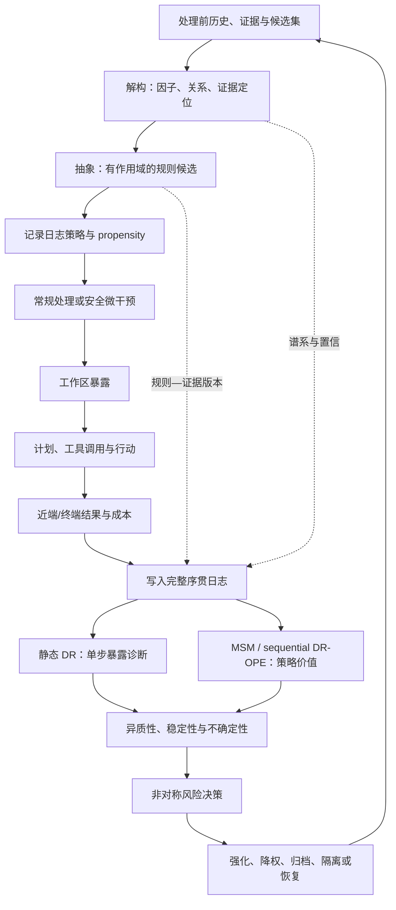

# 序贯因果推断驱动的 Agent Memory 遗忘框架：方法与实验蓝图

对应的英文论文 Method 初稿见 [[08-English-Method-Draft|English Method Draft]]，英文实验初稿见 [[09-English-Experiments-Draft|English Experiments Draft]]。英文版本沿用本文件的处理定义、估计器和治理状态机，并把通用 Agent Memory 工作流与论文贡献边界写入 Figure 1 caption；实验版本严格区分受控校准、公开检索结果、行为代理和尚待复现的论文 baseline。

## 0. 文件定位

[[01-核心研究问题与具体设想|核心研究问题与具体设想]] 负责论文动机、两个 Research Gaps 和完整系统架构；本文件只展开**因果遗忘治理器的实现与实验**。完整的写入、存储、检索、工作区、Agent 和结果评估链路是实验底座，不作为当然的创新。候选方法的核心增量限定为：

1. 将整体轨迹记忆转换为**证据锚定的因子—规则候选**，使治理对象能够从整段经验下沉到属性、条件、行动、结果及其关系；
2. 将记忆治理形式化为这些候选单元的序贯暴露与状态动作，而非单次重要性评分；
3. 以真实 propensity 日志、安全微干预和序贯因果估计验证候选单元的条件化增量；
4. 仅在证据覆盖、效应稳定性和作用域条件满足时，将局部因子提升为可复用的条件规则，并将异质效应、不确定性和非对称损失转化为可恢复状态迁移。

本文暂不命名框架，避免在方法和证据尚未稳定前制造额外术语。

本方案将“解构—抽象”限定为因果治理的表示接口，而非固定记忆层或独立的因果发现模块。解构提供带证据定位的可寻址候选；抽象提供带作用域、支持集合和版本的规则候选；二者只有在处理定义、可交换性、overlap、效应稳定性和风险门控均满足时，才可影响记忆状态动作。更完整的概念边界、联合表示算子与失败条件见 [[06-解构抽象能力的学术化界定与因果架构融合|解构—抽象能力的学术化界定]]。

## 1. 问题形式化

### 1.1 决策过程

一个 episode 包含 $t=1,\ldots,T$ 个决策步。定义：

- $H_t$：第 $t$ 步处理前历史，包括任务、环境、过去观察、行动、结果、候选记忆、各记忆状态、模型/工具版本和预算；
- $E_t$：带来源、时间与作用域的原始事件证据；$F_t,R_t$：由解构器生成的候选因子及关系；$r_j$：由抽象器生成的条件规则候选；
- $G_t$：治理动作，可对一条记忆或一个记忆簇执行 `reinforce / keep / downweight / archive / isolate / restore`；
- $Z_t$：进入工作区的记忆暴露向量；
- $U_t$：可观测的记忆采用证据；
- $A_t$：Agent 的计划、工具调用或答案行动；
- $Y_t$：近端 reward、连续损失、约束违反和资源成本；
- $R_T=\sum_{t=1}^{T}\gamma^{t-1}r_t$：episode 累计效用。

将治理与暴露合为处理 $B_t=(G_t,Z_t)$。日志策略 $\pi_b(B_t\mid H_t)$ 产生历史数据，目标策略 $\pi_e(B_t\mid H_t)$ 是拟评估的因果治理策略。

### 1.2 解构—抽象作为因果治理的表示接口

令原始事件或轨迹证据为 $E_t$。解构器 $\mathcal D_\phi$ 产生候选因子图：

$$
\mathcal D_\phi(E_t)=\left(F_t,R_t,P_t,\rho_t\right),
$$

其中 $F_t=\{f_k\}$ 是实体、属性、成分、条件、行动、结果和约束等候选因子，$R_t$ 是它们之间的关系，$P_t$ 为每个因子/关系指向原始事件、文本跨度或工具输出的证据定位，$\rho_t$ 为抽取置信与解析版本。这里的“解构”是**表示层的可寻址化**：它把整体经验拆成可单独暴露、替换或成组干预的候选单元；它本身既不等价于因果发现，也不允许把语言模型生成的解释直接当作真实机制。

抽象器 $\mathcal A_\psi$ 在同一关系模板、作用域和证据支持下，将多个候选因子映射为规则候选：

$$
\mathcal A_\psi\!\left(\{f_k,R_k,P_k\}_{k\in\mathcal I}\right)
=\left(r_j,\;\mathcal S_j,\;\Gamma_j,\;\nu_j\right),
$$

其中 $r_j$ 是形如“在条件 $\Gamma_j$ 下，属性/关系 $X$ 对决策或结果 $Y$ 具有方向性贡献”的规则候选，$\mathcal S_j$ 是不可丢弃的原始证据集合，$\Gamma_j$ 包含主体、时间、工具版本、任务族和权限等适用边界，$\nu_j$ 是规则版本。抽象的目标不是把文本压缩为更短摘要，而是形成**可组合、可检索且可证伪的条件化表示**。只有在后续干预与效应分析支持时，$r_j$ 才能进入可激活规则库；否则它维持为待验证假设，不能触发强遗忘动作。

因此，本文的最小治理单元定义为证据支持的组件束 $c_k=(f_k\ \text{or}\ r_j,\mathcal S_k,\Gamma_k)$，而非孤立 token、未经定位的摘要片段或脱离证据的自然语言规则。该设计吸收因果表征学习与因果模型抽象关于“表示—机制—层级映射”的问题意识 [@Scholkopf2021CausalRepresentation; @BeckersHalpern2019AbstractingCausalModels]，但不声称仅凭表征学习即可识别真实结构因果模型。

### 1.3 两类 estimand

**近端组件束暴露效应。** 对证据支持的组件束 $c_k$，在给定干预前历史 $H_t=h$、其余工作区条件固定时比较暴露与遮蔽：

$$
\tau_{t,k}(h)=\mathbb E\left[Y_t(z_k=1)-Y_t(z_k=0)\mid H_t=h\right].
$$

该量用于回答“当前让这个因子或条件规则连同必要证据可见，是否改变计划、工具调用或结果”。它是给定候选集合和上下文编排的局部效应，不被解释为组件的永久固有价值，也不自动证明规则本体的结构因果关系。

**长期治理策略价值。** 比较整个 episode 中不同治理策略的累计效用：

$$
V(\pi_e)=\mathbb E_{\pi_e}\left[\sum_{t=1}^{T}\gamma^{t-1}
\left(r_t-\lambda c_t-\eta q_t\right)\right],
$$

其中 $c_t$ 为存储、token、延迟和调用成本，$q_t$ 为错误遗忘、作用域违反和不可恢复风险。论文的主要方法主张应落在 $V(\pi_e)$，单步 CATE 是用于诊断和初始化状态价值的中间量。

### 1.4 不将“成功”作为唯一结果

二元任务成功会产生两类系统性误判：

- **成功旁观者：** 易任务无论是否暴露某条记忆都成功，记忆与成功高共现但 ($\tau\approx0$)；
- **失败保护者：** 难任务即使暴露关键记忆仍可能失败，但连续损失或约束违反显著下降，记忆与失败共现但 ($\tau>0$)。

因此，$Y_t$ 至少同时包含最终成功、连续 reward/损失、约束违反、计划变化和工具参数变化。计划与工具变化是机制诊断结果，不取代终端任务效用。

## 2. 因果识别设计

### 2.1 最小日志要求

每个 `decision_id` 必须原子地关联以下数据：

1. 干预前 $H_t$：任务切片、基础模型、工具、预算、候选集及各记忆元数据；
2. 解构与抽象谱系：`evidence_id → factor_id/relation_id → rule_id`、原始证据定位、抽取器/本体版本、规则作用域与支持集合；
3. 候选产生规则和候选概率；
4. 日志策略版本、实际处理 $B_t$ 与 $\pi_b(B_t\mid H_t)$；
5. 工作区中每个组件束的版本、位置、token 与共同暴露组件；
6. Agent 计划、工具调用、答案证据和采用诊断；
7. 近端与终端结果、评估器版本及资源成本；
8. 后续状态 $H_{t+1}$ 和治理迁移。

propensity 必须由执行策略在动作发生时记录，不能用事后分类器伪造为已知日志概率。若候选生成是确定性的，只能对候选集合内部的暴露进行因果比较；对从未进入候选集的记忆不能声称已识别其暴露效应。

### 2.2 安全微干预

干预仅在模拟器、可回放 benchmark 或可自动判分的低风险沙盒中执行：

| 干预 | 控制条件 | 识别目的 |
| --- | --- | --- |
| 因子束遮蔽 | 固定候选、提示模板、工作区预算和可控随机性；同时提供其必要证据 | 单步因子级局部暴露效应。 |
| 版本替换 | 只在两个版本均允许暴露时切换 | 时间、更新和作用域效应。 |
| 簇级遮蔽 | 近重复或可替代记忆整体处理 | 降低替代效应导致的低估。 |
| 规则—证据对照 | 对“规则 + 来源证据”“仅来源证据”“仅规则”进行安全回放 | 区分抽象收益、证据依赖和无证据规则的幻觉风险。 |
| 二阶遮蔽 | 对少量关键记忆对运行 (2\times2) 组合 | 检验互补或抑制交互。 |
| 影子回放 | 主线程不改变，离线分叉执行另一处理 | 减少真实行动风险。 |

安全规则、权限状态和不可逆工具调用进入 `non_explorable` 清单。对于这些状态，系统报告“不具备 overlap，不能识别”，默认保留或隔离，不能为了估计而随机遮蔽。

### 2.3 识别假设与诊断

| 假设 | 本系统中的含义 | 诊断/缓解 |
| --- | --- | --- |
| 一致性 | 同名处理具有固定内容版本、提示位置范围和工作区策略。 | 版本化处理；报告处理变体。 |
| 表示可审计性 | 因子、关系和规则均可回溯至原始证据、解析版本及其作用域。 | 报告 provenance coverage；无来源规则不得进入主分析。 |
| 序贯可交换性 | 给定 $H_t$，不存在未记录因素同时影响 $B_t$ 与潜在结果。 | 完整日志、随机微干预、负对照。 |
| Positivity | 在目标历史状态中，待比较处理有非零概率。 | overlap 图、有效样本量、权重尾部、禁外推区。 |
| 可测量结果 | reward 与约束指标可重复计算。 | evaluator 版本化；人工双标小样本审计。 |
| 有限干扰 | treatment 单元之外的记忆影响被候选/簇定义控制。 | 簇级 treatment、二阶交互、候选集敏感性。 |
| 可迁移条件 | 训练与目标环境差异由已记录变量或环境切片表达。 | leave-one-environment-out；不作任意环境保证。 |

## 3. 估计器阶梯：每一层回答不同问题

### 3.1 关联与静态基线

第一组估计器用于暴露问题的基本核验：成功/失败共现、naive difference、outcome regression（OR）、inverse propensity weighting（IPW）和 augmented IPW / doubly robust（DR）。给定暴露 $Z_{t,i}\in\{0,1\}$、结果模型 $\mu_z(H_t)$ 与 propensity $e(H_t)$，单步 DR 伪结果为：

$$
\widehat\phi_{t,i}=\widehat\mu_1(H_t)-\widehat\mu_0(H_t)
+\frac{Z_{t,i}(Y_t-\widehat\mu_1(H_t))}{\widehat e(H_t)}
-\frac{(1-Z_{t,i})(Y_t-\widehat\mu_0(H_t))}{1-\widehat e(H_t)}.
$$

使用 cross-fitting 降低灵活辅助模型的过拟合偏差，并将 propensity clipping 作为敏感性分析，而非默认掩盖无重叠 [@BangRobins2005DoublyRobust; @Chernozhukov2018DML]。静态 DR 只回答单步局部效应，不承担长期策略价值主张。

### 3.2 边际结构模型：透明的序贯基线

过去暴露会影响后续历史，后续历史又影响未来暴露和结果。以稳定化逆概率权重构造伪总体：

$$
SW_T=\prod_{t=1}^{T}
\frac{P(B_t\mid \bar B_{t-1},E_0)}
{P(B_t\mid H_t)},
$$

其中 $E_0$ 为 episode 起点协变量。MSM 直接展示时间变化处理和混杂的校正逻辑，是必须实现的透明序贯基线 [@Robins2000MSM]。报告权重分布、截断阈值、有效样本量和不同截断下的结论敏感性。

### 3.3 Sequential DR / DR-OPE：目标策略价值

对于目标治理策略 $\pi_e$，使用逐步 importance ratio 与行动价值模型构造序贯双重稳健价值估计。该类方法在日志策略概率或价值模型至少一侧正确时具有稳健性优势，但并不免除支持集不足和模型错误 [@JiangLi2016DROPE; @ThomasBrunskill2016OffPolicy]。工程上采用以下顺序：

1. 在可控 simulator 中用已知 $V(\pi_e)$ 校验 estimator bias；
2. 在短 horizon 上与枚举回放值比较；
3. 再扩展到公开 benchmark 日志，只报告 OPE 估计及置信区间，不将其当作真实反事实金标；
4. 最终以实际部署目标策略的独立测试 episode 验证 OPE 排序是否正确。

### 3.4 CRM：单步日志决策的相邻基线

若治理简化为每个 episode 或决策点的一次 bandit 选择，采用 counterfactual risk minimization（CRM）作为从 logged bandit feedback 学习策略的基线，并比较 propensity weighting、方差正则与直接效应模型 [@SwaminathanJoachims2015CRM]。CRM 不直接解决多步状态依赖，因此不与 sequential DR 混称为同一算法。

### 3.5 异质效应与跨环境稳定性

在 DR 伪结果上，用 causal forest 或 R-learner 估计任务难度、主体、时间、组件类型和工具版本上的 CATE [@WagerAthey2018CausalForest; @NieWager2021RLearner]。将环境定义为时间段、任务族、用户/主体或工具版本，形成：

$$
S_i(x)=\operatorname{mean}_{e}\widehat\tau_i^{(e)}(x)
-\kappa\operatorname{sd}_{e}\widehat\tau_i^{(e)}(x)
-\xi\operatorname{SignConflict}_i(x).
$$

该分数只表示在**已观测环境**中的稳健偏好。抽象器仅可将具有相同关系模板、足够独立证据来源、作用域可对齐且 $S_i(x)$ 达到预先设定门槛的因子集合提升为条件规则；任一条件不满足时，保留因子及其证据而不激活规则。Invariant Causal Prediction 与 data fusion/transportability 文献为环境稳定性和跨域条件提供理论参照，但本文不声称直接满足其全部结构假设 [@Peters2016InvariantPrediction; @BareinboimPearl2016DataFusion]。

## 4. 从效应估计到治理策略

### 4.1 决策特征

治理器输入不再是单一 importance score，而是：

- 近端 CATE 与长期策略价值贡献；
- 解构置信、证据定位完整性、规则的独立支持数和抽象层级；
- 效应置信区间、overlap 和有效样本量；
- 跨环境方向一致性与适用作用域；
- 来源、时间、权限、撤回和版本合法性；
- 错误遗忘与错误保留的场景代价；
- 存储、提示 token、延迟和恢复成本。

时间、频率、相似度和成功共现仍作为 propensity、结果模型或简单基线特征存在，但不直接决定删除。

为处理“抽象规则保护关键记忆、同时扩大 stale 误保留”的冲突，第一版治理器增加跨粒度风险回退：设 $q_i$ 为解构/抽象置信度，$S_i^{group}$ 为规则组的跨环境稳定下界，$S_i^{item}$ 为可估计时的 item-level 稳定下界，$I_i$ 表示 item-level 是否有足够 overlap。定义

$$
g_i=mathbf 1\{q_i\geq\theta_q,\;I_i=0\;\lor\;[\operatorname{sign}(S_i^{group})=operatorname{sign}(S_i^{item})\land S_i^{item}>\theta_-]\},
$$

并令 $S_i^{gate}=g_iS_i^{group}+(1-g_i)S_i^{item}$。当候选表示置信不足、跨层效应符号冲突或 item-level 下界低于负效应门槛时，治理器回退到 item-level causal；当 item-level 不可估计时，不把缺失估计当作负效应，而依赖证据覆盖、作用域和非对称误删代价采取保守动作。该门控是可消融的方法模块，不能只在测试集上调阈值。

### 4.2 状态决策表

| 证据状态 | 风险/合法性 | 默认动作 |
| --- | --- | --- |
| 稳定正效应，置信下界高于阈值 | 来源、时间和作用域合法 | `reinforce` 或 `keep`。 |
| 因子关系跨环境稳定，证据覆盖达到门槛 | 规则作用域已显式记录 | 生成或更新 `proposed rule`；仅在规则—证据对照通过后激活。 |
| 规则在某环境失稳、证据相互冲突或无来源支撑 | 原始证据仍合法 | 降级为 `scoped` 或 `proposed`，不删除来源因子。 |
| 点估计接近零但区间宽 | 错误遗忘代价高 | `keep` 或轻度 `downweight`，继续收集数据。 |
| 只在特定环境为正 | 条件可识别 | `isolate` 到对应作用域，条件触发时 `restore`。 |
| 稳定非正且资源成本高 | overlap 与样本量充分 | `downweight` 后进入 `archive`，保留恢复指针。 |
| 效应在漂移前后反转 | 新旧版本均有合法作用域 | 版本分叉，旧版归档，新版激活。 |
| 撤回、越权或超过保留期 | 合规规则明确 | `isolate`，传播完成后 `delete`。 |

### 4.3 抽象与遗忘的耦合边界

抽象不能被用作删除原始经验的理由。它在本框架中承担两项更受限的功能：其一，将在不同表面情境中重复出现的、经验证的条件化成分聚合为更小的检索和暴露单元；其二，将表面细节与可迁移条件分离，使治理器可以优先降权对当前规则无增量且无独立安全价值的情境细节。原始证据、因子和规则均保留版本化谱系；规则被激活时，工作区仍应按风险与预算携带最小充分来源证据或可验证引用。

在工程上，原始证据索引是主通道，因子/规则表示是 sidecar 通道。检索器先分别生成候选，再按来源、作用域、版本和预算合并；规则命中只能提升或过滤其指向的证据，不能在未验证情况下直接替代证据。LongMemEval-S 的负对照已经表明，固定句子压缩和关键词规则拼接会显著损害证据召回，因此“抽象后覆盖原文”不进入第一版方法。

换言之，本文的遗忘对象是**在既定作用域内缺少增量效用、且可由受证据约束的抽象替代的访问权重**，而不是把“被抽象过”误写为“已经无用”。这将“少记一点”改写为“在证据可追溯的条件下，减少对非因果或非稳定表面细节的默认暴露”。

### 4.4 在线闭环



### 4.5 伪代码

```text
for each episode:
    initialize immutable event log and memory state
    for t = 1 ... T:
        H_t <- snapshot(task, environment, memory states, budget, versions)
        E_t <- append raw event evidence and its provenance
        F_t <- decompose(E_t)  # factors/relations are hypotheses, not causal facts
        R_t <- propose_abstractions(F_t, prior evidence, explicit scopes)
        C_t <- retrieve eligible evidence-supported component bundles from F_t, R_t
        B_t, p_t <- logging_policy(H_t, C_t, safety_constraints)
        atomically log(C_t, B_t, p_t)
        W_t <- compose_workspace(H_t, C_t, B_t)
        A_t, adoption_t <- agent_act(W_t)
        Y_t <- evaluate(A_t, environment, constraints, resource_cost)
        append trajectory(H_t, B_t, W_t, adoption_t, A_t, Y_t)

periodically:
    check overlap, missingness, evaluator drift and index consistency
    fit static estimators for proximal exposure effects
    fit MSM and sequential DR/OPE for governance-policy value
    estimate heterogeneous/stable effects and uncertainty
    promote only rule candidates with adequate support, scope and stability
    choose risk-sensitive reversible transitions
    apply transitions transactionally and retain rollback tokens
```

## 5. 工程实施蓝图

### 5.1 最小可行系统（MVP）

第一版无需实现固定的短期/长期多层记忆操作系统。建议最小栈为：

1. **不可变事件账本**：SQLite/PostgreSQL 均可，保存原始交互和工具结果；
2. **统一 `MemoryRecord` 表**：内容引用、类型、来源、时间、作用域、版本、状态和恢复指针；
3. **因子与规则谱系表**：`EvidenceRecord`、`FactorRecord` 与 `AbstractRule` 以外键连接，保存证据定位、关系模板、抽取器版本、规则支持集合与适用作用域；
4. **两类索引**：BM25 与 dense index，外加元数据资格过滤；
5. **工作区编排器**：在固定 token 预算下生成实际暴露集合，并支持“规则 + 最小证据”成束暴露；
6. **可回放 Agent runner**：冻结模型、prompt、工具与 evaluator；
7. **审计日志与 propensity recorder**；
8. **离线估计器服务**：先静态 DR，再 MSM 与 DR-OPE；
9. **可恢复状态机**：只实现 active/downweighted/archived/isolated/restore，物理删除先不进入任务价值实验。

情景、事实、程序和规则类型可先共用一张逻辑表，以 `type` 和 `scope` 区分；只有在访问模式或一致性要求确实不同后再拆分后端。这避免参考图的固定分层先于研究问题决定实现。

### 5.2 一致性与故障处理

- 状态变化先写主表和 outbox，再异步更新索引；索引延迟期间以主表资格过滤兜底。
- 处理与 propensity 采用同一事务写入；缺失 propensity 的样本不得进入 IPW/DR 主分析。
- evaluator 升级后不直接混用旧 reward，需重放或将 evaluator version 纳入环境切片。
- 抽取器、本体或关系模板升级后不覆盖旧因子；新旧解析以版本并存，并在回放时固定所用版本。
- 每条激活规则必须可回溯到来源事件与具体证据定位；来源失效、撤回或超出作用域时，规则同步降级或隔离。
- 禁止只暴露无来源的高层规则来衡量抽象收益；规则—证据对照必须与相同 token 预算和提示位置下的来源证据比较。
- 归档内容保存 hash、版本谱系和冷存储位置；restore 必须通过权限和有效期复核。
- 所有不可逆动作需要独立授权路径；研究算法只能建议，不能自行扩大删除权限。

### 5.3 分阶段实现

| 阶段 | 实现范围 | 通过条件 |
| --- | --- | --- |
| P0：日志底座 | event/memory/factor/rule schema、候选、暴露、propensity、结果和状态迁移 | 任一决策可由 `decision_id` 与证据谱系全链路回放。 |
| P1：解构可用性 | 因子抽取、关系模板、证据定位、规则候选与200包分层人工审计 | 在 [[experiments/semantic_gate_a/LongMemEval语义解构Gate-A标注规范|Gate A]] 上，bootstrap 95%下界达到 Factor micro-F1≥0.80、Relation F1≥0.70、provenance coverage≥0.95、scope completeness≥0.90；错误率用95%上界≤0.10；不以 LLM 自述替代审计。 |
| P2：可控干预 | 六类 simulator、因子束/簇级遮蔽、规则—证据对照、静态估计器 | 在真值数据上复现已知 ATE/CATE 方向，并能区分表面因素与有效条件。 |
| P3：序贯估计 | MSM、sequential DR/OPE、策略部署回测 | OPE 能在模拟器上正确排序目标策略。 |
| P4：公开基准 | LongMemEval、GoodAI-LTM、LoCoMo | 固定底座下完成简单规则与强基线公平比较。 |
| P5：风险治理 | 稳定性、非对称损失、归档/恢复 | OOD 与 rare-critical 指标有可复核增量。 |

## 6. 数据集与数据选择

### 6.1 推荐组合

| 层级 | 数据 | 获取与证据状态 | 本研究用途 |
| --- | --- | --- | --- |
| P0 真值层 | 自建可控因果遗忘 simulator | 本研究生成并公开规则、随机种子和潜在结果/可枚举反事实 | 验证 estimator bias、PEHE、策略价值偏差和状态动作。 |
| 主标准集 | LongMemEval | 论文与 artifact 可获取；实验前锁定 release、license、hash | 全历史噪声、时间推理、知识更新、跨会话效用。 |
| 语义审计层 | LongMemEval-S Gate A 200包 | 已按固定哈希分层抽取；40 pilot + 160 main；418个 gold evidence sessions | 先验证因子、关系、时间、作用域和证据谱系，再决定是否构建全量 semantic sidecar；不是因果效应金标。 |
| 动态验证集 | GoodAI-LTM | 作者/项目 artifact；实验前独立复核 release 与许可 | 在线 retain/revise/update、长跨度和恢复。 |
| 外部有效性 | LoCoMo | ACL 正式论文与官方仓库可获取 | 与多项现有 Agent Memory 方法对齐。 |
| 二阶段扩展 | MemBench、MemoryAgentBench | 当前为候选公开 benchmark；接入前复核仓库和许可 | 事实/反思广度与 selective forgetting 复验。 |

公开 benchmark 没有逐条记忆的反事实效应金标，因此只用于端到端效用、过程归因和治理风险；因果估计准确性必须在 simulator 或可枚举回放中报告。详细 data card 要求见 [[02-Agent Memory遗忘评测基准、基线与数据选择方案|数据选择方案]] 与 [[data-card|数据卡与复现冻结草案]]。

### 6.2 可控真值的七类场景

1. **成功旁观者**：高暴露、高成功共现、真实效应为零；
2. **失败保护者**：高失败共现，但连续损失下降、真实效应为正；
3. **低频条件效应**：全局 ATE 接近零，罕见切片 CATE 为正；
4. **高频过时记忆**：漂移前为正、漂移后为负；
5. **记忆替代与协同**：两条记忆可互替或必须共同出现；
6. **作用域与撤回**：不同主体/时间均有局部真值，或条目因权限而不可继续持有；
7. **表面变换与条件继承**：实体名称、描述风格和无关属性发生变化，但真实有效条件保持不变；同时设置“同名不同机制”反例，检验抽象器是否错误地过度推广。

每类改变任务难度、干扰数量、处理倾向、效应大小和 horizon，避免只生成有利于拟议方法的模板。

### 6.3 数据切分

- IID：验证估计器基本正确性；
- Temporal OOD：严格按 `available_at` 和环境切换切分；
- Task-family OOD：留出任务族或工具类型；
- Subject OOD：留出用户/主体；
- Policy shift：训练日志策略与目标策略不同；
- Rare-critical slice：低频关键条件独立报告；
- Long-horizon slice：按 horizon 分层检验权重方差和误差累积。

## 7. Baseline、强基线与 SOTA 边界

### 7.1 Agent Memory 基线

| 组别 | 方法 | 必要性 |
| --- | --- | --- |
| 下界/上界 | No-memory、Full context、Oracle evidence、固定滑窗 | 判断记忆本身、候选上限和上下文容量影响。 |
| 简单治理 | FIFO、LRU、Recency、Frequency、Recency×Frequency | 验证复杂治理是否超越廉价规则。 |
| 固定检索 | BM25、dense cosine、dev-tuned RRF hybrid，统一 top-k | 排除检索器差异；LongMemEval-S 上 RRF 已作为多证据覆盖较强的检索对照。 |
| 常用系统 | Mem0；一个分层/摘要型系统；A-MEM（可复现时） | 比较事实 CRUD、摘要/分层与关联组织。 |
| 直接遗忘 | FadeMem、Oblivion | 时间/频率/相关性衰减与可恢复访问控制。 |
| 结果反馈 | Memory Worth | 最接近“从任务结果更新记忆状态”的关联基线。 |
| 决策压缩 | DeMem | 最接近“以决策充分性定义可遗忘边界”的强基线。 |
| 程序经验 | ReMe；程序任务上可加 Reflexion | 检验方法是否局限于事实 QA。 |

### 7.2 因果与策略估计基线

| 层级 | 方法 | 比较问题 |
| --- | --- | --- |
| 关联 | 成功/失败共现、相关系数、naive difference | 选择偏差有多大。 |
| 静态 | OR、IPW、AIPW/DR、causal forest、R-learner | 单步暴露效应与异质性。 |
| 序贯 | MSM/IPW、sequential DR、DR-OPE | 时间变化混杂与长期策略价值。 |
| Logged bandit | IPS/CRM | 单步治理策略学习及方差控制。 |
| 稳健性 | 无环境约束、环境平均、稳定性惩罚 | 样本外增益是否来自跨环境约束。 |

### 7.3 SOTA 表述规则

不存在跨基础模型、检索器、预算和数据集统一成立的 Agent Memory 遗忘 SOTA。正文使用“近期强基线”或“原论文在其协议下报告的领先结果”。只有在相同数据 release、基础模型、候选流、检索器、token/存储预算和 evaluator 下重跑成功，才将数值放入同一主结果表；其余只列为背景报告值。

## 8. 指标与统计报告

### 8.1 指标面板

| 维度 | 主指标 | 说明 |
| --- | --- | --- |
| 任务效用 | QA accuracy/token-F1、任务成功率、累计 reward、decision regret | 公开集与 simulator 均报告。 |
| 因果估计 | ATE/CATE bias、PEHE、effect-sign accuracy、CI coverage/calibration | 只在有真值或可枚举反事实时报告。 |
| 解构与抽象 | 因果条件覆盖率、表面特征误提升率、证据可追溯率、规则作用域 calibration、rule-with-evidence OOD gain | 只在 simulator 或具有人工可审计标注的切片报告；不以模型自述作为金标。 |
| 策略评估 | policy-value bias/RMSE、策略排序准确率、部署值与 OPE 差距 | 验证 OPE 是否可用于选择治理策略。 |
| 样本外 | Temporal/Task/Subject OOD、worst-group、CVaR | 检验是否只拟合历史轨迹。 |
| 遗忘风险 | false-forgetting、false-retention、critical-memory recall、stale adoption | 同时测“该留”与“该压”。 |
| 恢复与合规 | restore success/latency、scope violation、revocation propagation、future leakage | 检验可恢复和合法性。 |
| 过程归因 | candidate recall、exposure、adoption、action-change、outcome conversion | 区分候选、暴露、采用和推理瓶颈。 |
| 资源 | 存储、提示 token、LLM 调用、延迟、每成功任务成本 | 报告任务效用—成本帕累托前沿。 |

### 8.2 统计规范

- 预注册一个 primary endpoint：建议为固定资源预算下的 OOD task utility，并将 false-forgetting 设为关键安全终点；
- 报告均值、95% bootstrap CI、随机种子和逐场景结果；
- 因果估计使用 cross-fitting，按 propensity 区间报告 overlap 与有效样本量；
- MSM/OPE 报告权重分布、截断前后结果和 horizon 分层；
- 对 CATE 报告 calibration、sign accuracy 和 rare-critical slice，不能只展示挑选的案例；
- 对多项指标区分 primary、secondary 和 diagnostic，不能在测试后更换主终点；
- 若平均准确率不领先而仅改善成本或误删风险，主张必须收缩为帕累托或风险改善。

## 9. 实验矩阵

| 实验 | 回答的问题 | 数据 | 主要比较 | 通过条件 |
| --- | --- | --- | --- | --- |
| E0 表示可寻址性 | 解构能否把有效条件与表面细节分开，抽象是否不过度推广 | 表面变换/反例 simulator + LongMemEval Gate A 200包 | 整体轨迹、POS-v2、语义解构器、因子束、规则+证据、仅规则 | 真值模拟中条件覆盖/作用域 calibration 改善；真实证据上通过 Factor/Relation/provenance/scope 门槛。 |
| E1 估计器校准 | 能否从有偏日志恢复真实效应 | simulator | 共现、OR、IPW、DR | DR/序贯方法在预设偏差与覆盖指标上有稳定优势。 |
| E2 序贯必要性 | 静态 CATE 是否误估长期治理 | long-horizon simulator | static DR、MSM、sequential DR/OPE | 序贯方法更准确排序目标策略。 |
| E3 异质、抽象与漂移 | 条件规则是否可跨表面变换而不跨作用域外推 | low-frequency/shift 场景 | global ATE、CATE、稳定性约束、无作用域抽象 | rare-critical、OOD 与规则校准改善。 |
| E4 风险状态机 | 可恢复与非对称损失是否必要 | drift/reversal/scope 场景 | 对称阈值、硬删除、拟议状态机 | 更低错误遗忘和更高恢复成功。 |
| E5 公开主结果 | 是否改善真实任务效用—成本 | LongMemEval、GoodAI-LTM、LoCoMo | 简单规则、FadeMem、Oblivion、Memory Worth、DeMem | 至少一个公开集上改善公平协议下的帕累托前沿。 |
| E6 归因控制 | 收益是否来自表示/治理而非检索 | 表示×检索小型交叉矩阵 | BM25/dense/hybrid、固定 top-k | 因子/规则与治理收益在合理检索设置中方向稳定。 |
| E7 扩展复验 | 是否跨记忆能力面成立 | MemBench/MemoryAgentBench | 可运行强基线 | 作为外部复验，不替代主结果。 |

当前已完成的前置校准：E0 的表示层最小模拟见 [[experiments/解构抽象最小模拟实验报告|解构—抽象最小模拟实验报告]]；静态混杂校正见 [[experiments/因果估计器最小校准实验报告|因果估计器最小校准实验报告]]。二者只能证明局部必要条件，不能替代 E2 的长 horizon 序贯验证或 E5 的公开 benchmark 复现。

公开表示层还完成了两级负对照：TF-IDF 句子/关键词表示及其 sidecar 见 [[experiments/LongMemEval-S表示对照实验报告|LongMemEval-S表示对照]]；带来源句、谓词—论元与局部否定的 POS-v2 关系 sidecar 见 [[experiments/LongMemEval-S可审计关系Sidecar实验报告|可审计关系Sidecar实验]]。后者仅对 Recall-all 产生约0.1–0.2个百分点增量，却显著损害 top-1、NDCG 和 MRR，说明局部关系切分不足以构成本文定义的语义解构。

## 10. 消融实验清单

### 10.1 识别模块

- A1：成功/失败共现替代因果效应；
- A2：去掉安全微干预，仅用观察日志；
- A3：不记录真实 propensity，使用事后估计；
- A4：OR、IPW、DR 分别替换完整估计器；
- A5：静态 DR 替代 MSM/sequential DR；
- A6：去掉 cross-fitting；
- A7：不同 propensity clipping/weight truncation；
- A8：单条 treatment 替代簇级 treatment；
- A9：不记录连续损失，只用二元成功；
- A10：不同 horizon 与日志策略偏移强度。
- A11：整体轨迹单元替代证据支持的因子组件束。
- A12：去掉证据定位与谱系，只保留解构后的文本。
- A13：规则 + 证据替代为仅规则或仅来源证据。
- A14：去掉规则作用域、独立支持数或跨环境稳定性门槛。

### 10.2 治理模块

- B1：去掉 CATE，只用全局 ATE；
- B2：去掉跨环境稳定性，只用历史平均；
- B3：去掉置信区间/overlap 保护，只用点估计；
- B4：去掉非对称损失，错误遗忘与错误保留同成本；
- B5：硬删除替代 downweight→archive→restore；
- B6：去掉来源、时间、主体和作用域元数据；
- B7：负效应直接删除，检验其合规与恢复风险；
- B8：去掉自由能正则；再以普通复杂度正则替换；
- B9：不同存储、token、top-k 和探索预算；
- B10：BM25、dense、hybrid 三种检索器。
- B11：抽象后立即删除来源证据，检验可追溯性、恢复和错误泛化风险。
- B12：去掉表示置信度门控，仅使用抽象组效应；
- B13：去掉跨粒度效应符号一致性检查；
- B14：去掉 item-level 负效应 veto，检验 stale 误保留率与关键记忆召回的权衡。

每个论文创新点必须至少有一个直接消融；若某模块移除后对应指标不退化，应删除或降级其贡献表述。

## 11. Bad-case 诊断与迭代顺序

1. **先核基线复现：** 锁定论文版本、代码 commit、数据 release、模型和预算；未达到原结果同一数量级前，不声称超越失败。
2. **再做四阶段归因：** 未候选、候选未暴露、暴露未采用、采用后执行失败；另标过度降权、归档未恢复和索引残留。
3. **检查因果诊断：** overlap、权重尾部、效应符号、CI coverage、多记忆干扰和 evaluator drift。
4. **检查策略诊断：** OPE 是否在 simulator 正确排序策略；若不正确，不继续调状态阈值。
5. **检查公平性：** 候选方法是否额外使用更多 token、调用、更好的检索器或未来证据。
6. **收缩主张：** 若只对特定记忆类型、风险切片或成本前沿有效，明确限定该边界；若核心因果和端到端指标均无增益，则否定框架。

## 12. 论文结构与下一次汇报材料

### 12.1 建议论文结构

1. **Introduction**：研究重要性、现有轨迹信号、Gap 1、Gap 2、方法概览；
2. **Related Work**：Agent Memory 状态减负；因果效应与异质性；序贯决策与 OPE；
3. **Problem Formulation**：$E_t,F_t,R_t,r_j,H_t,G_t,Z_t,U_t,A_t,Y_t$、两个 estimand、识别假设；
4. **Method**：证据锚定的解构—抽象、日志与微干预、静态/序贯估计、稳定性、风险状态机；
5. **System Implementation**：事件账本、存储/索引、工作区、事务与恢复；
6. **Experiments**：真值校准、公开主结果、OOD、风险、资源、消融和 bad cases；
7. **Limitations**：未测混杂、多记忆干扰、探索边界、模拟—真实差距和 transportability 边界。

### 12.2 下一次会议最小交付包

- [[01-核心研究问题与具体设想#2. Introduction 初稿|Introduction 初稿]] 与两个 Gap；
- [[09-English-Experiments-Draft|英文 Experiments 初稿、claim–evidence map 与 Conditional-GO 边界]]；
- 完整 Agent Memory 工程图、序贯因果图和治理闭环图；
- LongMemEval、GoodAI-LTM、LoCoMo 的 data card 与获取状态；
- 简单规则、FadeMem、Oblivion、Memory Worth、DeMem、ReMe 的代码/复现状态；
- simulator 七类模板、真实效应定义与最小样例；
- 解构—抽象最小模拟实验及其敏感性结果：[[experiments/解构抽象最小模拟实验报告|初步可行性报告]]；
- 静态混杂校正的 estimator sanity check：[[experiments/因果估计器最小校准实验报告|因果估计器最小校准实验报告]]；
- 真实公开基准的 session-level 检索底线：[[experiments/LongMemEval-S初步检索基线报告|LongMemEval-S 初步检索基线报告]]；
- BM25、MiniLM dense 与 dev-tuned RRF hybrid 的10-split强检索对照：[[experiments/LongMemEval-S初步检索基线报告|LongMemEval-S 初步检索基线报告]]；
- 同检索器下的整体/因子/规则/规则+证据负对照：[[experiments/LongMemEval-S表示对照实验报告|LongMemEval-S 表示对照实验报告]]；
- 可审计谓词—论元关系 sidecar 的全量多划分负结果：[[experiments/LongMemEval-S可审计关系Sidecar实验报告|LongMemEval-S 可审计关系Sidecar实验报告]]；
- 语义解构 Gate A 的200包分层标注资产、标注规范与校验器：[[experiments/semantic_gate_a/LongMemEval语义解构Gate-A标注规范|LongMemEval语义解构Gate A]]；
- 两份独立40包盲化工作区、离线标注界面与裁决流程：[[experiments/semantic_gate_a/双人盲化标注工作流|Gate A双人盲化标注工作流]]；
- 证据谱系、规则激活门控、作用域和归档/恢复的事务原型：[[prototype/README|因果记忆工程原型]]；
- 同一 candidate stream、workspace budget 与 evaluator 下的通用 workflow runner：[[experiments/统一AgentMemory工作流Runner初步实验报告|统一 Agent Memory 工作流 Runner 初步实验]]；
- 指标、实验矩阵、消融和预计计算预算；
- 待确认选择：第一版主数据、基础模型、是否先移除自由能正则、探索是否全部限制在模拟/回放环境。

## 13. 可证伪完成标准

只有同时满足下列条件，才支持“序贯因果治理提高样本外遗忘质量”的主张：

1. 在因果真值的表面变换与反例场景中，因子束与“规则+证据”相对整体轨迹、摘要和仅规则提高因果条件覆盖/作用域校准，且不增加表面特征误提升；
2. 在因果真值上，相对共现、naive、OR 与静态基线降低效应或策略价值误差；
3. 在 Temporal/Task/Subject OOD 中减少过时记忆采纳，且不增加低频关键记忆误弃；
4. 在至少一个公开 benchmark 上改善同预算任务效用—成本前沿；
5. 过程日志能将改进定位到表示/治理模块，而非额外检索、token 或未来证据；
6. 去掉解构谱系、证据约束抽象、序贯校正、稳定性或非对称损失后，对应指标按预期退化；
7. 归档/恢复相对硬删除在漂移反转场景具有可验证优势。

缺少第 1 条时，不能使用“解构—抽象提高可迁移因果表示”作为算法贡献；缺少第 2 条时，不能使用“因果遗忘”作为算法贡献；缺少第 3 条时，不能主张未来任务泛化；缺少第 4 条时，只能定位为因果诊断或 benchmark 方法。

## 参考入口

- [[01-核心研究问题与具体设想|核心研究问题与完整系统架构]]
- [[02-Agent Memory遗忘评测基准、基线与数据选择方案|数据与复现方案]]
- [[04-腾讯会议教师要求与下次汇报任务清单|教师要求与任务清单]]
- [[参考文献/第三部分参考文献|第三部分参考文献]]
