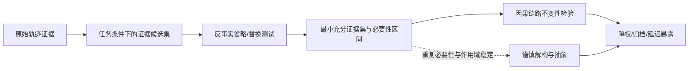
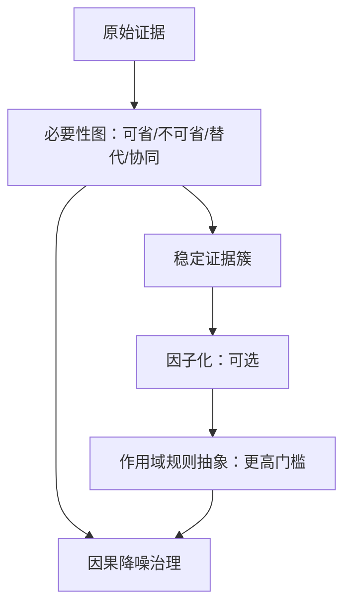
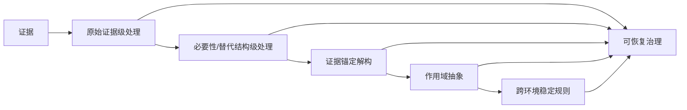

# 最小充分证据的因果降噪遗忘框架：从先证明可省到安全降权

## 0. 这份文档要探索什么

现有主线把“因果推断能力”理解为：先对轨迹进行解构，再对因子进行抽象，最后估计因子对行动或结果的因果效应。这条路线有理论吸引力，但也存在一个危险的前置假设：**解构器必须先把自然语言轨迹正确拆成相对稳定的因果成分**。一旦实体、关系、时间、否定或作用域被错误拆分，抽象器可能把解构误差放大成新的规则噪声；遗忘器随后又会对这些伪规则进行强化、降权或删除。

本方案不是放弃解构，也不是退回时间衰减或普通检索过滤，而是把因果问题的顺序改写为：

> **先在原始证据上证明哪些信息可以被省略而不改变因果链路，再把经过验证的可省略部分转化为降权、归档或延迟暴露动作；只有当重复的必要性证据足以支持跨情境复用时，才进行较高层的解构与抽象。**

这里的“最小充分证据”不是单纯的摘要压缩，也不是“回答变短即可”。它要求在给定任务、历史和环境下，从原始候选证据中寻找一个尽可能小、但足以维持关键因果约束和行动结果的证据集。遗忘因此首先表现为一种**受反事实约束的因果降噪**：证明某些证据对当前因果链没有必要，再减少其默认可见性，而不是先相信一个可能错误的抽象表示。

本方案是思维发散和候选研究框架，不把任何尚未完成的公开 benchmark 结果写成结论。它的价值在于为现有“解构—抽象—因果治理”增加一条更保守、可回退、可与原始证据直接对齐的路径。

## 1. 核心命题与一条反向路径

### 1.1 从“理解后遗忘”改为“验证可省后遗忘”

原有路径可以写成：

候选的新路径为：

这个顺序的差别是：解构不再承担全部因果识别责任，而成为一种**可选的后验压缩和跨任务复用机制**。当解构质量不足时，系统仍可以在原始证据级别进行因果治理；当某些证据束在多个环境中反复呈现稳定必要性时，才允许将其提升为因子或规则候选。

### 1.2 可证伪的一句话命题

> 在固定任务、候选流、reader 和资源预算下，若一个原始证据片段或证据簇被遮蔽、替换或延迟暴露后，关键因果链路和行动约束保持不变，则该证据可以被视为当前条件下的可省信息；累积多个环境中的此类证据后，系统可以在不显著增加错误遗忘的情况下，把默认访问从“保留全部”转为“按需回退”。

这不是“任何不影响答案字符串的证据都可遗忘”。关键是先定义什么必须保持不变。

## 2. 与现有文献和已有项目路线的区分

下表不是说相邻工作没有启发，而是明确本方案不把已有机制重新命名为新贡献。

| 已有路线 | 已覆盖的核心问题 | 本方案不重复的部分 | 仍可能形成的差异 |
| --- | --- | --- | --- |
| FadeMem | 时间、频率、语义相关性驱动的衰减与融合 | 不提出新的衰减函数作为核心 | 用反事实必要性而非访问/相似度决定“可省”；衰减只是验证后的动作 |
| Oblivion | 访问可达性衰减、不确定性门控读写 | 不把“何时读”本身宣称为新遗忘范式 | 读前先估计证据是否改变因果链，而非仅依据不确定性或响应贡献 |
| Memory Worth | 成功/失败共现计数 | 不把结果反馈称为因果贡献 | 以遮蔽/替换下的链路变化和条件效应区分旁观记忆、保护记忆与真正必要证据 |
| DeMem | 以决策失真定义压缩边界 | 不重复“压缩应服务决策”这一原则 | 把“决策保持”细化为因果链路不变性、约束不变性和行动方向不变性，并用证据级必要性测试寻找可省集合 |
| SAGE / 写入门控 | 新颖性、冗余和写入成本控制 | 不把新颖性或密度作为因果价值 | 写入后仍可通过后验省略测试判断哪些已存证据可降权；不依赖新颖性推断行动必要性 |
| 结果反馈与程序经验路线 | 用成功、失败、技能或反思更新记忆 | 不提出一般性的反馈强化或技能巩固 | 将反馈用于生成反事实测试目标和保护性约束，而不是直接累加记忆价值 |
| 现有反事实遮蔽/消融基线 | 检查移除内容后的性能变化 | 不把单次消融直接等同于长期遗忘策略 | 将多证据集合、替代/协同、任务完成度与状态迁移整合为“省略证明—治理动作”闭环 |
| 本项目原有解构—抽象方案 | 构造可寻址因子和有作用域规则 | 不否定其作为高质量表示接口的作用 | 将其从强前置条件改为分级升级：原始证据级治理 → 因子级治理 → 规则级复用 |

因此，潜在的新问题不是“有没有用反事实”“有没有决策压缩”，而是：**能否把证据级反事实必要性测试变成一种保守的、可积累的、面向长期状态治理的因果降噪过程，并把解构只放在必要时使用。** 该差异仍需文献逐篇核验，不能在论文中写成未经检索支持的绝对“首次”。

## 3. 关键概念：最小充分证据不是最短摘要

### 3.1 条件化候选集

在决策时刻 (t)，令 (C_t={e_1,ldots,e_n}) 为同一候选流中的原始证据块、版本、来源句或已审计证据簇。给定任务状态 (H_t)、当前查询/子目标 (q_t)、工具和权限条件 (Gamma_t)，系统不要求先为每个 (e_i) 赋予语义因子类型。

### 3.2 充分性应由一组保持条件定义

令 (K_t) 为必须保持的因果不变量向量，而不是单一答案准确率。可包含：

1. **行动方向不变量**：最终选择的关键动作、工具调用或风险处置方向不改变；
2. **因果顺序不变量**：必要的条件—机制—结果依赖关系不被倒置；
3. **约束满足不变量**：安全、权限、时间有效性、用户偏好和任务硬约束仍满足；
4. **关键结果不变量**：任务是否成功、是否违反关键约束、是否触发高损失事件不改变；
5. **可追溯不变量**：对高风险结论仍能回溯到至少一个有效来源；
6. **状态迁移不变量**：当前保留、降权、归档或恢复的治理结论不因表面描述变化而反转。

答案完整度、解释长度、措辞质量、次要例证数量可以被放入软指标 (J_t)，允许在一定范围内下降。这样，“不降低回答/行动质量”可以被更精确地放宽为：**不改变关键因果链路和硬约束，允许非关键完成度下降。**

### 3.3 最小充分证据集（MSES）

定义一个候选证据子集 (Ssubseteq C_t) 在容差 (epsilon_K) 下充分，当：

$$
\Pr\left(K_t(Y(S))=K_t(Y(C_t))\mid H_t,q_t,\Gamma_t\right)\ge 1-\epsilon_K,
$$

并且 (S) 在代价意义下不可再删：

$$
\forall e_i\in S,quad
\Pr\left(K_t(Y(S\setminus\{e_i\}))\neq K_t(Y(S))\right)>\delta_i.
$$

这里的 (Y(S)) 可以来自真实 reader 的回放、受控 simulator、工具执行结果或人工审计，而不是只看语言模型是否生成了相同答案。若存在多个等价的最小集合，不应强制选择唯一解释，而应保留一个**必要性区间**：

$$
\mathcal S_t^{\min}=\{S: S\text{ 满足充分性且近似最小}\}.
$$

这个集合族比单一“因果因子标签”更保守，也可以自然表达替代关系与协同关系。

## 4. 因果核心：证明可省本身就是一种遗忘

### 4.1 省略处理而非删除处理

对证据 (e_i)，定义处理不是“从数据库删除”，而是工作区层面的可逆操作：

$$
B_{t,i}\in\{\text{expose},\text{mask},\text{delay},\text{replace-by-pointer},\text{retrieve-on-demand}\}.
$$

基础近端 estimand 为：

$$
\tau_{t,i}^{K}(H_t)=
\mathbb E\left[K_t(Y_t(B_{t,i}=\text{expose}))-
K_t(Y_t(B_{t,i}=\text{mask}))\mid H_t\right].
$$

为了允许完成度下降，同时定义软损失：

$$
\tau_{t,i}^{J}(H_t)=
\mathbb E\left[J_t(Y_t(\text{expose}))-J_t(Y_t(\text{mask}))\mid H_t\right].
$$

典型判断不是简单要求 (	au^J=0)，而是：

$$
|\tau_{t,i}^{K}|\le \epsilon_K,\qquad
\tau_{t,i}^{J}\le \epsilon_J,
$$

其中 (epsilon_J) 可以大于零，表示允许回答更短、解释不完整或次要证据缺失，只要硬因果不变量保持。

### 4.2 从单条必要性到集合必要性

单条遮蔽不足以处理替代和协同：两条证据各自被遮蔽可能都无影响，但同时遮蔽会破坏行动；或者两条证据互相替代，删掉任意一条都不改变结果。因而至少需要三类测试：

- **边际省略测试**：估计单条证据的局部必要性；
- **簇级省略测试**：估计互补证据束的联合必要性；
- **替代集测试**：寻找多个可互换的充分证据集合，避免错误保留冗余副本。

由此，治理对象不是孤立 token，而是证据集合的必要性结构。解构只有在该结构已被观察到稳定重复时，才有理由把证据集合命名为一个因子或规则。

### 4.3 序贯因果问题

一次成功的省略不能保证长期安全。系统需要记录历史 (H_t)、候选集合、策略 propensity、共同暴露、采用证据、行动、结果和下一状态，并使用静态 DR、MSM 或 sequential DR/OPE 评估长期策略：

$$
V^\pi(H_0)=\mathbb E^\pi\left[\sum_{t=0}^{T}\gamma^t
\left(R_t-\lambda_K L_t^K-\lambda_C C_t\right)\right],
$$

其中 (L_t^K) 是因果不变量违反，(C_t) 是 token、延迟、存储和回退成本。这里的因果推断仍是主线：它不只是估计“某条记忆是否有用”，而是估计“在什么历史和策略下，将其改为延迟/遮蔽/指针访问是否改变未来状态与行动”。

## 5. 一个完整的框架：Causal Sufficiency Denoising（候选名称）

名称暂定为 **Causal Sufficiency Denoising, CSD**，仅作为工作标签，不应直接写入论文。

### 5.1 模块一：证据账本与可逆视图

原始事件进入不可变账本，保留来源、时间、主体、任务、工具版本、权限、撤回和版本关系。所有省略首先只发生在工作区视图，不物理删除原始证据。这样能把“不可见”与“不可恢复”严格分离。

### 5.2 模块二：候选证据束生成

候选证据束可由 session、turn、来源句、时间窗口、版本链或检索邻域组成。初始阶段允许使用低语义假设的切分方式；其目标是提供可干预地址，不宣称已经发现因子。候选束应记录 hash、来源跨度和共同暴露关系。

### 5.3 模块三：主动省略试验

在安全回放或低风险在线探索中，治理器以小概率执行 mask、delay、pointer replacement 或 cluster ablation。探索概率必须写入日志，并满足 overlap；生产环境不得对高风险约束做无保护随机删除。

试验选择可以由不确定性驱动：优先测试对效应估计最不确定、但潜在成本最低的证据；对高风险、低 overlap 证据则采取保守保留，而不是强行估计。

### 5.4 模块四：因果链路评估器

评估器分别输出：

- (\hat\tau^K)：硬因果不变量效应；
- (\hat\tau^J)：软完成度效应；
- 置信区间、有效样本量、propensity overlap；
- 证据是否存在替代、协同或冲突；
- 任务/主体/时间/工具版本切片上的稳定性。

只有“硬不变量安全、软损失可接受、估计不确定性受控”的证据，才可进入可省候选集。

### 5.5 模块五：必要性图而非强语义因果图

系统先维护一个较弱的必要性图：节点是证据束，边表示替代、协同、冲突、版本支配或共同必要。它不宣称完整 SCM，也不强迫语言模型给出真实机制。只有当某类关系在多环境中稳定、来源覆盖充分且效应符号一致时，才允许升级为因子/规则图。

这给原有解构—抽象框架一个新的位置：

即：**必要性图是低噪声中间层，因子与规则是经过多轮证据验证后的高级表示。**

### 5.6 模块六：四态或五态治理状态机

建议至少区分：

1. `protected`：可能承载关键约束或高误删代价，默认保留；
2. `active`：当前任务高概率需要，正常暴露；
3. `deferred`：已证明当前条件下可省，保留指针与恢复入口；
4. `archived`：长期默认不暴露，但在触发条件或回退请求下恢复；
5. `retracted`：由合规、撤回或确定失效流程处理，不由普通因果分数直接删除。

状态迁移依据的是 (\hat\tau^K)、(\hat\tau^J)、风险和成本，而不是一个不可解释的 importance score。

### 5.7 可并行探索的五条因果分支

“最小充分证据”可以发展成不同的 estimand 和治理接口，不必一开始锁死为一种算法。以下分支共享同一个证据账本、可逆处理和因果日志，但回答的问题不同：

| 分支 | 核心问题 | 可能的处理 | 与解构的关系 | 首要风险 |
| --- | --- | --- | --- | --- |
| **必要性分支** | 删除/延迟哪组证据会破坏硬因果链？ | mask、delay、pointer replacement | 不依赖高层解构；可作为最低噪声主线 | 回放 evaluator 可能只看表面答案 |
| **信息价值分支** | 当前任务是否值得支付访问某证据的成本？ | retrieve-on-demand vs no-retrieve | 解构只用于缩小候选或解释成本 | 把“有信息”误当“有因果效应” |
| **不变性分支** | 哪些证据在环境变化后仍保持必要性？ | 跨环境保留/隔离 | 稳定集合可再升级为因子 | 环境划分不足导致伪稳定 |
| **安全约束分支** | 哪些低频证据即使均值效应小也不能省？ | protected veto、保守归档 | 解构可提供约束类型，但不能单独授权删除 | 风险阈值过保守，资源收益有限 |
| **策略价值分支** | 哪种长期可见性策略在固定预算下更优？ | deferred/archive/restore policy | 解构是策略特征之一，不是唯一处理单位 | OPE overlap 差、长期效应难识别 |

这五条分支可以形成逐层实验，而不是堆成一个不可归因的大模型。最先验证必要性分支；若其收益主要来自“是否需要检索”而不是证据本身，再转向信息价值分支；若收益只在稳定环境成立，再引入不变性约束；只有在这些基础上，才值得训练更复杂的解构器和抽象器。

## 6. “回答完成度可以下降”如何严格化

这是本方案最重要的放宽，但必须避免变成“答案差一点也算成功”。建议采用三层结果契约：

| 层级 | 必须保持什么 | 是否允许下降 |
| --- | --- | --- |
| L0：因果与安全硬约束 | 行动方向、关键因果顺序、权限/时间/安全边界、关键事实真值 | 不允许，违反即视为不可省 |
| L1：任务结果 | 成功/失败、关键工具调用、主要决策和约束满足 | 仅允许预注册的极小容差 |
| L2：表达与完成度 | 解释长度、次要例子、风格、冗余证据、非关键细节 | 可以下降，但必须记录成本收益 |

因此，某证据被省略后回答从“完整解释五条理由”变成“给出两条关键理由”，若行动、约束和主要因果链不变，可以视为安全降噪；若回答仍看似正确但把“因为 A 所以 B”改成了错误方向，哪怕最终字符串偶然相同，也不能视为可省。

可把最终接受规则写成：

$$
\mathrm{AdmitToDeferred}(e_i)=1\iff
\begin{cases}
\mathrm{LCB}(\Delta K_i)\le \epsilon_K,\\
\mathrm{UCB}(\Delta J_i)\le \epsilon_J,\\
\mathrm{Risk}(e_i)<\rho,\\
\mathrm{Coverage}(e_i)\ge \theta_P,\\
\mathrm{Overlap}(e_i)\ge \theta_O.
\end{cases}
$$

其中保守的置信界优先于点估计；高风险证据即使均值上可省，也可以保持 `protected`。

## 7. 与原有解构—抽象主线的兼容方式

本方案不是另起炉灶，而是把原有主线改成分级资格链：

每一级都能独立停止，不要求系统一定走到规则抽象：

- 若原始证据的省略效应已经可估计，直接做证据级降权；
- 若发现替代/协同结构，做证据簇级治理；
- 若必要性结构跨环境重复，才进行因子化；
- 若因子效应、作用域和证据支持稳定，再进行规则抽象。

这样可以把解构误差限制在局部升级路径，而不是让一次错误解析污染整个遗忘系统。

## 8. 关键研究问题与可证伪假设

### RQ1：证据级必要性是否足以支持因果降噪

在不生成高层规则的情况下，证据遮蔽/延迟是否能识别出安全可省集合，并降低 token 或暴露噪声？

### RQ2：硬因果链路与软完成度是否应该分离

允许 L2 完成度下降，是否能显著增加可省证据量，同时不增加 L0/L1 违反？

### RQ3：必要性图是否比直接解构更抗噪

在实体替换、句式变化、同名不同机制、否定和时间冲突场景中，必要性图是否比 POS/关键词/一次性 LLM 解构更少产生错误规则？

### RQ4：何时值得升级为抽象

跨环境重复的必要性集合、替代结构和效应符号稳定性，能否成为抽象规则激活的准入标准？

### 可证伪假设

- **H-S1（安全省略）**：证据级省略策略在固定 reader 和候选流下，可在不增加 L0/L1 违反的前提下减少 L2 冗余、token 或默认暴露量。
- **H-S2（放宽完成度）**：相较“答案字符串完全一致”的约束，硬因果链路不变 + 完成度容差能找到更多稳定可省证据，且不增加关键行动错误。
- **H-S3（抗解构噪声）**：必要性图在低至中等语义解析噪声下，比直接规则抽象具有更缓慢的性能退化。
- **H-S4（分级升级）**：只有将多环境稳定必要性证据升级为因子/规则时，规则级治理才会相对证据级治理带来额外 OOD 收益；若升级不带来增益，应停留在证据级。
- **H-S5（长期策略）**：使用序贯 DR/OPE 选择 `deferred/archive/retrieve-on-demand` 的策略，比静态重要性或成功共现治理在固定预算下具有更好的效用—风险帕累托前沿。

任一假设不成立，都应缩小主张，而不是靠增加抽象层或调参弥补。

## 9. 评估设计：把“可省”与“该降权”分成两步

### 9.1 第一步：省略证明（evidence necessity audit）

对每个问题包生成原始候选集，进行遮蔽、延迟、指针替换和簇级消融。报告：

- L0/L1 硬不变量保持率；
- L2 完成度损失与 token 节省；
- 证据必要性 precision/recall；
- 替代集和协同集识别准确率；
- 置信区间覆盖、overlap、有效样本量。

### 9.2 第二步：治理迁移

把通过省略证明的证据迁移为 `deferred` 或 `archived`，在后续任务中观察恢复和漂移：

- 关键证据恢复成功率；
- 过时证据错误采纳率；
- rare-critical violation；
- 状态迁移延迟；
- 恢复后是否仍能回溯原始来源；
- 资源成本和 OPE 与实际部署值的差距。

### 9.3 必须保留的对照

不应只与弱基线比较，至少包括：Raw evidence、BM25/dense/hybrid、Recency/Frequency、FadeMem、Oblivion、Memory Worth、DeMem，以及本项目原有的 item-level causal、risk-gated decomposition–abstraction。新方案还需做：

1. 证据级无抽象；
2. 必要性图但不因子化；
3. 解构但不抽象；
4. 解构—抽象联合；
5. 规则无证据回退；
6. 硬约束完全保持 vs 允许 L2 完成度下降。

比较的核心不是单一 QA 分数，而是任务效用—硬约束风险—token/延迟—恢复成本的帕累托前沿。

## 10. 可能形成的真正贡献与不应声称的内容

### 10.1 可能形成的贡献

若实验成立，贡献可以谨慎表述为：

1. 将 Agent Memory 遗忘形式化为**证据级因果必要性测试到可恢复治理动作**的两阶段问题；
2. 提出区分硬因果链路与软回答完成度的充分性准则；
3. 提出在低语义承诺下维护证据必要性/替代/协同结构，并按证据稳定性逐级升级到因子和规则；
4. 给出“先证明可省，再决定是否降权”的序贯日志、微干预与 OPE 协议。

### 10.2 不应提前声称

- 不能声称最小充分证据自动等于真实因果变量；
- 不能声称一次遮蔽测试证明长期可遗忘；
- 不能声称允许完成度下降就必然提高鲁棒性；
- 不能把 DeMem 的决策充分性、已有反事实消融或普通读时过滤重新包装为独立创新；
- 不能在没有逐篇核验文献和统一实验的情况下声称“首次”“超越 SOTA”；
- 不能把必要性图称为完整结构因果模型，除非另有识别假设和干预证据。

## 11. 最小可行实验路径

### P0：先做证据级闭环

在现有 simulator 和统一 runner 中，把“因子噪声”替换为原始证据束的 mask/delay/pointer 操作。保持 candidate-stream hash、workspace budget、reader 和 evaluator 不变。先验证 L0/L1/L2 指标可以被稳定记录。

### P1：做必要性结构压力测试

加入替代、协同、同名不同机制、时间更新、撤回、低频高冲击和失败保护者场景。比较边际遮蔽、簇遮蔽和必要性图策略，报告噪声退化曲线。

### P2：接入 LongMemEval 证据审计切片

使用已有 Gate A 的 `query_required_factor_ids` 思路，但先将其改为原始证据必要性标注：哪些 source/session/turn 被删除后会破坏 L0/L1，哪些只降低 L2 完成度。不要把最终答案字符串作为唯一金标。

### P3：再引入解构与抽象

只在必要性集合跨题型、主体或时间环境重复后，测试 factor sidecar 和 scoped rule sidecar 是否有增量。如果没有增量，保留证据级方案作为主方法，不因“必须有抽象”而强行升级。

### P4：序贯治理与外部复验

在固定预算下比较 `keep-all`、证据级 deferred、必要性图、解构—抽象联合和现有强基线；使用 DR/OPE 选择策略，再用独立回放验证实际价值。

## 12. 当前判断

这条路径的合理性不是因为它绕开了解构，而是因为它把解构放回了应有的位置：**解构是对已验证稳定结构的命名与复用工具，不应是每次遗忘决策都必须信任的前置真相。**

它也保留了因果推断的核心：处理仍是暴露、遮蔽、延迟或替换；目标仍是反事实结果、序贯策略价值和风险约束；差别只在于首先估计“证据是否必要”，而不是首先估计一个可能错误的语义因子的效应。

最值得优先验证的窄问题是：

> **在不改变关键因果链路和硬约束、允许非关键回答完成度下降的条件下，证据级最小充分集合能否在固定预算下减少默认暴露，并在后续任务中通过可恢复回退保持性能？**

如果答案为“能”，解构—抽象可以作为第二阶段的跨情境复用增强；如果答案为“不能”，则说明问题不在解构噪声，而在证据候选、reader、因果识别或任务评估本身，应据此收缩框架。

## 相关文档

- [[03-因果推断驱动的Agent Memory遗忘框架论文方案|因果推断驱动的 Agent Memory 遗忘框架论文方案]]
- [[06-解构抽象能力的学术化界定与因果架构融合|解构—抽象能力的学术化界定与因果架构融合]]
- [[05-解构抽象因果遗忘框架阶段性可行性判断|阶段性可行性判断]]
- [[experiments/semantic_gate_a/LongMemEval语义解构Gate-A标注规范|LongMemEval 语义解构 Gate A 标注规范]]
- [[experiments/统一AgentMemory工作流Runner初步实验报告|统一 Agent Memory 工作流 Runner 初步实验]]
- [[experiments/LongMemEval-S表示对照实验报告|LongMemEval-S 表示对照实验]]
- [[experiments/LongMemEval-S可审计关系Sidecar实验报告|LongMemEval-S 可审计关系 Sidecar 实验]]
