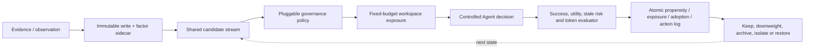

# 统一 Agent Memory 工作流 Runner 初步实验

## 1. 目的与边界

本实验把论文架构中的证据写入、因子 sidecar、候选检索、有限工作区、记忆暴露、Agent 决策、结果评估、propensity 日志和可恢复状态迁移接入同一个可运行 runner。所有策略接收完全相同的候选记忆流、任务序列、12项工作区预算和 evaluator。它只验证工程闭环与公平比较接口，不包含真实 LLM、真实语义解构器或公开 benchmark，不能作为 SOTA 结果。

实现位于 `prototype/unified_agent_memory_runner.py`，事务存储位于 `prototype/causal_memory_store.py`。每个 seed 的候选与任务生成 canonical SHA-256；若不同策略的 stream hash 不一致，runner 直接失败。

## 2. 通用工作流

图中策略插件仅改变治理评分；候选流、预算、Agent 和 evaluator 保持一致。存储后端是 SQLite 原型，但证据、因子和规则是逻辑谱系对象，不要求正式系统采用固定物理分层。

## 3. 协议

- 30 个随机种子；每 seed 100 个任务；
- 32 个候选记忆：rare-critical、common-useful、stale 和 noise；
- 工作区预算：12项；
- 表示组噪声：0.2；
- 策略：recency、frequency、fade-like、outcome-feedback-like、item-level causal、risk-gated decomposition–abstraction；
- stale exposure 不被设为自动失败，而是从每步 utility 中扣除0.35，避免 evaluator 人为把简单策略全部清零；
- 每步记录候选、策略动作、propensity、暴露、采用、Agent 动作、success、utility 与下一状态动作。

## 4. 30-seed 结果

| 策略 | Task success / required recall | Average utility | Stale exposure | Rare-critical recall | Positive precision | Avg. workspace tokens |
| --- | ---: | ---: | ---: | ---: | ---: | ---: |
| Recency | 0.417±0.101 | 0.067±0.101 | 1.000 | 0.000 | 0.056 | 360.7 |
| Frequency | 0.710±0.012 | 0.360±0.012 | 1.000 | 0.000 | 0.214 | 361.3 |
| Fade-like | 0.527±0.096 | 0.177±0.096 | 1.000 | 0.000 | 0.081 | 360.2 |
| Outcome-feedback-like | 0.555±0.089 | 0.205±0.089 | 1.000 | 0.000 | 0.114 | 356.3 |
| Item-level causal | 0.891±0.053 | 0.891±0.053 | 0.000 | 0.217±0.073 | 0.739 | 360.8 |
| Risk-gated joint | **0.991±0.018** | **0.991±0.018** | **0.000** | **0.833±0.079** | **0.939** | 359.7 |

所有策略的 decision-log completeness 均为1.0，每 seed 每策略均产生20次可审计治理状态迁移。Risk-gated 方法在近似相同 token 预算下超过 item-level causal，并显著提高低频关键记忆召回；该结果来自受控候选特征和效应代理，只支持 runner 接口与机制组合可执行，不支持真实 benchmark 泛化。

## 5. 工程结论

1. 通用 Agent Memory 的写入—检索—使用—反馈—状态更新闭环可以在不固定物理分层的情况下实现；
2. 同一 candidate-stream hash 和统一 evaluator 可以防止把更强检索器或更大上下文的收益归因于治理算法；
3. 决策级 propensity、exposure、adoption 和 outcome 可原子化记录，为 DR/MSM/OPE 提供输入；
4. `downweight / archive / isolate / restore` 已形成可恢复事务路径；
5. 下一步仍必须将 controlled Agent 替换为 LongMemEval/GoodAI-LTM/LoCoMo 的统一 reader，并接入真实 Gate A parser 与公开遗忘 baseline。

## 6. 可复现文件

- `prototype/unified_agent_memory_runner.py`；
- `prototype/unified_agent_memory_runner.json`；
- `prototype/test_unified_agent_memory_runner.py`；
- `prototype/causal_memory_store.py`；
- `prototype/test_causal_memory_store.py`。
