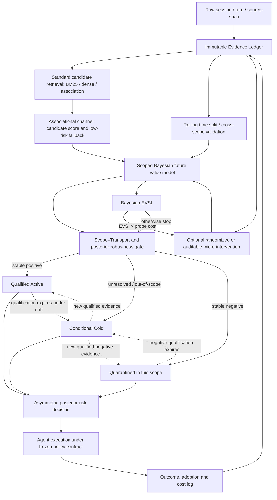
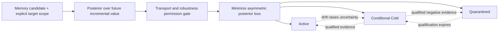

# 贝叶斯作用域迁移门控与非对称访问动态设计提案

> **版本状态更新（2026-08-08）：** 本候选 v4 已被上级目录的 SQCAD 作业二正式稿 `../08-作业二-SQCAD完整方案-20260808.md` 取代，不再作为当前作业二框架。该文件及 09/10 图仅保留为设计历史和对照；其中 Bayesian inference、default-cold 和非对称分层均不再单列为核心贡献。

> 状态：候选 v4，尚未获得正式实验支持；不得覆盖 v3 的已验证结论。  
> 目的：在不恢复复杂语义解构、不过度承诺因果识别的前提下，把未来不确定性、作用域差异和错误代价不对称统一为可复现的记忆访问决策。  
> Introduction 已可定稿，本提案只讨论 Introduction 之后的 Method、数据、基线、消融和工程流程。

## 交付资产

- 全流程工程图（PNG）：[09-Bayesian-Scope-Transport-Full-Framework.png](框架图/09-Bayesian-Scope-Transport-Full-Framework.png)
- 全流程工程图（SVG）：[09-Bayesian-Scope-Transport-Full-Framework.svg](框架图/09-Bayesian-Scope-Transport-Full-Framework.svg)
- 核心机制图（PNG）：[10-Bayesian-Scope-Transport-Core-Framework.png](框架图/10-Bayesian-Scope-Transport-Core-Framework.png)
- 核心机制图（SVG）：[10-Bayesian-Scope-Transport-Core-Framework.svg](框架图/10-Bayesian-Scope-Transport-Core-Framework.svg)
- 可复现渲染脚本：`框架图/render_bayesian_scope_transport_framework.py`

## 0. 一句话论证、核心边界与术语

### 0.1 一句话论证

在历史暴露由 Agent 策略与环境共同生成、且记忆价值会随任务、用户、工具、模型版本和时间变化的条件下，我们不把历史成功共现直接固化为长期记忆权重，而是估计一条记忆在明确未来作用域中的价值后验，用作用域可迁移性与后验稳健性控制持久治理权限，并以错误保留、错误遗忘和访问成本不对称的后验期望损失决定热访问、条件冷访问、作用域隔离或继续审计。

### 0.2 本提案回应的 Research Gap

> **Agent Memory 的价值信号由历史策略、历史环境和记忆暴露共同生成，但现有生命周期治理通常缺少对未来作用域可迁移性、认识不确定性和非对称未来损失的联合控制，因而容易把历史相关性错误固化为跨时间、跨任务的长期访问策略。**

该 Gap 包含三个不可互换的问题：

1. **相关不等于因果**：历史共现只能说明在既有轨迹中一起出现，不能自动获得改变持久访问权的资格；
2. **现在不等于未来**：即使历史上有效，也必须说明对未来时间、版本和环境的可迁移边界；
3. **这个不等于那个**：同一记忆在不同用户、任务、工具和风险下可以具有不同价值，错误保留与错误遗忘的损失也不同。

### 0.3 贝叶斯方法能够和不能够做什么

贝叶斯方法能够：

- 用分布而非单点分数表达未来价值及其不确定性；
- 在数据稀疏时对显式作用域进行保守的部分池化；
- 让时间与环境漂移表现为后验不确定性增加，而不是把“很久没用”直接解释为“已经无用”；
- 把门控、分层访问、非对称损失和探测价值统一到同一决策问题；
- 输出可校准、可撤回、可做先验敏感性分析的访问动作。

贝叶斯方法不能：

- 把混杂的观察数据自动变成因果证据；
- 在缺少 overlap、随机暴露或可信识别假设时恢复不可识别的处理效应；
- 保证模型失配或分布外条件下的后验一定校准；
- 仅靠一个“贝叶斯分数”证明跨时间、跨版本可迁移。

因此，本方法应称为 **Bayesian Scope–Transport-Gated Asymmetric Access Dynamics**，而不能称为“贝叶斯因果记忆”。

### 0.4 术语账本

| 规范术语 | 定义 | 不应混称 |
|---|---|---|
| Evidence Ledger | 不可覆盖的 session/turn/source-span 原始证据与版本化日志 | 长期访问权重 |
| Associational Signal | 由历史共现、相关性、频率、语义匹配得到的候选信号 | 因果效应、未来真值 |
| Predictive Transport Evidence | 严格时间切分或跨作用域验证得到的未来预测证据 | 干预因果证据 |
| Interventional Audit Evidence | mask/expose/delay/replace 等可审计干预产生的证据 | 普通成功/失败反馈 |
| Scoped Future-Value Posterior | 在明确作用域和未来时点下的记忆增量价值分布 | 全局永久价值分数 |
| Transport Gate | 判断当前后验能否用于目标作用域的支持度与稳健性权限门 | 因果识别器 |
| Access Layer | Qualified Active、Conditional Cold、Quarantined 三种作用域访问状态 | 原始证据存亡状态 |
| Asymmetric Access Dynamics | 由后验损失决定的方向与速度不同的访问状态变化 | 统一时间指数衰减 |

## 1. 方法论与世界观

### 1.1 认识论：记忆价值是可修正信念，不是历史事实

一条记忆“有用”不是其不可改变的内在属性，而是关于未来条件下增量效用的暂时信念。单点价值分数会掩盖样本量、冲突证据和分布漂移；后验分布至少迫使系统同时表达估计值与不知道的程度。

### 1.2 时间观：遗忘首先应当是资格过期，而不是证据消失

时间本身不是负证据。没有新观测时，合理变化是未来价值的不确定性扩大；一条旧的正向记忆可因资格过期从热层回到中性冷层，但不能仅因时间流逝被写成负向记忆。旧的负向记忆同样不应成为永久惩罚：当作用域改变或负向资格失效时，应从隔离层回到冷层等待再验证。

### 1.3 作用域观：价值属于“记忆 × 条件”，不只属于记忆

作用域至少包含 task、user、tool、model version、policy version、environment regime 和 risk class。跨作用域共享只能形成先验，不能直接继承资格。该设计不需要把轨迹做成复杂语义因果图；最小寻址单元仍采用 session/turn/source-span pointer。

### 1.4 决策观：非对称来自未来损失，不来自情绪标签

“成功经历”不等于应长期保留，“失败经历”也不等于应快速删除。失败可能携带稀有安全约束，成功也可能只是特定版本下的偶然荣耀。机器的非对称治理应由错误保留和错误遗忘的未来代价决定，而不是简单模仿人类“记痛忘喜”或反向执行“记喜忘痛”。

### 1.5 最小性原则：贝叶斯只进入需要不确定性的环节

不把检索器、语义解构器和所有日志模型全部贝叶斯化。标准 BM25/dense/association 继续负责廉价候选；贝叶斯层只负责未来价值、迁移资格、访问决策和探测停止。这样可以避免以概率建模之名重新增加无可消融的复杂度。

## 2. 问题设定

对记忆单元 $m_i$、目标作用域 $s$ 和未来时点 $t$，定义在固定下游 Agent 策略与评测合同下的增量操作价值：

V_{i,s,t}=U_{s,t}(A_i=1)-U_{s,t}(A_i=0),

其中 $A_i=1$ 表示该记忆在决策前可访问，$A_i=0$ 表示被 mask 或不进入可访问上下文。该定义是一个决策对象；只有在随机或可识别暴露条件成立时，才可把其估计解释为因果效应。

框架维护三个不可混合的证据通道：

1. $D^{\mathrm{assoc}}$：普通轨迹共现，只更新候选排序和低风险当前访问；
2. $D^{\mathrm{transport}}$：严格时间后切分、跨版本或跨上下文验证，更新未来可迁移预测；
3. $D^{\mathrm{audit}}$：随机或可审计的 expose/mask/delay/replace，更新治理资格所需的干预后验。

普通 outcome 不得伪装成 $D^{\mathrm{audit}}$。在无法识别干预效应时，论文只能报告 transport-qualified predictive value，不能报告 causal value。

## 3. 贝叶斯未来价值模型

### 3.1 显式元数据作用域与保守部分池化

不恢复语义 hierarchy。仅对可审计元数据建立统计层级，例如：

V_{i,s,t}=\mu_i+b_{i,\mathrm{task}}+b_{i,\mathrm{tool}}
+b_{i,\mathrm{version}}+b_{i,\mathrm{regime},t}+\epsilon_{i,s,t}.

其中 $\mu_i$ 是跨作用域中心，$b$ 是作用域偏移。新作用域可以从相关作用域借用先验，但必须通过目标作用域数据更新后才获得资格。比较实验必须同时包括 global pooling、no pooling 和 hierarchical partial pooling，以检验部分池化是否真的减少方差而不造成负迁移。

### 3.2 时间与漂移：衰减不直接作用于证据或价值均值

推荐把无新证据下的时间演化写成不确定性膨胀：

\operatorname{Var}(V_{i,s,t+\Delta}\mid D)
=\operatorname{Var}(V_{i,s,t}\mid D)+\Delta\sigma^2_{\mathrm{drift},s}.

若存在可观测 regime change，则切换到新作用域后验或提高漂移方差。这样，时间会使正向或负向资格逐步失效并回到中性冷层，而不是把均值机械推向负值或把原始证据删除。

### 3.3 先验

- 新记忆采用以零附近为中心、方差较大的 skeptical prior，默认进入 Conditional Cold；
- 相关作用域只能提供层级先验，不能提供持久资格；
- 稀有安全约束可以通过较高 false-forgetting cost 得到保护，不能通过人为设定“永远有益”的先验保护；
- 需要报告弱信息先验、经验贝叶斯先验和稳健重尾先验的敏感性。

### 3.4 防止贝叶斯过度自信

持久动作不仅要求后验概率越过阈值，还应同时通过：

1. 目标作用域有足够支持度或有效样本量；
2. 时间/版本 shift 未超出预注册边界；
3. leave-one-regime-out 或 rolling-origin 后验预测覆盖合格；
4. 结论对合理先验与 likelihood tempering 不敏感；
5. 高风险动作具备相应等级的干预或外部验证证据。

任一条件失败，状态为 unresolved/out-of-scope，并进入 Conditional Cold，而不是直接维持热层或进入隔离层。

## 4. 门控、分层与非对称访问动态

### 4.1 三层访问状态与一个永久证据层

| 层 | 进入条件 | 默认访问 | 离开条件 |
|---|---|---|---|
| Qualified Active | 目标作用域下稳定正向，且持久热访问的后验损失最低 | 默认可访问、慢速重新验证 | 资格过期或漂移时回 Cold；稳定负向时进入 Quarantined |
| Conditional Cold | 新记忆、未决、弱证据或作用域外 | 仅在当前 query 匹配且风险允许时按需召回 | 正向合格晋升；负向合格隔离 |
| Quarantined | 对应作用域下稳定负向，且隔离的后验损失最低 | 默认 veto/不访问，但允许审计与显式恢复 | 负向资格过期时回 Cold；新正向证据可恢复 |
| Evidence Ledger | 所有来源与决策日志 | 不直接参与默认检索 | 不因访问状态变化而删除 |

关键区别：

- **新记忆默认 Cold，不默认 Hot**，从源头实现“少即是多”；
- **unresolved 不连续衰减到零，也不无限冻结在原热层**；它对应一个有限、中性的条件访问层；
- 旧资格因 scope/transport 失效而回 Cold，不等价于出现负证据；
- Quarantined 是作用域特定访问策略，不是永久删除。

### 4.2 非对称后验损失

设 $a\in\{H,C,Q\}$ 分别表示 Hot、Cold 和 Quarantined。最小损失可以写为：

L(H,V)=C_H(s,r)(-V)^+ + \lambda_{\mathrm{token}},

L(C,V)=C_{\mathrm{FF},C}(s,r)(V)^+
+C_{\mathrm{miss},C}(s,r)(-V)^+ + \lambda_{\mathrm{lookup}},

L(Q,V)=C_{\mathrm{FF},Q}(s,r)(V)^+ + \lambda_{\mathrm{restore}}.

访问动作由后验贝叶斯风险决定：

a^*_{i,s,t}=\arg\min_a
\mathbb E_{p(V_{i,s,t}\mid D,s,t)}[L(a,V)].

其中 $C_H$ 表示错误保留有害记忆的代价，$C_{\mathrm{FF}}$ 表示错误忘记有益记忆的代价。二者随任务风险和作用域改变，而不是由“成功/失败”标签直接指定。

### 4.3 门控的精确定义

门控不是另一个相关性打分器。它回答两个权限问题：

1. 当前后验能否迁移到目标作用域？
2. 当前最优动作是否在后验、先验和漂移扰动下足够稳定，足以改变持久访问状态？

只有答案均为“是”，$a^*$ 才能改变 persistent access policy。否则，当前任务仍可使用受风险折扣的 associational fallback，但持久状态保持或回到 Conditional Cold。

### 4.4 贝叶斯探测与唯一预算原则

对候选干预 $q$，计算一次新证据的期望样本信息价值：

\operatorname{EVSI}(q)=
\mathbb E_{y\sim p(y\mid q,D)}
\left[
\min_a\mathbb E[L(a,V)\mid D]
-\min_a\mathbb E[L(a,V)\mid D,q,y]
\right].

仅当 $\operatorname{EVSI}(q)>C_{\mathrm{probe}}(q)$ 时执行 probe。该规则已经同时承担预算分配和停止职责，不再增加 task-adaptive cap。

## 5. 全流程工程图

## 6. 核心流程图

## 7. 在线与异步流程

### 7.1 在线路径

1. 标准检索器从 Evidence Ledger 的可寻址指针生成共享候选；
2. 对每个候选读取目标 scope 下的后验摘要和访问层；
3. Active 默认进入工作区，Quarantined 默认 veto，Cold 仅在 query match 和风险允许时条件召回；
4. 记录 candidate、exposure、position、adoption、action、outcome、cost、model/tool/evaluator version；
5. 普通 outcome 只更新 associational/transport 通道，不直接更新干预因果后验。

### 7.2 异步治理路径

1. 对高不确定且可能改变访问动作的候选计算 EVSI；
2. 选择少量可审计 probe 或等待未来时间切片；
3. 更新作用域后验并执行 posterior predictive check；
4. 通过 transport 与稳健性门后，按后验损失更新层级；
5. 所有状态变化写入 versioned decision log，并保留 source pointer 与撤回原因。

## 8. 为什么它可能优于当前 v3

当前 v3 已支持“unresolved 不应驱动持久衰减”，但平均多保留约 32.6% 热记忆，尚未实现活跃记忆层面的“少即是多”。本提案通过三个新假设尝试解决该缺口：

1. **Default-Cold**：新记忆不再自动成为热记忆，只有未来价值合格后才晋升；
2. **Uncertainty Inflation**：旧资格会因漂移失效并回到冷层，但不会被误写为负向或删除；
3. **Posterior-Loss Layering**：热、冷、隔离由未来损失而非统一时间常数决定。

贝叶斯部分也可能改善当前 causal probe 的稀疏性问题：显式作用域部分池化可以降低方差，后验 EVSI 可以优先探测最可能改变动作的候选。但这只是新假设，不能把 v3 的负结果改写成“其实已经有效”。

## 9. 与已有工作的边界

不能把以下部分单独声称为创新：

- gate、uncertainty-gated retrieval；
- accessibility decay、再激活或双层/多层记忆；
- 时间、频率和相关性驱动的差异衰减；
- Bayesian update、hierarchical Bayesian model 或 EVSI；
- uncertain memory 不应直接删除；
- 决策导向压缩或 forgetting cost。

如果本提案最终有新意，应当落在下列联合契约，而不是其中任一零件：

> 在策略生成的 Agent Memory 生命周期中，把显式目标作用域下、经未来迁移和后验稳健性检验的证据规定为改变 persistent access policy 的必要权限；以 default-cold 中性层承接未决和作用域外记忆，并以风险特定的非对称后验损失控制 Active、Cold 与 Quarantined 之间的可撤回动态，同时保持 Evidence、Belief 与 Access 分离。

该表述仍需对 Bayesian memory gating、Bayesian forgetting、contextual bandit memory 和 non-stationary Bayesian decision 文献做全文审计，不能直接使用“首次”。

## 10. 数据与实验设计

### 10.1 D0：受控机制世界

新增以下预注册因素：

- abrupt 与 gradual regime shift；
- task/tool/model version 改变；
- hitchhiker/confounding；
- scope similarity 从完全无关到部分可共享；
- 稀有保护性正价值记忆与高危负价值记忆；
- 不同错误保留/错误遗忘成本比；
- prior misspecification 与 heavy-tailed outcome；
- 随机 probe 稀疏度和 observational exposure bias。

### 10.2 D1：公开端到端 benchmark

使用严格 chronological split，禁止随机打散历史与未来。所有方法共享候选、reader、workspace token、模型、工具、evaluator 和价格合同。公开数据若没有逐条干预真值，只验证 future utility、风险、压缩和 calibration，不能替代 causal calibration。

### 10.3 D2：真实或半真实微干预校准

在低风险任务随机 expose/mask/delay 少量候选，校准后验方向、区间覆盖、propensity、overlap、adoption observability 和 evaluator stability。高风险治理只有在该层通过后才可启用。

## 11. 强基线

必须包括：

1. keep-all；
2. fixed time decay；
3. association-only；
4. Memory Worth；
5. Oblivion；
6. FadeMem；
7. DeMem；
8. Memory Worth + Oblivion/FadeMem 的组合基线；
9. 当前 v3 qualification-gated governance；
10. 新框架的 non-Bayesian point-estimate 版本；
11. 新框架的 full Bayesian 版本。

## 12. 必要消融

| 编号 | 单变量 remove/replace | 回答的问题 | 失败裁决 |
|---|---|---|---|
| B1 | full posterior → posterior mean | 分布不确定性是否必要 | 无差异则删除贝叶斯复杂度 |
| B2 | transport gate → no transport gate | 未来迁移资格是否必要 | 无差异则收缩 Gap 2 |
| B3 | hierarchical partial pooling → no pooling/global pooling | 贝叶斯层级是否减少稀疏方差而不负迁移 | oracle/partial pooling 无优势则删除层级 |
| B4 | asymmetric loss → symmetric loss | 非对称治理是否必要 | 无差异则不列核心创新 |
| B5 | uncertainty inflation → mean time decay/fixed decay | 贝叶斯式资格老化是否更安全 | 不降低未来 regret 则删除 |
| B6 | default-cold → default-hot/unresolved-freeze | “少即是多”是否来自默认冷层 | 若效用相同但不减 active tokens，则失败 |
| B7 | three layers → one continuous weight | 分层状态是否有独立作用 | 无差异则保留连续策略 |
| B8 | separate evidence channels → merged outcomes | 证据来源权限分离是否必要 | 若合并不伤害，Gap 1 实证不足 |
| B9 | Bayesian EVSI → uniform/entropy/random probe | 决策导向探测是否必要 | 不优于 no-probe 则降级审计 |
| B10 | robust prior/check → single empirical prior | 后验收益是否依赖先验巧合 | 敏感则不能部署或主张泛化 |

## 13. 指标与统计

### 13.1 主指标

- future utility / regret；
- false-forgetting regret；
- harmful-retention regret；
- active tokens、active fraction、workspace occupancy；
- 固定 future utility 或固定 regret 下的最小活跃记忆量；
- posterior calibration：coverage、Brier score、log score；
- transport coverage、out-of-scope rejection、negative transfer；
- archive/quarantine/restore rate 与 recovery latency；
- probe cost、总 API/工具成本。

### 13.2 公平性与预注册

- 不按 scenario 单独调 decay、prior 或 loss weight；
- 不用测试集选择 scope hierarchy；
- 同一 candidate stream 和 downstream policy contract；
- 报告 prior sensitivity、bootstrap/paired interval 和多重比较控制；
- 同时报告平均效用和尾部风险，不能用平均增益掩盖稀有安全失败。

## 14. Go/No-Go

| Gate | 通过条件 | 未通过裁决 |
|---|---|---|
| G1：后验校准 | rolling future split 和 randomized holdout 的区间覆盖合格 | 贝叶斯后验只作诊断 |
| G2：迁移 | 相对 global pooling 降低跨版本 regret，且不过度拒绝 | 缩小 scope，不主张未来泛化 |
| G3：非对称决策 | 相对 symmetric loss 同时改善 FF 与 harmful-retention 前沿 | 非对称只作任务超参数 |
| G4：少即是多 | 固定效用/固定 regret 下 active tokens 显著更少 | 不能声称压缩或“少即是多” |
| G5：贝叶斯必要性 | full posterior 稳定优于 point estimate 且先验不敏感 | 回退到更简单资格门 |
| G6：外部有效性 | 至少一个公开 future-split benchmark 和一个微干预切片通过 | 仅保留受控机制结论 |

## 15. 当前最诚实的裁决

1. 贝叶斯化在方法论上有明确改善，因为它把“未来不确定性”从口号变成后验对象，并把门控、分层、非对称衰减和预算统一为后验决策；
2. 它不解决因果识别，只能把观察、迁移和干预证据的权限边界写得更清楚；
3. 最值得恢复的不是旧的语义解构或 group hierarchy，而是基于显式 scope 元数据的保守统计部分池化；
4. 最值得重新设计的不是统一衰减率，而是“时间使资格不确定性上升，失效后回中性冷层”的访问动态；
5. 最核心的实证问题是：相对 v3、Memory Worth、Oblivion/FadeMem 和它们的组合，能否在相同 future utility 下减少活跃记忆，同时不增加错误遗忘与有害保留；
6. 在该实验通过前，本提案是理论上更完整的候选框架，不是已经证明更优的新框架。

