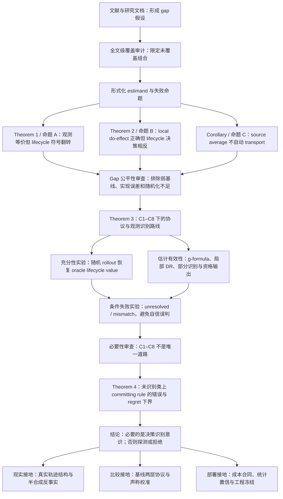

# SQCAD：从 Research Gap 假设到 Gap 证明、充分性与必要性的完整实验逻辑线

> 日期：2026-08-13  
> 文档性质：当前研究的主逻辑与证据导航。  
> 目标：把“参考文献产生 gap 假设—反例证明 gap—恢复识别—证明充分性—审查必要性—得到门控下界—接入现实性、基线、公平性、成本和统计门”串成一条可审查的实验逻辑线。  
> 声称纪律：本文档只区分“文献支持的假设”“形式化证明”“实验/计算验证”“现实对应物”和“尚未完成”，不把其中任何一层替代另一层。

## 0. 一句话总论点

> 在持久访问动作会改变未来候选、暴露、预算和结局的 Agent Memory 中，历史关联、固定查询局部干预效应和 source-scope 平均一般不足以授权逐记忆生命周期决策；我们以观测等价和符号翻转反例形式化这一 memory-specific identification gap，给出一组可操作、可审计的充分识别与治理授权条件，并进一步证明：在尚未识别且最优动作可能翻转的模型类上，任何不探测、不拒绝的 committing rule 都具有不可消除的最坏情况错误与 regret。

边界是：C1–C8 是一条充分、可操作且可审计的路线，不是唯一识别路线；当前 Theorem 4 证明的是未识别类上的门控必要性，而不是 SQCAD 或 C1–C8 的唯一性。

## 1. 统一术语

| 规范术语 | 本文含义 | 禁止混用 |
|---|---|---|
| persistent-access action | 在决策期内持续改变记忆可及性的 `keep/archive/protect/downweight` 等动作 | 单次 query 是否检索到 |
| lifecycle value | 在目标策略、时间跨度、预算、共同记忆和成本下，持久动作的折扣长期价值 | 当前答案分数、一次检索贡献 |
| identification gap | 给定观测信息与允许假设后，目标 lifecycle value 或其最优动作不能由观测分布唯一确定 | “现有论文没做过”的纯文献空白 |
| point identification | lifecycle value 被唯一确定 | 仅能确定正负号 |
| decision identification | 所有相容世界支持同一治理动作，即使数值仍为区间 | 完整点识别 |
| committing rule | 必须输出 `keep/archive`、不允许 `unresolved` 且不获取新证据的规则 | 所有现有 Agent Memory 系统的无条件统称 |
| Qualification gate | 根据识别、作用域、支持和测量状态输出 `{point, bound, unresolved, mismatch}` 的授权层 | 一个普通置信度阈值 |
| C1–C8 | 一组可操作、可审计的充分识别与治理授权条件 | 最小条件、唯一必要条件 |

## 2. 整体证据链

## 3. 第一阶段：Research Gap 最初是文献驱动的假设

### 3.1 最初观察

研究最初从 Agent Memory 的存量治理与选择性遗忘文献中观察到：已有方法分别使用时间衰减、频率、语义相关性、结果反馈、query-local 干预、写时显著性、决策压缩或事后归因来管理记忆，但这些目标并不自动等于：

\[
\tau_s^\pi
=
V_s^\pi(\texttt{keep})
-
V_s^\pi(\texttt{archive}),
\]

其中价值需要覆盖未来任务分布、候选生成、暴露位置、预算竞争、共同记忆干扰、作用域和成本。

这一阶段只能得到：

> 文献驱动的 research gap 假设：现有常用代理可能不足以支撑持久访问生命周期决策。

它不是严格证明，因为“已阅读工作未覆盖”不能推出“任何现有或未来方法都不能覆盖”。

### 3.2 文献与研究文档覆盖

文献基础按功能分为三层：

1. **Agent Memory 治理直接工作**：Memory Worth、CMI、Oblivion、FadeMem、DeMem、SimpleMem、SAGE、MemAudit、GateMem、GovMem、ActMem、Trivium；
2. **公开基准和外部轨迹**：LongMemEval、LoCoMo，以及相关长期记忆基准；
3. **理论锚点**：纵向因果识别、g-formula、DR/OPE、干扰、部分识别、transportability、safe policy improvement。

当前 11 篇最接近工作的全文级核对支持的限定结论是：

> 在已核对工作中，没有发现一篇同时把持久访问动作定义为 treatment、把目标策略下 lifecycle value 定义为 estimand，并显式处理策略生成的候选—暴露反馈，再以识别资格授权治理动作。

这句话是覆盖审计，不是数学证明；不能扩张成“所有现有 Agent Memory 理论均无法处理”。

### 3.3 对 gap 假设最关键的先验

- **Memory Worth**：关联价值与共检索 hitchhiker 现象构成直接先验；其共检索实验为 Theorem 1 的现实机制提供独立对应物。
- **CMI**：代表 query-local 干预价值；是 Theorem 2 需要区分的最近估计目标。
- **Trivium**：是最接近的因果记忆控制先验；其 transcript 不可区分下界与 Theorem 4 使用相近证明骨架，但 treatment、estimand 与 regret 对象不同。
- **Oblivion/FadeMem**：代表访问衰减治理，但没有自动提供 lifecycle action identification。
- **DeMem**：代表决策导向压缩，与资格化思想相邻，但治理对象和 estimand 不同。
- **Robins、Jiang & Li、Manski、Pearl/Bareinboim 等理论工作**：提供识别、估计、界和迁移机器；这些通用机器不是本文的新理论。

来源与边界详见：

- `08-Gap1覆盖审计与框架设计重点-20260811.md`；
- `docs/实验证据链/09-基线必要性审计与外延声称校准-20260813.md`；
- `docs/实验证据链/10-最接近工作全文级核对与因果文献定位-20260813.md`。

## 4. 第二阶段：把文献假设转成可证伪命题

仅说“现有方法没有考虑长期价值”仍是描述性陈述。理论化需要固定：

1. treatment：持久访问动作；
2. estimand：目标策略与有限决策期下的 lifecycle value；
3. observation contract：候选、暴露、位置、预算、采纳、结局、版本和作用域；
4. failure criterion：两个观测等价世界给出不同 lifecycle value 或不同最优动作。

由此提出三组命题。

### 4.1 命题 A / Theorem 1：历史关联一般不足

设计两个 SCM，使完整可观测日志联合分布相同，但逐记忆生命周期价值符号相反。实验检查：

- 全字段 `max_field_diff=0`；
- 25,000 行联合日志一致；
- 两世界的最优动作相反；
- 关联型 Memory Worth 决策 regret 为 1100。

证明对象是：

> historical association 不能在一般情况下识别 persistent-access lifecycle value。

它不证明所有关联方法在所有数据上都会失败，而是证明不存在仅依赖该观测分布、对整个模型类都正确的规则。

### 4.2 命题 B / Theorem 2：固定查询局部干预一般不足

构造两条记忆，使 query-local true do-effect 均为 2.0，但 lifecycle value 分别为 −1784 和 +1776。局部效应估计没有误差，错误来自未来候选、预算和共同记忆竞争没有进入 estimand。

证明对象是：

> 即使 fixed-query local effect 被精确知道，它也不一般性地识别持久访问生命周期价值。

这排除了“只要把 CMI 估得更准就能解决”的解释。

### 4.3 命题 C / Transport Corollary：source average 不自动等于 target value

构造 source 数据相同、target mechanism 不同的世界。仅使用 source-scope 平均无法判断 target-scope value，target world 1 的错误决策 regret 约为 2.0。

证明对象是：

> source-period 或 source-scope 的平均效应没有额外 transport assumptions 时，不能直接授权 target-scope 生命周期动作。

### 4.4 为什么这三组实验能够证明 gap

三组实验分别击中三类常用代理：

| 常用证据 | 反例控制 | 失败原因 |
|---|---|---|
| 历史成功共现/关联 | 两世界完整日志同分布 | 观测等价类内 lifecycle 符号翻转 |
| query-local do-effect | 局部因果真值完全正确 | continuation、预算和干扰项改变长期符号 |
| source-scope average | source 数据完全相同 | target mechanism 未被 source 信息确定 |

因此，gap 已从“文献中看起来没人做”升级为：

> 在明确观测合同与决策设定下，存在形式化成立的 memory-specific identification gap。

对应报告：

- `docs/实验证据链/01-Gap证明实验报告-v2-20260812.md`；
- `docs/实验证据链/02-Gap实验公平性审查-20260812.md`。

## 5. 第三阶段：Gap 公平性审查排除了什么替代解释

反例只有在基线得到公平信息时才有说服力。公平性审查确认：

- 失败不是由于基线实现错误；
- 失败不是因为局部因果效应估计有偏；
- 失败不是简单的随机化不足；
- 失败发生在估计目标层，而不是优化器或参数调节层；
- proposition 的量词被限制在其实际覆盖的观察与干预范围内。

因此，Theorem 1/2 不依赖官方基线 R3 复现来成立。官方复现影响“完整系统表现如何”，不影响“这类 estimand 是否一般充分”的机制级定理。

## 6. 第四阶段：从不可识别转向充分识别

证明旧证据不够，不等于证明新框架能工作。为此，Theorem 3 给出一组 C1–C8：可操作、可审计的充分识别与治理授权条件，并分成两条路线。

### 6.1 协议路线

随机化持久动作，在目标策略与预注册决策期内运行 rollout，直接比较折扣生命周期回报。

### 6.2 观测路线

在一致性、可交换性、支持覆盖、日志完整性、采纳测量、干扰建模和稳定作用域等条件下，以 sequential g-formula 识别，并以 DR/OPE 作为估计实现或局部稳健组件。

### 6.3 资格输出

条件不足时不强制制造点估计，而输出：

\[
\{\texttt{point},\texttt{bound},\texttt{unresolved},\texttt{mismatch}\}.
\]

这一步将识别条件直接导向框架设计：日志层、证据层、作用域层、随机探测层、部分识别层和 Qualification gate 都不是任意模块拼接，而是对失败机制的操作化回应。

完整定理和框架推导：

- `10-识别条件到框架设计的形式化推导.md`；
- `11-形式化定理陈述与证明.md`。

## 7. 第五阶段：充分性实验验证了什么

### 7.1 协议路径识别恢复

在已知 oracle lifecycle value 的理想合成环境中满足识别条件，随机化持久动作的 rollout 估计器得到：

- bias 约为 Monte Carlo 噪声量级；
- CI 覆盖诚实；
- 自信决策错误为 0；
- neutral 或不可授权对象正确输出 `unresolved`；
- 多 seed 稳定。

这支持：

\[
\text{C1–C8 满足}
\Rightarrow
\text{协议路线可恢复当前定义的 lifecycle value}.
\]

### 7.2 条件违反与资格门

逐步制造采纳误测、共同暴露、支持缺失、漂移和作用域迁移，资格层将失败对象标记为 `unresolved/mismatch`，没有用未经授权的点估计做自信治理。

这支持：

> Qualification gate 的实现能够把预先规定的失败状态映射到退守输出。

它不单独证明门控是理论必要的；必要性由后续 Theorem 4 承担。

### 7.3 观测估计与部分识别

估计有效性实验显示：

- sequential g-formula 在支持覆盖处恢复已知真值；
- 支持缺失处出现可预言的符号错误；
- 局部效应层 DR 在单模型误设下保持低偏，双重误设时失效；
- C6 采纳误归属会使包括 DR 在内的估计失效；
- 部分识别输出将两个错误点决策改写为 `unresolved`，真值落入所给区间；
- C7 下逐条价值不可识别，但 bundle value 可作为改变治理粒度后的退守对象。

必须保留的边界：当前完整 lifecycle-level sequential DR 尚未得到与文字声称完全等强的实现验证；主要 lifecycle 恢复来自 g-formula，DR 证据集中在局部效应层。

对应报告：

- `docs/实验证据链/03-识别恢复实验报告-20260812.md`；
- `docs/实验证据链/04-估计有效性实验报告-20260812.md`。

## 8. 第六阶段：必要性审查改变了什么

### 8.1 没有得到的结论：C1–C8 是唯一必经路线

必要性分析给出替代或退守例子：

- C6 对不读取采纳代理的协议路线可能不必要；
- C2/C3 可在额外 IV 假设下由外部变异替代；
- C7 失败时可以改变治理粒度，退守到 bundle value；
- C8 漂移时 fresh randomization 仍可识别当期 value，但不再识别原预注册长期复用目标。

所以必须把 Theorem 3 从“minimal conditions”改称：

> 一组可操作、可审计的充分识别与治理授权条件。

更严格地说，现有 Lemma 没有逐项处理 C1、C4、C5；C7/C8 的部分例子改变了治理粒度或 estimand；因此不能写“C1–C8 每一项都已被证明不必要”。

### 8.2 得到的结论：未识别类上的门控必要性

Theorem 4 使用 Theorem 1 的观测等价符号翻转对。令规则以概率 \(p\) 选择 `keep`，两个世界中的最坏情况 regret 为：

\[
\max\bigl((1-p)|\tau_1|,\;p|\tau_2|\bigr).
\]

对 \(p\) 最小化得到：

\[
\frac{|\tau_1||\tau_2|}{|\tau_1|+|\tau_2|}.
\]

当前构造 \(\tau_1=1650\)、\(\tau_2=-1100\)，下界为 660；最坏情况错误概率至少为 1/2。

这证明：

> 在这个未识别类中，任何只使用现有观测日志、既不获取新证据也不允许拒绝的 committing rule，都不能把最坏情况 regret 压到该界以下。

因此要突破下界，规则必须：

1. 获取能够缩小观测等价类的新证据，例如随机化或探测；或
2. 暂不提交持久动作，即输出 `unresolved`。

### 8.3 必要性结论的准确范围

Theorem 4 证明的是：

- worst-case / minimax 必要性；
- 在含有观测等价、最优动作相反世界的模型类上成立；
- 不排除 IV、front-door、自然实验或强先验通过额外假设缩小模型类；
- 不证明 C1–C8 是唯一识别条件；
- 不证明 SQCAD 是唯一实现；
- 当前把拒绝的延宕代价置于定理外，尚需纳入完整成本决策。

必要性文档与实验：

- `12-必要性证明与识别路线分类学-20260813.md`；
- `13-形式化为真正理论空白的必要性证明方向-20260813.md`；
- `docs/实验证据链/11-必要性证明实验报告-20260813.md`。

## 9. 第七阶段：为什么基线工作不能直接回应该 gap

基线不能回应 gap 的原因必须分成三个层次。

### 9.1 Estimand 层

关联型、query-local、source-average 方法即使精确估计自己的目标，也可能没有识别 lifecycle value 或其最优动作。这由 Theorem 1/2 和 transport 反例承担。

### 9.2 Authorization 层

很多方法输出排序、分数或直接动作，没有显式区分：

- 已点识别；
- 只有不跨零的界；
- 当前未识别；
- 作用域或版本不匹配。

因此它们缺少的是识别资格到持久动作之间的授权接口，而不只是一个更复杂的评分函数。

### 9.3 系统比较层

官方完整基线 R3 尚未全部完成，所以不能声称“SQCAD 已超过所有现有系统”。当前只能说：

- Theorem 1/2 排除了若干估计目标的一般充分性；
- 在统一合同的可迁移策略子集中，SQCAD 的机制组合表现出优势；
- proxy 数字只能支持结构级结论，不能冒充官方系统结果。

对应报告：

- `docs/草稿-draft/实验报告/外围支撑归档-20260813/05-基线两层比较与统一合同主表-20260812.md`；
- `docs/实验证据链/09-基线必要性审计与外延声称校准-20260813.md`；
- `docs/实验证据链/10-最接近工作全文级核对与因果文献定位-20260813.md`。

## 10. 第八阶段：现实性、成本与统计证据如何接入主逻辑

这些实验不承担数学证明，但决定论文能否从“正确的合成反例”连接到 Agent Memory 实践。

### 10.1 真实轨迹与半合成接地

LongMemEval-S 和 LoCoMo 的轨迹审计记录候选、暴露、位置、预算、共同暴露、采纳代理、动作、结局和作用域。它支持：

- 共暴露、预算满载、版本/时间结构在真实轨迹中有对应物；
- 真实文本和时间线可以承载受控注入的反事实实验；
- 合成机制不是完全脱离 Agent Memory 接口的抽象变量。

但它不证明真实世界中 causal hitchhiker harm 的总体发生率；半合成反事实真值仍由注入机制产生；外部 QA 层尚未完成端到端复现。

### 10.2 成本合同

成本价值同时计入 utility、token、LLM 调用、探测、延迟、伤害和 false forgetting。结果只支持条件性净收益：SQCAD 相对配探测 CMI 的净收益均值有小幅优势，但 10-seed CI 下界为 0；部分环境下简单基线更好。

这意味着当前不能声称“真实部署收益已被证明大于成本”，但成本合同为下一步把 `commit/defer/probe` 纳入统一决策定理提供了实证接口。

### 10.3 统计与工程冻结

当前统计门使用 seed/world 作为采样单位、paired bootstrap 和重尾检查，并冻结代码—配置—结果—报告的 hash。它提高结论可复核性，但不能弥补外部 QA、官方 R3 或理论量词不足。

对应报告：

- `docs/草稿-draft/实验报告/外围支撑归档-20260813/06-机制发生率审计与轨迹接地半合成基准-20260812.md`；
- `docs/草稿-draft/实验报告/外围支撑归档-20260813/07-成本合同与净收益实验报告-20260812.md`；
- `docs/草稿-draft/实验报告/外围支撑归档-20260813/08-统计与工程门-20260813.md`。

## 11. 当前已经形成的论证闭环

| 逻辑问题 | 证据 | 当前裁决 |
|---|---|---|
| 文献是否提示未覆盖问题 | 直接工作与 11 篇全文审计 | 支持“已核对工作未覆盖完整 treatment–estimand–feedback–authorization 组合”，不是普遍缺失证明 |
| gap 是否只是研究直觉 | Theorem 1/2、命题 A/B/C | 否；在限定模型类和观测合同下已有构造性 identification gap |
| 失败是否来自基线太弱 | 公平性审查；local do-effect 使用真值 | 主要反例发生在 estimand 层，不依赖估计误差 |
| 新路线是否能恢复目标 | Theorem 3；协议 rollout；g-formula | 在充分条件和验证范围内恢复；完整 lifecycle DR 仍需补全 |
| 条件失败时是否能避免误判 | qualification violation experiments、部分识别 | 在测试的失败类型中能退守为 unresolved/mismatch |
| C1–C8 是否唯一必要 | Lemma A–D | 否；是充分、可操作、可审计条件族，不是唯一桥型 |
| 有什么是真正必要的 | Theorem 4 | 未识别符号翻转类上，强制提交存在错误与 regret 下界；要突破需新证据或拒绝 |
| 是否已达到完整基础理论 | 当前定理审计 | 尚未；缺一般决策识别定理、拒绝/探测成本、动态探索下界和 SQCAD 上界匹配 |

## 12. 当前最强安全定位

中文：

> 本文形式化刻画了持久访问生命周期决策中的记忆特定识别空白：历史关联、固定查询局部干预和 source-scope 平均在策略生成暴露、预算竞争与共同记忆干扰下，一般不足以授权逐记忆生命周期动作。本文进一步给出一组可操作、可审计的充分识别与治理授权条件，并证明在含观测等价符号翻转世界的未识别类上，任何不探测、不拒绝的 committing rule 都具有不可消除的最坏情况错误与 regret。

英文定位建议：

> We characterize a memory-specific identification gap for persistent-access lifecycle decisions, provide an operable and auditable family of sufficient identification and governance-authorization conditions, and establish a minimax lower bound for committing rules over observationally indistinguishable, sign-discordant worlds.

暂时不要写：

- “C1–C8 是最小且必要条件”；
- “SQCAD 是唯一安全框架”；
- “分类学已经穷尽所有识别路线”；
- “所有现有 Agent Memory 系统都必然落入 660 下界”；
- “真实 Agent Memory 上收益大于成本已经证明”；
- “完整的 sequential lifecycle DR 已实现”；
- “基础理论已经完整建立”。

## 13. 通向真正理论空白的下一步

按优先级：

1. **一般决策识别定理**：安全提交当且仅当识别集合位于同一动作区域；把 Theorem 4 从两点构造推广到一般 \([L,U]\)。
2. **统一 `commit/defer/probe` 成本**：拒绝不是零成本，探测也不是免费；推导三者的最优决策边界。
3. **动态探索必要性**：证明策略生成暴露下，无探索存在 \(\Omega(T)\) regret 或 self-confirming non-identifiability。
4. **探测样本复杂度下界**：用 KL/Le Cam/Fano 等工具刻画达到错误概率 \(\delta\) 所需的最小有效 probe 数量。
5. **SQCAD 上界**：证明其 gate/probe policy 在相同假设下达到匹配或近似匹配的 regret/sample-complexity rate。
6. **修复现有必要性细节**：隔离 C6 测量误差；将 IV 扩展到 lifecycle estimand；收紧 C7/C8 的 estimand/granularity 语义；重新形式化 authorization certificate 与审计性。

完成这些以后，才有条件把当前定位提升为：

> 持久访问 Agent Memory 治理的一般决策识别理论及其近似最优实现。

## 14. 文件导航：按研究逻辑阅读

1. **Research gap 来源与覆盖边界**  
   `08-Gap1覆盖审计与框架设计重点-20260811.md`  
   `docs/实验证据链/09-基线必要性审计与外延声称校准-20260813.md`  
   `docs/实验证据链/10-最接近工作全文级核对与因果文献定位-20260813.md`

2. **Gap 形式化与反例证明**  
   `11-形式化定理陈述与证明.md`  
   `docs/实验证据链/01-Gap证明实验报告-v2-20260812.md`  
   `docs/实验证据链/02-Gap实验公平性审查-20260812.md`

3. **充分识别与恢复实验**  
   `10-识别条件到框架设计的形式化推导.md`  
   `docs/实验证据链/03-识别恢复实验报告-20260812.md`  
   `docs/实验证据链/04-估计有效性实验报告-20260812.md`

4. **必要性与门控下界**  
   `12-必要性证明与识别路线分类学-20260813.md`  
   `docs/实验证据链/11-必要性证明实验报告-20260813.md`

5. **现实、比较、成本与统计支撑**  
   `docs/草稿-draft/实验报告/外围支撑归档-20260813/05-基线两层比较与统一合同主表-20260812.md`  
   `docs/草稿-draft/实验报告/外围支撑归档-20260813/06-机制发生率审计与轨迹接地半合成基准-20260812.md`  
   `docs/草稿-draft/实验报告/外围支撑归档-20260813/07-成本合同与净收益实验报告-20260812.md`  
   `docs/草稿-draft/实验报告/外围支撑归档-20260813/08-统计与工程门-20260813.md`

6. **下一阶段理论推进**  
   `13-形式化为真正理论空白的必要性证明方向-20260813.md`

