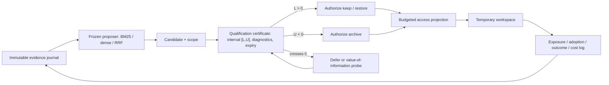

# SQCAD vNext：资格证书与价值信息访问控制

## 结论摘要

本方案将 SQCAD 的主创新收敛为：**以 scoped persistent-access lifecycle value 为对象的动作授权**。BM25、dense、RRF 与 Candidate Guard 只负责低成本候选提议；它们不能改变 `keep/archive/restore` 的持久状态。

公开数据上的 Guard-1 保留为 evidence-coverage 修复，不升级为理论主张。真正的资格估计先在有干预和长期结果的受控/半合成环境完成；公开数据只验证候选覆盖、预算和成本外部性。

## 1. 新的最小框架

### 1.1 决策对象

对记忆 $i$、目标 scope $s$ 和动作对比 `(keep, archive)`，资格层估计：

$$
\tau(i,s) = V_s^\pi(\operatorname{keep}_i) - V_s^\pi(\operatorname{archive}_i)
$$

证书保存其识别区间 $[L,U]$，而不是将 query 相关性、历史命中率或 LLM 解释直接写成长期价值。

### 1.2 严格授权规则

| 条件 | 状态/动作 |
|---|---|
| $L > 0$ | 授权 `keep`；若对象已归档，候选进入工作区后可 `restore` |
| $U < 0$ | 授权 `archive` |
| $L \le 0 \le U$ | 不提交持久动作；比较 `defer` 与 `probe` |
| scope、版本、证据来源失效 | `mismatch`，重新资格化，不以旧证书提交 |

对跨零区间，不允许“低 regret 的随机 commit”替代资格。该限制对应论文的最小安全提交条件：识别集合不得跨越动作边界。

### 1.3 Probe 规则

候选 probe 必须预注册预期的后验区间 $[L',U']$ 和成本 $C_{\mathrm{probe}}$：

$$
\operatorname{VOI} = C_{\mathrm{defer}} - \left(C_{\mathrm{probe}} + R^*(L', U')\right)
$$

$$
R^*(L,U) = \frac{U(-L)}{U-L} \quad (\text{only when } L < 0 < U)
$$

仅当 $\operatorname{VOI} > 0$ 时 probe；按 $\operatorname{VOI}$ 排序，检索分数仅用于同值打破。probe 产生的是一次性 exposure，除非更新后的资格证书授权，否则不能写 persistent store。

### 1.4 Access 规则

在 workspace budget $B$ 下，access 分两步：

1. 资格投影：移除被授权 archive 的常驻记忆；保留 unresolved 的现状但不改变持久状态；把获选 probe 与已授权 restore 作为临时可访问对象。
2. 排序投影：只在资格兼容的对象中，以 BM25/dense/RRF 等冻结 proposer 的分数选择 top-$B$。

因此，检索器只能决定“已允许访问的对象中先看谁”，不能决定“谁可以长期留下”。archive 后缺少访问记录被记录为 censoring，不更新为 negative qualification。

## 2. 代码落地边界

新增 `src/sqcad/qualification_access.py`，提供：

- `QualificationCertificate`：scope、区间、证据 id、诊断、过期 epoch；
- `decide_persistent_action`：严格的 keep/archive/defer/probe 授权；
- `ProbeOption` 与 `probe_value`：价值信息优先的 probe；
- `plan_access`：资格先行、检索后置的 workspace projection。

该模块**暂不直接并入** `public_unified_contract.py`：LongMemEval-S/LoCoMo 的 QA 金标不足以估计持久动作生命周期值。直接把它们的 evidence recall 当作资格标签会违反理论边界。

## 3. 实验计划

### E1：资格授权恢复（受控，主理论实验）

**目的**：验证 certificate 是否在可识别条件下正确授权、在条件失败时拒绝提交。

- 环境：现有 `identification_recovery_experiment.py`，扩展为输出每个 memory-scope 的 certificate；
- treatment：随机化 `keep/archive` 持久动作，记录 rollout 的长期效用、token/probe/延迟成本；
- 对照：association-only、Memory Worth、CMI local effect、blind point-decision、always-defer；
- 主指标：false-commit rate、授权覆盖率、区间覆盖率、lifecycle regret、`unresolved/mismatch` 校准；
- 必要消融：移除 scope/version、移除 interval gate、将 crossing interval 强制 commit、移除 source/lineage 记录。

**验收**：可识别条件下 action sign error 接近零；五类条件违反不出现自信 commit；forced-commit 的 regret 明显高于 gate。

### E2：价值信息 Probe（半合成 chronological overlay）

**目的**：证明 probe 的贡献不是“多检索几条”，而是以更低成本改变持久动作。

- 轨迹：LongMemEval-S/LoCoMo 的时间顺序和 session 结构；
- 注入：版本反转、rare critical bridge、hitchhiker、scope drift 和 archive-induced censoring；
- 比较：无 probe、随机 probe、BM25 probe、retrieval-score probe、SQCAD-VOI probe；
- 保持不变：同一 candidate stream、budget、reader、token 成本、潜在结果表；
- 主指标：probe 后跨零区间减少率、每次 probe 的 action-change rate、lifecycle regret、恢复时间、probe cost；
- 关键消融：将 VOI 排序换成 BM25 排序；允许 crossing interval 直接 restore；禁止 archive 证据再入流。

**验收**：VOI probe 在相同 probe budget 下提高 action-change rate、降低 false commit/regret；BM25 probe 只能提高覆盖，不能替代资格收益。

### E3：公开集外部验证（不作因果资格主张）

**目的**：验证资格约束不会因候选饥饿牺牲过多 QA 证据覆盖。

- 数据：LongMemEval-S chronological split、LoCoMo frozen QA order；
- 默认方法：SQCAD + Guard-1；`_2/_4` 仅做 budget sensitivity；
- proposer 消融：BM25、dense、RRF 在同一 Guard budget 下替换；
- 对照：BM25、dense、RRF、keep-all、recency、原 SQCAD、no-probe/no-restore；
- 指标：Hit、evidence recall、LoCoMo official token-F1、storage/exposure tokens、probe 数、candidate coverage；
- 分层：temporal update、rare session、multi-hop、冲突/lineage、Guard 命中与未命中。

**验收**：Guard-1 保持低 persistent storage 并缓解 coverage bad case；任何结果只表述为 retrieval/access 外部效度，不表述为因果资格已被公开集证明。

### E4：端到端 Agent 验证（后续门槛）

在固定 LLM、prompt、工具版本与盲法 evaluator 下，记录 candidate → exposure → adoption → action → outcome。只有具备这些日志并加入低风险随机化 probe 后，才可将 E1 的证书迁移为真实 Agent Memory 的资格主张。

## 4. 预注册与声称边界

- 任何方法不得读取 answer/evidence gold；
- candidate proposer、预算、成本系数、reader、seed、bootstrap 规则在测试前冻结；
- E1/E2 支持资格和生命周期主张，E3 支持覆盖/成本主张；
- 不以 Guard 超过 BM25 的 QA F1 声称 SOTA 或证明因果识别；
- 完整强基线官方系统尚未全部端到端复现时，报告为统一合同下的策略比较或明确 proxy。
