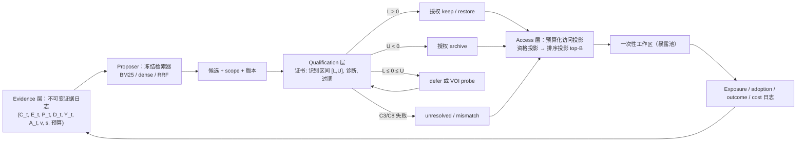

# 26- SQCAD 框架完整工作流与量化公式说明（2026-08-18）

> **文档定位**：本文是论文 Method 部分的**量化规格**——给出 SQCAD 框架的完整工作流（Evidence–Qualification–Access 三层闭环）以及支撑它的全部量化公式，并将每条公式回接到形式化定理。它与[21-资格证书与价值信息访问控制方案](21-资格证书与价值信息访问控制方案-20260817.md)（方法接口与实验计划）、[23-SQCAD 完整实验方案](23-SQCAD完整实验方案-理论公开自建消融-20260817.md)（实验矩阵与声称纪律）互补；**完整证明见** [`11-形式化定理陈述与证明`](../01-research-gap/研究逻辑与理论证明/11-形式化定理陈述与证明.md)、[`12-必要性证明与识别路线分类学`](../01-research-gap/研究逻辑与理论证明/12-必要性证明与识别路线分类学-20260813.md)。本文只陈述公式与工作流语义，不重复证明。

**编号说明**：论文主体文档序列为 21/22/23/24，本文取 26- 以避免与实验证据链的 [25-复现性修复报告](../03-实验证据链/25-第二次AutoDL完整复现与复现性修复报告-20260818.md) 编号冲突。

---

## 1. 记号与问题设定

记号与 [11-](11-) §0 完全对齐。时间离散，$t = 1, 2, \dots$；每个记忆 $i$ 属于目标 scope $s$；系统在**决策期边界** $t_0, t_0+H, t_0+2H, \dots$ 上重新评估持久访问。

**观测历史**：$O_{1:H}^{(s)} = \{(C_t, E_t, Y_t)\}_{t=1}^{H}$——候选身份、暴露指示、标量结局。持久访问动作 $A_i^{\text{pers}} \in \mathcal{A} = \{\texttt{keep}, \texttt{downweight}, \texttt{isolate}, \texttt{archive}, \texttt{restore}\}$ 是**每个 epoch 内的一次性 treatment**：在 $t_0$ 赋值后固定 $H$ 步不重随机化；跨 epoch 是重复的一次性 treatment 序列，estimand 以 epoch 前状态为条件。epoch 内的暴露 $E_{i,t}$ 是**后果变量（中介）**，不是 treatment。

**目标估计量（persistent-access lifecycle value）**：

$$
\boxed{
V_s^{\pi}(a) = \mathbb{E}^{\pi}\left[\sum_{t=1}^{H} \gamma^{t-1}\left(Y_t - \lambda C_t - \rho R_t\right) \;\middle|\; do(A_i^{\text{pers}} = a),\; s\right],
}
$$

其中 $\lambda, \rho \ge 0$ 为预注册的成本与风险权重，$R_t$ 为风险/危害项。比较估计量：

$$
\tau_s^{\pi}(a_1, a_0) = V_s^{\pi}(a_1) - V_s^{\pi}(a_0).
$$

**三种估计目标必须分开**（11- §0.4，这是框架不自欺的起点）：

| 估计目标 | Treatment | 固定不变的是什么 | 回答的问题 |
|---|---|---|---|
| Historical association value | 无（观测） | 历史策略 | "这条记忆与成功共现吗？" |
| Query-local intervention effect $\Delta_t(i)$ | $do(E_{i,t}=1)$ vs $do(E_{i,t}=0)$ | query、candidate set、model、evaluator | "这条记忆对当前回答有帮助吗？" |
| **Persistent-access lifecycle value** $V_s^{\pi}(a)$ | $do(A_i^{\text{pers}}=a)$ | 策略 $\pi$ 重新生成未来候选 | "改变长期访问能否改善未来轨迹？" |

Theorem 1/2（11- §1/§2）构造性证明前两类量**在信息论层面不足以**决定持久访问决策：观测等价世界可给出相反符号的 lifecycle value（数值实例 $+1650$ vs $-1100$，`gap_proof_experiments.py`）；query-local 效应精确相等的两条记忆可给出相反决策（$+1776$ vs $-1784$）。

---

## 2. 框架完整工作流

### 2.1 三层架构与闭环

闭环语义：**日志（Evidence）→ 提议（Proposer）→ 资格化（Qualification）→ 授权/弃权 → 预算化投影（Access）→ 一次性暴露 → 结局与成本回写日志**。检索器（Proposer）只能决定"已允许访问的对象中先看谁"；它**不能**决定"谁可以长期留下"。持久状态变更只经由资格授权路径。

### 2.2 决策期（epoch）语义（11- §3.0）

**Epoch 前状态**：

$$
S_{t_0} = \left(\mathcal{M}_{t_0},\; B_{t_0},\; \pi,\; s,\; v_{\text{model}}, v_{\text{tool}}, v_{\text{eval}},\; \bar{H}_{t_0}\right),
$$

其中 $\mathcal{M}_{t_0}$ 为全部记忆的访问状态，$B_{t_0}$ 为工作区预算，$v$ 为版本标识符，$\bar{H}_{t_0}$ 为完整历史。

**干预后过程**（estimand 的结局过程），$t = t_0+1, \dots, t_0+H$：

$$
S_{t+1} \sim P_\pi\!\left(\cdot \mid \bar{H}_t,\; A_i^{\text{pers}}=a,\; s\right),
\quad
S_{t+1} = \left(C_{t+1},\; E_{t},\; P_{t},\; D_{t},\; Y_{t},\; \mathcal{M}_{t+1},\; B_{t+1}\right),
$$

- $C_{t+1}$——**未来候选转移**：记忆 $i$ 的入选由 $A_i^{\text{pers}}$ 决定，是 estimand 的**状态变量**而非外生噪声；
- $E_t$——预算 $B$ 下的暴露/位置分配；$P_t$——位置；$D_t$——采用（adoption）代理；
- $Y_t$——epoch 内累积的任务效用；$C_t$ 为成本（token、延迟、probe 数），$R_t$ 为风险；
- $\mathcal{M}_{t+1}$——由使用/采用更新的记忆状态；$B_{t+1}$——共记忆竞争下的预算动态。

**Epoch 形式的目标估计量**：

$$
\boxed{
V_s^{\pi}(a \mid S_{t_0}) =
\mathbb{E}^{\pi}\!\left[\sum_{t=t_0+1}^{t_0+H} \gamma^{\,t-t_0-1}\left(Y_t - \lambda C_t - \rho R_t\right)
\;\middle|\; do(A_i^{\text{pers}}=a),\; S_{t_0},\; s\right],
}
$$

比较估计量 $\tau_s^{\pi}(a_1, a_0 \mid S_{t_0}) = V_s^{\pi}(a_1 \mid S_{t_0}) - V_s^{\pi}(a_0 \mid S_{t_0})$。

### 2.3 每层职责与输出

| 层 | 输入 | 输出 | 对应定理约束 |
|---|---|---|---|
| **Evidence** | 行为流 | 结构化日志 $(C_t, E_t, P_t, D_t, Y_t, A_t, s, v)$ + 预算记录 | Thm 1：仅 $(C,E,Y)$ 不足→补 $P_t, D_t$、共暴露、版本；C1/C4/C5/C6/C8 |
| **Proposer** | 查询 + 已授权对象 | 候选排序（top-$B$ 内的顺序） | Thm 2：proposal 不构成授权 |
| **Qualification** | 候选 + 历史 + 条件检查 | 证书 $[L, U]$、诊断、过期 epoch；`unresolved` / `mismatch` | Thm 3：条件族门控；Thm 4：未识别类必须弃权；Thm 5：安全提交 = 区间不跨零 |
| **Access** | 证书 + 预算 $B$ | 一次性工作区（暴露池） | C7：预算与共记忆显式建模 |

**输出空间**（Theorem 3 定义）：$\{\texttt{point},\; \texttt{bound},\; \texttt{unresolved},\; \texttt{mismatch}\}$——点估计、界、弃权（C3 正向性/C8 稳定性失败）、失配（scope/版本/证据来源失效，须重新资格化）。`unresolved` 是理论禁止改变持久访问的状态，不是"保守偏好"（Theorem 4 必要性）。

---

## 3. 量化公式全集

### 3.1 识别条件族 C1–C8（充分、可操作、可审计；11- §3.1）

| 条件 | 内容 | 失败后果 |
|---|---|---|
| C1 Consistency | 执行动作 = 赋值动作，暴露为保留机制的后果 | 日志不可信 → `mismatch` |
| C2 Sequential exchangeability | $A_i^{\text{pers}} \perp\!\!\!\perp Y_{t_0+1:t_0+H}^{\text{pot}} \mid S_{t_0}$（epoch 边界无条件化） | 观测路不可识别 → 仅协议路 |
| C3 Positivity / overlap | 观测：$\pi_b(a \mid S_{t_0}) \ge \delta > 0$；或协议：随机化 $A_i^{\text{pers}}$ 且已知 propensity | 无界可给 → **`unresolved`** |
| C4 Treatment observability | 动作类型、生效窗口 $[\tau_0, \tau_1]$、回滚均记录 | — |
| C5 Exposure/position/budget observability | $C_t$、暴露 propensity $\pi_E$、位置 $P_t$、预算 $B_t$ 记录 | 暴露核不可识别 |
| C6 Adoption measurement | 采用代理 $D_{i,t}$ 带误差模型 $P(D \mid \text{true adoption})$ | 退化到界（§3.4） |
| C7 Interference specification | 共记忆组成入状态、预算显式、不假设可加性 | 退化到界 |
| C8 Measurement stability | $(s, v_{\text{model}}, v_{\text{tool}}, v_{\text{eval}})$ 窗口内固定或按版本分层 | **`mismatch`** |

C1–C8 是**充分**族而非最小族：Lemma A–D（12- §1）给出 C6/C7/C2–C3/C8 各自可被替代的世界（协议路独立、bundle 退守、IV、当期识别）。定理的实际地位是"门控在未识别类上**必要**"（Theorem 4），而非"这族条件必然最小"。

### 3.2 估计器

**(a) 协议路线（随机化微干预）**——rollout 估计量，无偏：

$$
\boxed{
\hat{V}_s^{\pi}(a \mid S_{t_0}) =
\frac{1}{n_a}\sum_{k=1}^{n_a} \sum_{t=t_0+1}^{t_0+H}
\gamma^{\,t-t_0-1}\left(Y_t^{(k)} - \lambda C_t^{(k)} - \rho R_t^{(k)}\right),
}
$$

$\mathbb{E}[\hat{V}] = V$（协议直接赋值，无需加权）；CI 由轨迹间方差给出：$\hat{V} \pm 1.96\,\mathrm{SE}$（$n_a \to \infty$ 时有效）。

**(b) 观测路线**——干预后过程上的**序贯 g-formula**：

$$
\boxed{
V_s^{\pi}(a \mid s_0) = \sum_{t=1}^{H} \gamma^{t-1} \int
\left(y_t - \lambda c_t - \rho r_t\right)\;
\prod_{\tau=1}^{t} \Bigl[
P_\pi\!\left(c_\tau, e_\tau, p_\tau, d_\tau \mid \bar{h}_{\tau-1}, a, s_0\right)
\times P\!\left(y_\tau, \mathcal{m}_\tau, b_\tau \mid \bar{h}_{\tau-1}, a, s_0\right)
\Bigr]\; d\bar{h}_{t-1},
}
$$

核由 C1/C5/C6/C8 从日志识别；候选/暴露核的 **$\pi$-索引**显式编码目标策略（行为策略 $\pi_b$ 数据需 overlap + 重要性加权或策略差建模）。

**(c) DR / OPE 泛函**（观测路的有效估计量，epoch 级单 treatment、轨迹级结局）：

$$
\hat{\tau}_s^{\pi}(a_1, a_0) =
\frac{1}{n}\sum_{k=1}^{n}
\Bigl[
\frac{\mathbf{1}[A_k = a_1]}{\hat{\pi}_A(a_1 \mid s_0^{(k)})}\left(G^{(k)} - \hat{Q}(a_1, s_0^{(k)})\right) + \hat{Q}(a_1, s_0^{(k)})
\Bigr] -
\frac{1}{n}\sum_{k=1}^{n}
\Bigl[
\frac{\mathbf{1}[A_k = a_0]}{\hat{\pi}_A(a_0 \mid s_0^{(k)})}\left(G^{(k)} - \hat{Q}(a_0, s_0^{(k)})\right) + \hat{Q}(a_0, s_0^{(k)})
\Bigr],
$$

其中 $G^{(k)} = \sum_t \gamma^{t-1}(Y_t^{(k)} - \lambda C_t^{(k)} - \rho R_t^{(k)})$ 为完整轨迹回报；$\hat{\pi}_A$ 为估计的 epoch propensity，$\hat{Q}$ 为估计的轨迹值回归。$\hat{\pi}_A$ 或 $\hat{Q}$ 之一正确设定时 $\sqrt{n}$ 一致（Robins 1986; Murphy 2003; Jiang & Li 2016）。

### 3.3 部分识别与输出语义

C6 失败时对采用误差模型 $\eta_D$ 取极值：

$$
V_s^{\pi}(a) \in \left[\underline{V}_s^{\pi}(a; \eta_D),\; \overline{V}_s^{\pi}(a; \eta_D)\right];
$$

C7 失败时对共记忆组成分布取界；**C3/C8 失败时不给任何界**，输出 `unresolved` / `mismatch`。

### 3.4 决策识别（Theorem 5，12- §3.6）——框架的决策层主定理

给定日志 $o$，与 $o$ 相容的世界类 $\mathcal{M}(o)$ 上 $\tau$ 的**识别集合**：

$$
[L(o), U(o)] = \left[\inf_{M \in \mathcal{M}(o)} \tau_M(o),\; \sup_{M \in \mathcal{M}(o)} \tau_M(o)\right].
$$

对二元持久访问决策 {keep, archive}：

- (a) $L(o) > 0$：committing keep 的最坏情况期望 regret $= 0$——**授权 keep**；
- (b) $U(o) < 0$：committing archive 的最坏情况期望 regret $= 0$——**授权 archive**；
- (c) $L(o) \le 0 \le U(o)$：任何 committing 规则（keep 概率 $p$，与 $o$ 可测）的最坏情况期望 regret

$$
\sup_{M \in \mathcal{M}(o)} \mathbb{E}_M[\text{regret}]
\ge R^*(L,U) = \frac{U(-L)}{U-L},
$$

于 $p^* = U/(U-L)$ 处取得；错误概率下界 $\ge 1/2$。

**推论（点识别不必要，决策识别必要）**：值未点识别（$U > L$）而动作已识别（$L > 0$ 或 $U < 0$）时安全提交存在——实例 $(L,U) = (500, 1650)$：commit keep 最坏 regret $= 0$，commit archive $= 500$。治理必要的不是点识别，是**决策可识别性**。

**推论（三成本修正）**："未识别必须拒绝"修正为

$$
\min\left\{R^*(L,U),\; C_{\text{defer}},\; C_{\text{probe}} + R^*_{\text{after}}\right\},
$$

拒绝与探测都有成本（P2 数值边界见 12- §4：$C_{\text{probe}} < 330$ 时探测胜于直接 commit）。识别理论与成本合同由此进入同一决策框架。

### 3.5 门控必要性（Theorem 4，12- §3）

在 Theorem 1 的符号翻转对 $(|\tau_1|, |\tau_2|) = (1100, 1650)$ 上，任何 committing 规则的最坏情况 regret

$$
\ge \frac{|\tau_1|\,|\tau_2|}{|\tau_1| + |\tau_2|} = \frac{1100 \times 1650}{2750} = 660,
$$

错误概率 $\ge 1/2$（数值复现于 `necessity_counterexamples.py`，$p^* = 0.6$）。**拒绝（`unresolved`）或取得新的干预证据是唯一低于该界的选项**——门控不是保守偏好，是定理必要性；且弃权触发必须可审计（Theorem 4(c′)：存在策略 $\pi$ 与可判别信号使 660 界下的误弃权率任意小）。

### 3.6 Probe 与 VOI 规则（21- §1.3 的量化）

候选 probe 预注册预期后验区间 $[L', U']$ 与成本 $C_{\mathrm{probe}}$：

$$
\operatorname{VOI} = C_{\mathrm{defer}} - \left(C_{\mathrm{probe}} + R^*(L', U')\right),
\qquad
R^*(L,U) = \frac{U(-L)}{U-L} \quad (\text{仅当 } L < 0 < U).
$$

仅当 $\operatorname{VOI} > 0$ 时 probe，按 $\operatorname{VOI}$ 降序执行（检索分数仅用于同值打破）。probe 产物是一次性 exposure；除非更新后的资格证书授权，否则**不能**写入 persistent store。

### 3.7 成本契约（统一合同，16-）

在统一 budget $B$、同一 reader/evaluator 下记录两类成本（`results/public_unified_contract.json`）：

- **storage tokens**：$|\text{persistent store}| = \sum_{m \in \mathcal{M}_{\text{retained}}} \operatorname{len}(m)$——持久驻留成本；
- **exposure tokens**：每次查询暴露池的 token 数（budget 内 top-$B$）——每次读取成本；
- 衍生量：存储压缩比 $\text{storage}_{\text{bm25}} / \text{storage}_{\text{sqcad}}$（修复后 LME 45.4×、LoCoMo 40.4×）。

### 3.8 统计协议（配对 studentized bootstrap，16-/20-）

策略对比用**配对 studentized bootstrap**：对单位级配对差 $\{d_k\}_{k=1}^{n}$，bootstrap 样本 $d_k^* = d_{\lfloor U_k n \rfloor}$（$U_k$ 为 seed 流伪随机），studentized 统计量 $t^* = (\bar{d}^* - \bar{d}) / \mathrm{SE}^*$，从 $t^*$ 分布取 CI；**CI 排除 0 即显著**。参数：n_boot = 2000、seed 20260812（公开集）/ 20260817（自建集），bootstrap 前 `random.seed` 显式设定——显著性判定是预注册协议，不是事后检验。

### 3.9 自建集量化（LifecycleBench，20-）

单个 episode 上，策略对某记忆的 action 分支价值 $V(\texttt{action})$ 与结局：

$$
\text{regret} = \max\left(V^{\text{oracle}}(\texttt{keep}),\; V^{\text{oracle}}(\texttt{archive})\right) - V(\texttt{action}),
$$

$$
\text{false-commit} = \mathbb{1}[\texttt{action} = \texttt{keep} \land \texttt{oracle} = \texttt{archive}],
$$

$$
\text{agreement} = \mathbb{1}[\texttt{action} = \texttt{oracle}],
$$

oracle 一致率按非 neutral 分母计算（neutral 场景 oracle 按协议选 keep，产生 oracle_policy regret 0.015，20- §8）。主表指标为 1380 episode 上的均值（mean value / regret / oracle 一致率 / false-commit，paired bootstrap 显著）。分支价值由与 estimand 相同机制、同一 horizon/discount/action window、独立 RNG 流的 rollout 计算。

---

## 4. 定理 → 框架映射（Derivation Map，11- §5 精简）

| 定理 | 识别的缺陷 | 框架要求（层） |
|---|---|---|
| Thm 1 | $(C, E, Y)$ 日志不足 | **Evidence**：补暴露 propensity、位置、共暴露、采用代理、任务上下文 |
| Thm 2 | query-local do-effect 不足 | **Access**：定义持久 treatment 语义；**Evidence**：跟踪策略反馈与下一候选流 |
| Thm 3 C1/C4–C6 | 一致性/可观测性 | **Evidence**：分离 $E, D, A, Y$ 并记录生效窗口；**Qualification**：检查测量质量 |
| Thm 3 C2/C8 | 可交换性/测量稳定 | **Evidence**：完整协变量历史 + scope/version 标签；**Qualification**：稳定性门 |
| Thm 3 C3 | 正向性可能失败 | **Qualification**：门控随机化微干预到安全合格候选 |
| Thm 3 C7 | 干扰 | **Access**：工作区预算 + 共记忆组成显式建模 |
| Cor 1 | source ≠ target | **Qualification**：运输前审计目标 scope 支持 |
| Thm 4 | 未识别类上 committing 规则必然失败 | **Qualification**：`unresolved` 是必要性而非偏好，弃权可审计 |
| Thm 5 | 点识别不必要 | **Qualification**：只要求识别区间不跨零；跨零时比较 $R^*(L,U)$ / $C_{\text{defer}}$ / $C_{\text{probe}} + R^*_{\text{after}}$ |

---

## 5. 验证状态（对应证据链）

| 公式/定理 | 数值佐证 | 证据链 |
|---|---|---|
| Theorem 1 反例 | $+1650$ vs $-1100$，Memory Worth regret 1100 | [01-Gap](../03-实验证据链/01-Gap证明实验报告-v2-20260812.md)、[02-公平性审查](../03-实验证据链/02-Gap实验公平性审查-20260812.md) |
| Theorem 2 反例 | $\Delta_t$ 相等 $= 2.0$，lifecycle $+1776$ / $-1784$，CMI regret 1784 | 同上 |
| Theorem 3(a) rollout 估计量 | bias −0.47（MC 级）、CI 覆盖 12/12、自信错误 0、`unresolved` 恰为 3 个 neutral；SQCAD gated regret 2.6 vs association 91.3 | [03-识别恢复](../03-实验证据链/03-识别恢复实验报告-20260812.md) |
| Theorem 3(b)(c) g-formula / DR | g-formula 与协议路径在各自验证范围一致；局部效应层 DR 性质通过 | 同上 |
| Theorem 4 | regret ≥ 660 复现（$p^*=0.6$） | [12-决策识别理论与动态探索](../03-实验证据链/12-决策识别理论与动态探索实验报告-20260813.md) |
| Theorem 5 | 实例 $(500,1650)$ commit keep regret 0；三成本边界 $C_{\text{probe}} < 330$ | 同上 |
| 成本契约 | storage 1631 vs 74092（45.4×）；暴露 +748.7 tokens/任务（修复后主表） | [16-统一合同](../03-实验证据链/16-公开数据集统一合同主表与显著性判定-20260814.md)（数值以 [25-](../03-实验证据链/25-第二次AutoDL完整复现与复现性修复报告-20260818.md) 修复后为准） |
| 自建集量化 | oracle regret 0.015；SQCAD+lineage 修改 −0.278 / regret 1.258；三项框架修改判定 | [20-LifecycleBench 审计与基线矩阵](../03-实验证据链/20-SQCAD-LifecycleBench公允性审计与基线矩阵报告-20260817.md) |

---

## 6. 声称边界

- **可声称**：上述公式是框架的量化规格，与 11-/12- 证明、21- 方案、23- 实验矩阵逐条对应；协议路线估计量在受控环境中验证通过（§5）；成本契约与显著性协议在公开集/自建集上冻结执行。
- **不可声称**：(1) C1–C8 在真实部署中天然成立——它们是**授权的前提**，由 Qualification 门检查，不是描述性事实；(2) 观测路线 DR 在完整 lifecycle 层已端到端验证——当前验证覆盖协议路线与局部效应层，完整 sequential DR 是未完成项（11- §3.3 边界）；(3) scope 运输（Corollary 1）在公开数据上成立——需额外运输假设，留给 Phase B；(4) 公开集 QA 数字直接证明长期 lifecycle 价值——公开集只提供外部效度的覆盖/成本证据（16- §4）。
- **与 21- 的关系**：21- 给出接口与实验计划，本文给出其量化语义；两文档配合使用时，21- §1 的授权规则表即本文 §3.4/§3.6 的工程形态。
