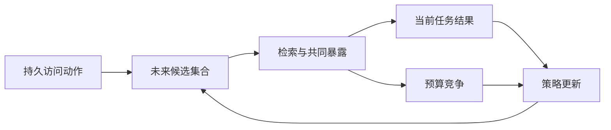

# 从门控必要性到完整理论空白：还需证明什么，以及可以从哪些方向推进

> 日期：2026-08-13  
> 用途：保存并固化对“接下来为了形式化到真正的理论空白，必要性还需要证明什么，可以从什么方向证明”的完整回答。  
> 当前边界：本文档是理论推进路线，不把尚未完成的命题写成既有结果。已完成的 Theorem 1–4、Lemma A–D 和实验状态以本目录的定理文档及 `docs/自用/03-实验证据链/` 为准。

## 0. 核心判断

可以继续提升，但方向需要稍微转一下：

> 接下来不应该证明“C1–C8 是必要的”，因为现有反例已经说明它们不是唯一道路；真正应该证明的是：不论系统采用哪条识别路线，只要想安全地提交持久访问决策，就必须满足一个更抽象的、与具体方法无关的必要条件。

这个必要条件最好定义为：

> 生命周期价值不一定需要被精确点识别，但治理动作必须是“决策可识别”的。

也就是说，不一定要知道 lifecycle value 是 3.71 还是 4.02；只需要确认所有与日志相容的可能世界，都支持同一个动作。如果可能世界中有的支持 `keep`、有的支持 `archive`，那么系统就不能安全提交。

这是最有希望把当前工作推进为完整理论贡献的方向。

## 1. 当前必要性证明距离“完整理论空白”还差什么

当前 Theorem 4 已经证明：

> 存在一对观测等价、最优动作相反的世界，使任何强制提交规则都有至少 1/2 的最坏情况错误概率。

这是一个有效的 impossibility result，但它目前仍然是：

- 针对一个具体双世界构造；
- 针对二元 `keep/archive` 动作；
- 暂时把 `unresolved` 的代价视为零；
- 没有刻画一般情况下“什么时候可以提交、什么时候必须拒绝”；
- 没有证明 SQCAD 的探测或门控在样本复杂度、regret 上接近最优。

因此，它证明了“某类强行决策不可能可靠”，但还没有形成一套完整的：

> 必要且充分的 Agent Memory 生命周期治理理论。

最关键的升级，是从“存在一个失败反例”变成“对一般模型类的完整刻画”。

## 2. 优先证明：决策可识别的必要且充分条件

这是最值得优先做的理论。

给定观测日志 $O=o$，定义与当前日志相容的所有可能世界：

$$
\mathcal M(o)
=
\{M:P_M(O=o)>0,\ M\text{ 满足基本模型约束}\}.

$$

这些世界对应一组可能的 lifecycle value：

$$
\mathcal T(o)
=
\{\tau_M(o):M\in\mathcal M(o)\}.

$$

假设其识别区间为：

$$
\mathcal T(o)=[L(o),U(o)].

$$

那么可以得到一个非常清楚的决策刻画：

- 若 $L(o)>0$，所有相容世界都认为 `keep` 更好，可以安全 `keep`；
- 若 $U(o)<0$，所有相容世界都认为 `archive` 更好，可以安全 `archive`；
- 若 $L(o)\leq 0\leq U(o)$，相容世界对正确动作存在分歧，不能保证安全提交。

这意味着真正必要的不是“点识别”：

$$
\tau\text{ 被精确识别},

$$

而是“符号或动作被识别”：

$$
\operatorname{sign}(\tau)
\text{ 在观测等价类中保持不变}.

$$

这可以写成一个必要且充分定理：

> 对二元持久访问决策，存在零最坏情况 regret 的 committing rule，当且仅当生命周期价值的识别集合不跨越决策边界 0。

这个定理的重要性在于，它把下列路线统一到一个原则下面：

- 点估计；
- 部分识别界；
- IV；
- 随机化；
- bundle 退守；
- transportability；
- SQCAD Qualification gate。

统一原则是：

> 不管用什么估计路线，只要最终能够证明识别集合落在同一个动作区域，就可以授权；否则不能授权。

这才是与具体 C1–C8 无关的“必经之路”。

### 2.1 更一般的 minimax 形式

若 $L<0<U$，系统以概率 $p$ 选择 `keep`，则最坏情况 regret 是：

$$
\max\{(1-p)U,\;p(-L)\}.

$$

最优随机提交规则的 minimax regret 为：

$$
R^*(L,U)
=
\frac{U(-L)}{U-L}.

$$

当前 Theorem 4 的 660，只是这个一般定理在

$$
L=-1100,\qquad U=1650

$$

时的具体值。

这样升级后，Theorem 4 就不再只是一个双世界计算，而成为：

> 任意跨零识别集合上的一般决策下界。

这会显著增强理论完整性。

## 3. 必须补上：拒绝不是零成本

当前 Theorem 4 最大的理论漏洞之一，是把 `unresolved` 写成：

> 错误为 0、决策 regret 为 0。

但是在真实 Agent Memory 中，拒绝决策并不意味着系统停止运行。例如：

- 当前记忆仍处于 `keep` 状态，拒绝归档意味着它继续占用 token 和预算；
- 当前记忆已经被归档，拒绝恢复可能造成 false forgetting；
- 等待更多证据有时间成本；
- 探测会消耗 token、LLM 调用和延迟；
- 不行动本身可能延续伤害。

所以应当把三个代价同时形式化：

$$
C_{\mathrm{commit}},\qquad
C_{\mathrm{defer}},\qquad
C_{\mathrm{probe}}.

$$

一般决策应写成：

$$
\min
\left\{
R^*(L,U),
C_{\mathrm{defer}},
C_{\mathrm{probe}}+R^*_{\mathrm{after\ probe}}
\right\}.

$$

由此可以得到更真实的必要性结论：

> 当强制提交的 minimax regret 高于拒绝成本或探测成本时，最优治理必须拒绝或获取新信息；反之，如果拒绝比错误决策更昂贵，强制提交可能反而是合理的。

这比“未识别就必须 `unresolved`”更加准确。

它还能直接把现有成本合同纳入理论，而不是让成本实验和识别定理成为两条平行证据链。最终可以形成一个更强的决策定理：

> 授权、拒绝和探测的选择由识别集合宽度、动作损失、拒绝成本和信息获取成本共同决定。

## 4. 证明 memory-specific 的动态必要性

目前 Theorem 4 的证明骨架接近一般的 two-point/minimax lower bound。审稿人可能会认为：

> 这是标准不可识别性或安全决策理论在 Agent Memory 上的应用。

要形成真正 memory-specific 的理论贡献，最好再证明一个由 Agent Memory 特有的动态反馈产生的定理。核心结构是：

也就是说：

> 当前的 `keep/archive` 动作会改变未来能够看到什么数据，因此系统可能把自己锁进一个永远无法纠正的证据环境。

可以从下面两个方向证明。

### 4.1 方向 A：无探索导致线性 regret

证明：

> 在策略生成暴露的 Agent Memory 环境中，若治理策略不执行持久访问探测或其他支持恢复操作，则存在一类环境，使任何纯日志驱动策略产生 $\Omega(T)$ regret。

通俗来说：

- 系统一开始误归档了某条稀有但关键的记忆；
- 归档后它不再暴露；
- 不暴露就不会产生正反馈证据；
- 没有证据又进一步强化“它没有价值”的判断；
- 系统永远无法从自身日志中纠正错误。

这是一种 memory-specific 的 self-confirming unidentifiability。它比当前静态双世界反例更强，因为它证明：

> 非识别不是一次性数据不足，而可能被记忆治理策略永久制造和维持。

### 4.2 方向 B：最低探测复杂度

如果两个世界经过一次探测后产生不同分布，可以用 KL divergence 表达它们的可区分程度。目标是证明：

$$
N_{\mathrm{probe}}
\geq
\Omega\left(
\frac{\log(1/\delta)}
{\mathrm{KL}(P_1^{\mathrm{probe}}\|P_2^{\mathrm{probe}})}
\right).

$$

即若希望以至少 $1-\delta$ 的概率选择正确动作，任何方法都必须进行一定数量的有效探测。

然后再证明 SQCAD 的 probe policy 达到：

$$
N_{\mathrm{SQCAD}}
=
O\left(
\frac{\log(1/\delta)}{\Delta^2}
\right)

$$

或相应的 KL 上界。

如果上下界能够匹配，就可以声称：

> SQCAD 不只是“一种能工作的充分方案”，而是在信息获取复杂度或 regret 意义上接近最优。

这是从“框架具备现有方法未覆盖的组件”升级到“理论上不可避免且近似最优的框架设计”的最直接路径。

## 5. 证明 local effect 何时足够、何时必然不够

现在 Theorem 2 主要通过构造反例证明：

> query-local effect 即使估计完全正确，也可能给出错误的生命周期决策。

下一步可以把它升级成一个必要且充分的分解定理。把 lifecycle advantage 分解为：

$$
\tau_{\mathrm{life}}
=
\underbrace{\Delta_{\mathrm{local}}}_{\text{当前查询收益}}
+
\underbrace{\Delta_{\mathrm{transition}}}_{\text{未来状态改变}}
+
\underbrace{\Delta_{\mathrm{budget}}}_{\text{预算竞争}}
+
\underbrace{\Delta_{\mathrm{interference}}}_{\text{共同记忆影响}}
-
\underbrace{\Delta_{\mathrm{cost}}}_{\text{持有和探测成本}}.

$$

由此证明：

> local effect 能够授权生命周期动作，当且仅当其余 continuation terms 为零、已知，或者其界不足以改变最终符号。

例如，如果 $\Delta_{\mathrm{local}}>0$，且能够证明：

$$
\Delta_{\mathrm{transition}}
+\Delta_{\mathrm{budget}}
+\Delta_{\mathrm{interference}}
-\Delta_{\mathrm{cost}}
>
-\Delta_{\mathrm{local}},

$$

则 `keep` 的符号稳定，可以授权；否则，local effect 不足。

这个方向会得到一个非常有价值的理论结论：

> 生命周期建模并不是所有情况下都必须使用；它只在未来反馈项可能改变决策符号时成为必要。

这比笼统地说“local 不等于 lifecycle”更精确，也能解释：

- 什么时候 CMI 类方法已经足够；
- 什么时候必须使用 SQCAD；
- 为什么 rare memory、共暴露、预算拥挤和版本漂移是关键环境。

## 6. 审计性必要性需要重新形式化

当前 Theorem 4(c′) 从“观测等价”直接推导“审计性必要”，这一步还不够严密。原因是：

- 一个系统可以无条件地永远拒绝；
- 它并不需要识别当前世界，也能避免错误提交；
- “规则是观测数据的函数”只是可测性，不自动等于可审计性；
- 工程意义上的审计还包括日志完整性、证据来源、可复算性和版本冻结。

因此，审计性应当单独定义。例如定义一个 authorization certificate：

$$
\mathcal C(o,a,\varepsilon).

$$

### 6.1 Soundness

$$
\mathcal C(o,a,\varepsilon)=1
\Rightarrow
\sup_{M\in\mathcal M(o)}
\operatorname{Regret}_M(a)
\leq\varepsilon.

$$

即证书通过时，动作的最坏情况 regret 有界。

### 6.2 Verifiability

证书能够仅使用已冻结的下列材料，由外部审计者复算：

- 日志；
- 随机化记录；
- overlap 统计；
- scope/version 信息；
- 估计区间；
- 成本合同。

### 6.3 Non-triviality

不能永远输出拒绝，需要在至少一部分可识别区域授权。

然后证明：

> 任何同时满足 uniform safety 和 non-trivial authorization 的治理系统，都必须产生某种 sound authorization certificate。

这时“审计性必要”才是一个真正独立、严密的定理，而不是对 Theorem 4 的口头延伸。

## 7. 现有必要性证明需要先修复的几个问题

在继续扩张理论以前，建议先处理这些 P0 问题。

### 7.1 “C1–C8 逐条件必要性均被证伪”表述过强

当前 Lemma 主要处理了：

- C2/C3；
- C6；
- C7；
- C8。

没有逐项处理 C1、C4、C5。因此目前最多可以说：

> C1–C8 的完整合取不是识别的必要条件，而且其中若干条件存在替代路线。

不能说：

> 每一个 C1–C8 条件都已被证明不必要。

除非再分别处理 C1、C4、C5。

### 7.2 改变 estimand 不等于推翻原 estimand 的必要条件

- C7 从 per-memory 改成 bundle value；
- C8 从 intended future value 改成 current value。

这说明存在“退守问题”或“替代目标”，但不严格证明原条件对原 estimand 不必要。更准确的说法是：

> 条件失败后可以改变治理粒度或估计目标，恢复另一个可治理对象。

### 7.3 IV 例子需要对应 lifecycle estimand

当前 IV 实验识别的是常数线性效应 $\tau$。要用于主理论，最好构造：

- 持久访问动作；
- 多时期 outcome；
- 候选—暴露反馈；
- lifecycle discounted return；
- 未观察混杂；
- 有效 instrument。

否则审稿人可能认为它只证明了标准横截面 IV 可以替代随机化，而没有证明可以识别原来的 $V_s^\pi(a)$。此外，一般 IV 识别的可能是 LATE，而不是 lifecycle ATE，需要明确效应同质性或 principal stratum。

### 7.4 C6 需要隔离“测量误差”和“真实机制变化”

当前两个 adoption error 世界中的估计值和 oracle 都发生了变化，说明 adoption error 可能不仅改变代理测量，还反馈进入了真实暴露机制。最好重新构造：

- 真实 adoption process 完全不变；
- 只翻转或污染观察到的 adoption proxy；
- 协议估计器仍恢复同一个 oracle；
- 观测 g-formula 因错误 proxy 失效。

这样才能干净地证明：

> C6 对协议路线不必要，但对依赖 adoption kernel 的观测路线必要。

## 8. 建议的理论推进优先级

### P0：先修正现有定理

- 删除“C1–C8 逐项均已证明不必要”；
- 修复 C6 隔离实验；
- 明确 C7/C8 是 estimand/granularity retreat；
- 收紧 Theorem 4(c′)；
- 将“识别意识”改成更精确的“决策可识别性意识”。

### P1：一般化 Theorem 4

证明：

$$
\text{安全提交}
\Longleftrightarrow
\text{识别集合位于同一动作区域}.

$$

并给出跨零区间上的一般 minimax regret：

$$
R^*(L,U)=\frac{U(-L)}{U-L}.

$$

这是最容易形成完整理论闭环的一步。

### P2：加入拒绝与探测成本

证明在 `commit`、`unresolved` 和 `probe` 三者之间的最优治理边界，使现有成本合同进入理论。

### P3：证明动态探索必要性

证明无探测时的 $\Omega(T)$ regret，或最低 probe sample complexity。

### P4：证明 SQCAD 达到上界

如果 SQCAD 的 gate/probe 策略能够匹配信息论下界，就可以提出真正强的结论：

> SQCAD 是实现有界错误 lifecycle governance 的一种 minimax-rate-optimal realization。

## 9. 最终可以争取的理论主张

如果完成 P1–P4，论文就不再只是说：

> 我们发现旧方法有遗漏，并提出一个更完整的框架。

而可以说：

> 我们建立了持久访问记忆治理的决策识别理论：刻画了何时日志足以授权动作、何时任何强制提交规则都具有不可消除的 minimax regret，以及为突破该下界所需的最小证据获取成本；SQCAD 实现了这一理论要求，并在给定条件下达到相应上界。

最核心的一句话是：

> 不要再试图证明“所有方法都必须经过 C1–C8”；应该证明“所有安全方法都必须获得一个不跨动作边界的识别集合，或者为更多信息/拒绝付出成本”。C1–C8 和 SQCAD 是实现这一必要原则的一条可审计路线。

---

## 10. 推进状态（2026-08-13 实验补充后回写）

> 本表把 §8 的优先级逐项回写为推进状态；详细数字见 `docs/自用/03-实验证据链/12-决策识别理论与动态探索实验报告-20260813.md`；代码 `src/sqcad/decision_identification_theory.py`（11 项测试，全套 224 项通过）。

| 优先级 | 内容 | 状态 | 落地 |
|---|---|---|---|
| P0 | C6 隔离（机制不变、只污染代理，§7.4） | ✅ 完成 | 协议估计 1.1914 逐位相同；观测采纳对比按 $(1-2\varepsilon)$ 稀释 0.322→0.089 |
| P0 | IV 扩展至 lifecycle estimand（§7.3） | ✅ 完成 | Wald-IV 误差 0.017 vs 观测偏倚 12.96；加性同质性下 lifecycle ATE，否则 LATE（如实标注） |
| P0 | C7/C8 语义修正为治理粒度/estimand 退守 | ✅ 完成 | `实验证据链/11` 报告口径已按本方向修订 |
| P0 | "识别意识" → "决策可识别性意识" | ✅ 完成 | `12` 文档 §3.6 命名修正 |
| P0 | authorization certificate 形式化（§6：soundness/verifiability/non-triviality） | ⚠️ 未完成 | Theorem 4(c′) 的收紧仍是 P0 遗留 |
| P1 | 一般决策识别定理 $R^*(L,U)=U(-L)/(U-L)$（§2） | ✅ 完成 | **Theorem 5 完整证明**（`12` 文档 §3.6）+ 计算验证（660 复现 @$p^*=0.6$；决策识别非点识别实例 $(500,1650)$ $\operatorname{regret} = 0$） |
| P2 | commit/defer/probe 三成本决策边界（§3） | ✅ 完成（数值级） | $C_{\mathrm{probe}}<330$ 探测胜 commit、$<170$ 胜 defer；与 Gate 4 $\lambda_{\text{probe}}$ 对接待做 |
| P3 | 动态探索必要性（§4 方向 A/B） | ⚠️ 数值落地 | 无探测斜率 $6.000=\tau\cdot p$ 精确线性（self-confirming）；$q=0.05$ regret 12000→128；**$\Omega(T)$ 严格证明待做** |
| P4 | 探测复杂度上下界（§4.2） | ⚠️ 数值落地 | $\operatorname{KL}$ 下界 9.36 vs SQCAD 式停止规则 34.6（3.7× 同阶）；**minimax 严格证明待做** |

**净变化**：Theorem 4 已从"双世界计算"升级为一般跨零识别集合的下界（Theorem 5 吸收）；"未识别必须拒绝"修正为三成本比较；C6/IV 两处 P0 缺陷关闭。仍缺：certificate 形式化（P0 遗留）、P3/P4 的严格证明、P2 与成本合同的参数对接。
