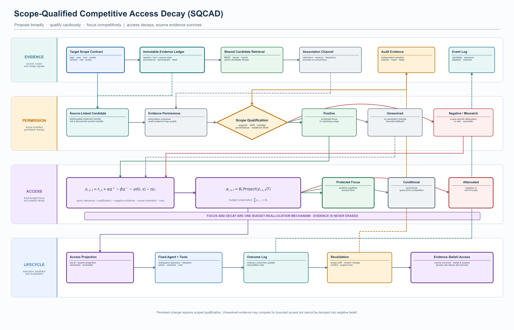
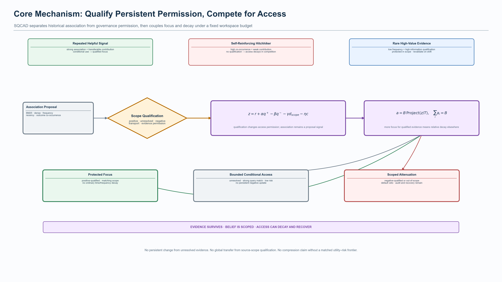

> **位置说明（2026-08-08）：** 本文件是作业二正式稿的草稿区源文件与版本留痕。对外提交或老师审阅请以同目录上级的 `../08-作业二-SQCAD完整方案-20260808.md` 为准；图源、脚本与实验记录继续保留在本杂项目录。

# Assignment 2 — Scope-Qualified Competitive Access Decay

> 本文件只整理 Introduction 之后的作业二内容。它给出完整的方法、框架图、数据与实验计划、基线、benchmark、消融、统计门和失败裁决。**本轮不运行 SQCAD 性能实验，也不把设计动机写成已证明的优越性。**

## 0. 一句话论证、当前状态与边界

### 0.1 一句话论证

在候选、曝光、采纳和结果由同一历史策略共同产生、且工作区预算有限的 Agent Memory 中，SQCAD 允许关联信号宽松提出候选，只允许目标作用域内获得资格的证据改变持久访问状态，并通过预算守恒的竞争性访问投影，将单次任务的访问质量从未支持、负向或作用域外记忆重新分配给合格记忆。

### 0.2 当前状态

- 正式保留的已有不变量：`unresolved` 证据不能改变持久访问权；Evidence、Belief 与 Access 必须分离。
- 本轮新增候选机制：**Scope-Qualified Competitive Access Decay（SQCAD）**。
- 本轮完成：方法定义、设计图、数据方案、benchmark、基线、消融、指标和 Go/No-Go。
- 本轮未完成：任何 SQCAD 性能实验、公开 benchmark 结果或优越性结论。

### 0.3 论证边界

SQCAD 不声称：

- 自动发现抽象因果规律；
- 一次普通成功即可建立因果和全局泛化；
- Bayesian inference、decay、分层或 softmax 本身是新方法；
- 更少 active tokens 自动意味着更高智能；
- 访问衰减等于物理删除；
- 当前设计已经优于 FadeMem、Oblivion、Memory Worth、DeMem、SimpleMem 或 SAGE。

## 1. 研究直觉与方法论世界观

### 1.1 聚焦与衰减是一体两面

Agent 的工作区预算固定为 (B_t) 时，提高一部分记忆的访问质量必然降低其他记忆的相对访问质量。因此，“聚焦”是访问资源重新分配的正面表述，“衰减”是同一过程的反面表述：

\sum_i a_{i,s,t}=B_t.

SQCAD 衰减的不是原始历史，而是记忆在目标作用域和当前任务中的**默认访问质量**。来源证据始终保留；资格、作用域或任务变化只改变 Access Projection。

### 1.2 频率不是价值，证据质量也不等于次数

同一历史可以形成四类记忆：

| 历史相关性 | 可迁移增量贡献 | 典型现象 | SQCAD 处理 |
|---|---|---|---|
| 高 | 高 | 多学多会 | 关联通道支持当前使用；资格通过后获得 protected focus |
| 高 | 低或无 | 多学多错、hitchhiker | 无独立证据则不得持久强化；在竞争中逐步失去访问质量 |
| 低 | 高 | 稀有保护规则、一次高信息量证据 | 正向资格可保护其作用域内访问，不受普通频率衰减 |
| 低 | 未知 | 新记忆或证据不足 | 保持 unresolved；允许有界条件访问，不做持久负衰减 |

“一次因果学习能够泛化”的严格版本是：一次高信息量、可审计的证据可以比大量内生共现更有资格，但它只能在 transport 条件通过的目标作用域中复用。

### 1.3 记忆价值是条件关系，不是内在标量

框架不假设全局固定的 (V(m_i))，而使用：

V_{i,s,t}=V(m_i\mid \text{task, user, tool, version, risk, policy}).

同一条记忆可以在一个作用域中 Active，在另一个作用域中 Conditional 或 Quarantined。泛化因此是一个 transport permission，而不是语义相似度自动授权。

### 1.4 因果不是更高级的分数，而是一种治理权限

相关性可以提高当次检索效率，但不能自动改变长期候选流。因果或等价的高等级资格证据的作用是决定：

> 哪些派生信念有权限改变 persistent access policy。

这使框架从“估计一个更好的 memory score”转向“治理长期状态变更的证据权限”。

### 1.5 最小主义

只有会改变以下对象的设计才进入核心：

1. qualification；
2. scope transport；
3. persistent permission；
4. fixed-budget access projection；
5. false-forgetting / harmful-retention 前沿。

语义解构、多分辨率、group hierarchy、独立 Bayesian optimization、额外预算上限和不可逆删除均不进入核心。

## 2. 两个 Research Gaps 与由此推导的设计挑战

### Gap 1 — Trajectory-Conditioned Associational Overfitting

候选 $C_t$、曝光 $Z_t$、采纳 $A_t$、行动和结果 $Y_t$ 由历史策略 $\pi_t$ 共同生成。一个无贡献的 hitchhiker 可能因为与真正有用的记忆共同曝光而反复伴随成功，并通过“成功共现 → 提高权重 → 更常曝光 → 更多成功共现”形成闭环自我强化。

**SQCAD 的回应：** association 只负责 candidate proposal 和低风险 conditional use；普通结果不得更新持久 qualification。只有独立变化、可审计微干预或满足预注册条件的证据才能授予 persistent permission。

### Gap 2 — Scope-Qualified Recoverable Governance

来源作用域中的局部效应或高相关性不能自动变成跨时间、跨任务和跨版本的永久访问规则。错误遗忘和错误保留的代价不同，且访问动作需要可撤回。

**SQCAD 的回应：** qualification 对 scope/version 有效；transport gate 决定能否迁移；positive、negative 和 unresolved 明确分离；竞争性衰减只改变目标作用域中的 Access Projection；Evidence Ledger 不被覆盖。

### 由两个 Gap 推导的设计挑战 — Focus–Decay Coupling under a Fixed Workspace Budget

这不是 Introduction 中独立提出的第三个 Research Gap，而是把 Gap 1 和 Gap 2 落地为访问算法时必然出现的工程与方法挑战：资格门若只阻止错误衰减，可能保留过多活跃记忆；强 default-cold 又可能过滤掉未资格但当前有用的信号。因而需要一个介于“冻结全部未决项”和“未资格即不可访问”之间的预算守恒机制。

**SQCAD 的回应：** unresolved 不承受持久负衰减，但会在每个任务中与其他候选竞争有限访问质量；强 query match 和低风险允许 bounded fallback；positive qualification 获得保护性 focus；negative qualification 和 scope mismatch 获得显著 attenuation。

## 3. 研究问题与可证伪假设

### 3.1 核心研究问题

在不把内生关联误作长期贡献、也不因强过滤而错误遗忘稀有信号的条件下，能否通过作用域资格约束的竞争性访问衰减，提高固定工作区中决策相关证据的浓度？

### 3.2 假设

| ID | 假设 | 决定性比较 | 失败裁决 |
|---|---|---|---|
| H1 | qualification 能阻止高频 hitchhiker 获得持久影响 | SQCAD vs association-only competition | 若无差异，Gap 1 的权限设计缺少实证必要性 |
| H2 | scope qualification 能降低跨任务/版本负迁移 | full vs no-scope / global scope | 若无差异，删除 transport gate |
| H3 | competitive access decay 能在保持 future utility 时减少 active tokens | SQCAD vs v3 qualification freeze | 若只减 token 但 utility 下降，不支持 focus–decay 结论 |
| H4 | protected focus 能保留低频高价值记忆 | full vs no-positive-protection / fixed time decay | 若 FF-regret 不改善，保护规则无独立价值 |
| H5 | bounded fallback 能避免 default-cold 的过度保守 | full vs no-fallback / default-cold | 若无改善，删除 fallback |
| H6 | negative qualification 与 scope mismatch 能减少 harmful retention | full vs no-negative attenuation | 若无改善，不主张显著衰减价值 |
| H7 | budget normalization 是聚焦—衰减耦合的必要条件 | competitive normalization vs independent decay | 若无差异，回退到更简单访问规则 |

## 4. 问题设定与术语账本

### 4.1 时序对象

- (E)：不可变 Evidence Records；
- (m_i)：第 (i) 条可寻址记忆或 source-linked handle；
- (s_t)：目标 scope，包括 task/user/tool/model/version/risk/policy；
- (C_t)：共享候选集合；
- (Z_{it})：是否进入工作区；
- (A_{it})：Agent 是否实际采纳；
- (Y_t)：任务效用、风险和成本结果；
- (Q_{i,s}\in\{q^+,q^-,?\})：目标作用域资格；
- (r_{i,t})：当前 query 的廉价关联分数；
- (a_{i,s,t}\ge0)：单次任务的访问质量；
- (B_t)：固定工作区访问预算。

### 4.2 规范术语

| 规范术语 | 精确定义 | 不应混用 |
|---|---|---|
| Evidence Record | 原始会话、行动、工具返回、结果和来源元数据 | 不称为 causal memory |
| Associational Candidate Signal | BM25、dense、频率、recency、成功共现等廉价候选信号 | 不称为 causal value |
| Scoped Qualification | 在明确 scope/version 和证据等级下的 positive、negative 或 unresolved | 不称为全局因果真理 |
| Persistent Permission | 允许改变长期访问先验或状态的资格权限 | 不等于当次 query 检索命中 |
| Competitive Access Decay | 固定预算下，候选访问质量的相对重分配和作用域衰减 | 不等于物理删除或统一时间衰减 |
| Protected Focus | positive-qualified 项在匹配作用域中的访问下界或资格加成 | 不等于永久全局保留 |
| Bounded Fallback | unresolved 项在强 query match、低风险条件下的有限临时访问 | 不授予持久资格 |
| Evidence–Belief–Access Separation | 来源、推断和访问策略分别维护 | 不允许派生状态覆盖来源 |

## 5. SQCAD 方法总览

SQCAD 只有三个核心职责：

\boxed{
\text{Propose broadly}
\rightarrow
\text{Qualify cautiously}
\rightarrow
\text{Focus competitively}
}

标准写入器、向量库、BM25/dense retriever、Agent、planner、tools 和 evaluator 是固定底座，不列为创新。

### 5.1 Framework Figures

*Figure 1. SQCAD full lifecycle. Persistent qualification and per-task access mass are separated across Evidence, Permission, Access and Lifecycle lanes. Focus and decay are implemented as one budget-conserving projection; source evidence is never erased.*

*Figure 2. SQCAD core mechanism. Repeated helpful signals, self-reinforcing hitchhikers and rare high-value evidence receive different access outcomes only after scope qualification; unresolved evidence retains bounded conditional access.*

### 5.2 M1 — Associational Candidate Proposal

**动机。** 对所有记忆执行付费审计不可扩展，而相似度、频率和历史共现仍是有效的廉价候选信号。

**机制。** 所有方法共享 (C_t)。关联通道只输出 (r_{i,t}) 和 proposal rank；普通在线结果可以更新这一廉价通道，但不能更新 (Q_{i,s})。

**边界。** M1 不是创新模块；其职责是保证 SQCAD 不依赖等待因果资格才能完成当前任务。

### 5.3 M2 — Scope-Qualified Persistent Permission

**动机。** 历史成功共现可能来自任务难度、共同曝光、检索位置或旧策略；来源作用域中的证据也可能无法迁移到目标作用域。

**机制。** 对候选读取：source provenance、scope/version、支持度、证据类型、overlap、漂移和资格状态。只有通过资格与 transport 检查的证据才能改变持久状态：

P_{i,s}^{\mathrm{persist}}=1
\iff
Q_{i,s}\in\{q^+,q^-\}
\land
T(i\rightarrow s)=1.

`unresolved`、out-of-scope 或资格过期均无权执行持久变化。统计实现可以是置信序列、校准后验或其他可验证估计器；Bayesian 不是方法贡献的必要条件。

**输出。** (q^+) 授予 protected focus；(q^-) 授予 scope-specific attenuation/veto；`?` 维持中性资格并进入竞争性条件访问。

### 5.4 M3 — Scope-Qualified Competitive Access Decay

**动机。** 资格门本身不能解决固定工作区中的聚焦问题；统一时间衰减会伤害低频高价值记忆；强 default-cold 会把未资格与无价值混为一谈。

**访问 logit。** 对目标作用域 (s) 和任务 (t)：

z_{i,s,t}
=r_{i,t}
+\alpha \mathbf 1[Q_{i,s}=q^+]
-\beta \mathbf 1[Q_{i,s}=q^-]
-\gamma d(i,s)
-\eta c_i,

其中 (d(i,s)) 是 scope/version mismatch，(c_i) 是 token、延迟或工具成本。所有系数全局预注册，不做 per-scenario tuning。

**预算守恒投影。** 将 logits 投影到固定访问预算：

a_{i,s,t}
=B_t\,
\frac{\exp(z_{i,s,t}/T)}
{\sum_{j\in C_t}\exp(z_{j,s,t}/T)},
\qquad
\sum_i a_{i,s,t}=B_t.

实现可以使用 top-(B)、sparsemax/entmax 或带下界的离散选择；主实验冻结一种实现，其他只作为替代消融。

**资格特定规则。**

- (q^+)：获得 protected focus；普通时间和低频不降低其匹配作用域访问下界，资格过期后回到 Conditional；
- `?`：不承受持久负衰减，只在每次任务中竞争；强 query match 且低风险时允许 bounded fallback；
- (q^-)：在该作用域中显著 attenuation 或 veto，但保留显式恢复和审计接口；
- out-of-scope：不改变来源资格，只降低目标作用域当次访问；
- Evidence Ledger：任何投影均不删除原始来源。

**聚焦—衰减解释。** 在固定 (B_t) 下，对 (q^+) 增加访问质量会自动降低未支持候选的相对访问；对 (q^-) 或 scope mismatch 施加衰减会把访问质量释放给更合格的候选。二者是同一个预算投影，而不是两个独立模块。

## 6. 在线和异步流程

### 6.1 在线路径

1. 读取 task/user/tool/model/version/risk，形成目标 scope contract；
2. 共享 BM25/dense/association 生成 (C_t) 和 (r_{i,t})；
3. 读取候选的来源、资格、transport 和成本字段；
4. 计算 (z_{i,s,t}) 并投影到 (B_t)；
5. 按 access mass 构造工作区；
6. Agent 执行并记录 candidate、exposure、position、adoption、action、outcome 和 cost；
7. 普通结果只更新 association，不更新 persistent qualification。

### 6.2 异步资格和治理路径

1. 对可能改变治理动作且证据不足的候选加入审计队列；
2. 使用自然独立变化、随机 expose/mask/delay 或人工验证获得资格证据；
3. 按 scope/version 更新 (Q_{i,s})；
4. 资格通过后更新 persistent permission，而不是覆盖 Evidence；
5. scope shift、版本变化、冲突或支持度下降触发重新验证；
6. 所有变化写入 versioned decision log，支持 rollback。

## 7. 框架贡献与已有工作的边界

### 7.1 不作为创新的部件

- novelty/write gate：SAGE 等已覆盖；
- semantic compression：SimpleMem 等已覆盖；
- time/frequency/relevance decay：FadeMem 等已覆盖；
- accessibility decay/reactivation：Oblivion 等已覆盖；
- success/failure feedback 与 Beta-Bernoulli uncertainty：Memory Worth 已覆盖；
- decision-centric rate-distortion：DeMem 已覆盖；
- Bayesian inference、softmax、top-k、冷热分层和恢复本身均不新。

### 7.2 候选联合贡献

1. **Permission formulation：** 将研究对象从 memory value score 改为“什么证据有资格改变 persistent access”。
2. **Association–Qualification separation：** 关联信号可以服务当前任务，但不能自动治理未来候选流。
3. **Scope-qualified competitive decay：** 持久资格和目标作用域约束一个预算守恒的访问投影，使 protected focus 与 access decay 成为同一机制，并保留 unresolved 的 bounded fallback。
4. **Closed-loop evaluation protocol：** 显式分开 candidate、exposure、adoption、action 和 outcome，评估治理动作对未来候选流的反馈。

在最接近工作的全文与代码审计完成前，不使用 `first`。

## 8. 数据与实验计划（本轮不执行）

### D0 — 受控机制世界

目的：得到可控真值，区分真正贡献、hitchhiker、低频高价值和作用域迁移。

预注册因素：

- 强相关真信号与高频 hitchhiker；
- task difficulty confounding；
- candidate co-exposure 和 prompt-position bias；
- 低频保护性正价值与高危负价值；
- abrupt/gradual scope、tool、model、version shift；
- scope overlap 从无共享到部分可迁移；
- qualification noise 和 gate error；
- 不同工作区预算、token cost 和 risk ratio；
- qualification sparse / dense；
- stationary association-friendly control。

每个策略共享 world、candidate stream、潜在曝光结果、Agent contract 和 evaluator；任何非 oracle 策略不得读取 latent value。

### D1 — LongMemEval chronological protocol

- 严格按时间构造历史和 future split；
- 使用相同 reader、candidate stream、workspace token、LLM、prompt 和 evaluator；
- 重点切片：temporal reasoning、knowledge update、multi-session、single-session user facts；
- 公开数据没有 item-level 因果真值，因此只评估 future utility、active tokens、作用域误拒绝和负迁移，不替代 D2 因果校准。

### D2 — LoCoMo longitudinal protocol

- 按 session 时间切分，禁止随机打散；
- 使用 gold evidence 或人工审计支持 retrieval/adoption precision；
- 构造语义高相似但决策无关、低频关键事实和跨 session 更新切片；
- 评估回答效用、证据覆盖、工作区污染和 token/成本。

### D3 — Dynamic interactive protocol

使用 GoodAI-LTM 或等价可复现长期交互环境，加入：

- 目标改变；
- 工具/规则版本更新；
- 切回旧作用域；
- 隐蔽保护规则；
- 恢复和 rollback 事件。

该层验证 access policy 改变未来候选流和恢复延迟。

### D4 — 随机微干预校准

在低风险任务中，对少量 shortlist 候选随机执行 expose/mask/delay：

- 记录 propensity；
- 检查 overlap；
- 区分 exposure 与 adoption；
- 验证 evaluator stability；
- 校准 qualification direction、interval coverage 和 sign error；
- 高风险 persistent governance 只有在该层通过后才启用。

## 9. Baselines

所有比较固定候选、预算、模型、工具、prompt、evaluator、时间切分和价格合同。

### 9.1 基础访问基线

1. full-history / keep-all；
2. BM25 top-k；
3. dense retrieval top-k；
4. hybrid retrieval；
5. LRU / recency；
6. fixed exponential decay；
7. association-only competitive access。

### 9.2 最接近治理和压缩基线

8. SAGE（写入 novelty gate；仅在统一写入协议可复现时比较）；
9. SimpleMem（结构压缩/意图读取；作为系统级效率基线）；
10. FadeMem；
11. Oblivion；
12. Memory Worth；
13. DeMem；
14. Memory Worth + FadeMem/Oblivion 组合基线。

### 9.3 本项目内部基线

15. v3 qualification-gated freeze；
16. v4 default-cold / posterior gate；
17. scope gate without competition；
18. competitive decay without qualification；
19. full SQCAD。

若论文原实现不可获得，只能报告明确标注的 behavioral proxy，不得把 proxy 冒充原方法。

## 10. 指标与 Decision-SNR

### 10.1 主指标

- future utility / future regret；
- false-forgetting regret（FF-regret）；
- harmful-retention regret；
- active tokens、workspace occupancy、active fraction；
- 固定 utility/risk 下的最小 active tokens；
- out-of-scope rejection 和 negative transfer；
- adoption precision / evidence precision；
- qualification coverage、sign error 和 calibration；
- quarantine/restore rate、recovery latency；
- probe、LLM、token、tool 和 wall-clock cost；
- tail risk / CVaR。

### 10.2 Decision-SNR

在可控或微干预切片中定义：

\operatorname{DecisionSNR}(s)
=\frac{\sum_{i\in W_s}(\tau_i(s))^+}
{\sum_{i\in W_s}(-\tau_i(s))^+
+\lambda_{\mathrm{token}}|W_s|
+\lambda_{\mathrm{conflict}}I_s},

其中 (	au_i(s)) 是 expose/mask 下的作用域增量价值，(W_s) 是实际工作区。公开数据无法识别 (	au_i) 时，Decision-SNR 只报告可观测代理，不能冒充因果指标。

### 10.3 成功判据

“聚焦—衰减”成功必须满足至少一种：

\text{相同 active tokens 下 future utility 更高},

或

\text{相同 future utility / risk 下 active tokens 更少}.

只减少 memory 或只降低 harmful retention 不能支持总体优越性。

## 11. 消融实验

| ID | Remove / Replace | 回答的问题 | 失败裁决 |
|---|---|---|---|
| A1 | qualification → association-only | 资格是否阻止多学多错 | 无差异则收缩 Gap 1 |
| A2 | scoped qualification → global qualification | scope 是否降低负迁移 | 无差异则删除 transport gate |
| A3 | competitive normalization → independent decay | 聚焦与衰减耦合是否必要 | 无差异则使用更简单衰减 |
| A4 | protected focus → no positive floor | 是否保护低频高价值 | 无差异则删除保护下界 |
| A5 | unresolved neutral → persistent unresolved decay | 是否复现错误遗忘 | 无退化则重新检查 Gap 设计 |
| A6 | bounded fallback → no fallback | fallback 是否防止过度保守 | 无差异则删除 fallback |
| A7 | negative attenuation → no negative action | 是否减少 harmful retention | 无差异则降级负向治理 |
| A8 | scope mismatch penalty → no mismatch penalty | 是否过滤作用域外噪声 | 无差异则不主张 scope filtering |
| A9 | recovery floor → zero floor | gate error 后能否恢复 | 无差异则简化恢复接口 |
| A10 | Evidence–Belief–Access separation → merged state | 状态分离是否防止不可撤回错误 | 无差异则降级为工程实现 |
| A11 | fixed budget → unbounded workspace | 增益是否依赖预算约束 | 仅限紧预算时必须明确边界 |
| A12 | query-time competition → persistent score update | 单次竞争是否避免自我强化 | 若持久更新不伤害，权限主张减弱 |

## 12. 压力测试与反例

1. **Strong association control：** association 已足够可靠，SQCAD 不应制造虚假增益；
2. **Hitchhiker saturation：** 无独立曝光时不得错误正资格；
3. **Rare protective memory：** 长期未使用但已正资格的规则不得因普通时间衰减丢失；
4. **Scope-gate error：** 错误作用域识别下的 FF-regret 和恢复能力；
5. **Abrupt version shift：** 旧资格应失效为 Conditional，而不是自动变负；
6. **Return-to-old-scope：** 切回旧作用域后的恢复延迟；
7. **Budget extremes：** 极小/极大 (B_t) 下的退化行为；
8. **No qualification evidence：** 系统应退化为 bounded associational access，而不是停止工作；
9. **Adoption unobserved：** 只能声称 exposure-level 效应；
10. **Evaluator drift：** evaluator 变化时资格暂停更新。

## 13. 统计与公平性规则

- 严格 chronological / rolling-origin split；
- paired seeds、共享 candidate stream 和潜在结果；
- 不按 scenario 调 (alpha,\beta,\gamma,\eta,T,B_t)；
- 开发集冻结全部参数，测试集只评估；
- 报告 paired bootstrap / paired CI；
- 多切片和多消融使用预注册 family control；
- 平均值、worst-group 和 CVaR 同时报；
- 结果按真实实现、behavioral proxy、oracle reference 分栏；
- 公开 benchmark 与微干预校准分别报告，不以一者替代另一者。

## 14. Go/No-Go

| Gate | 通过条件 | 未通过裁决 |
|---|---|---|
| G1：权限必要性 | qualification 相对 association-only 降低 hitchhiker persistent influence | 降级为普通 access re-ranking |
| G2：低频保护 | 相对 fixed decay/default-cold 不增加 rare-positive FF-regret | 删除 protected-focus 主张 |
| G3：显著衰减 | 相对 v3 在 matched utility/risk 下减少 active tokens 和 harmful retention | 不能声称 focus–decay 优势 |
| G4：作用域迁移 | 相对 global/no-scope 降低 cross-version negative transfer | 删除 scope-transport 贡献 |
| G5：竞争必要性 | competitive projection 优于 independent decay | 回退更简单规则 |
| G6：外部有效性 | 至少一个 public future split 和一个 micro-intervention slice 通过 | 仅保留受控机制结论 |
| G7：稳健性 | gate error、budget extreme、evaluator drift 下无灾难性退化 | 不启用 persistent governance |

## 15. 预期论文结构和允许的未来主张

### 15.1 建议 Method 小节

1. Problem Formulation and Evidence Permissions；
2. Associational Candidate Proposal；
3. Scope-Qualified Persistent Permission；
4. Competitive Access Decay；
5. Online Execution and Asynchronous Revalidation；
6. Complexity and Safety Invariants。

### 15.2 若全部实验通过，允许的主张

> Under a fixed workspace budget, SQCAD reallocates access mass from high-frequency but unqualified, negatively qualified, or out-of-scope memories toward scope-qualified evidence, reducing harmful retention and active context without increasing false forgetting at matched future utility.

### 15.3 当前只能写的主张

> SQCAD is a falsifiable design that couples scope-qualified persistent permission with budget-conserving competitive access decay. Its effectiveness, calibration and external validity remain to be evaluated under the preregistered protocol.

## 16. 完成作业二后的执行顺序

1. 冻结图、术语和实验协议；
2. 实现 D0 controlled challenge 与单元测试；
3. 先比较内部 v3/v4 和基础 decay baselines；
4. 通过机制门后再接 LongMemEval/LoCoMo；
5. 最后运行低风险 randomized micro-intervention；
6. 按 Go/No-Go 删除失败模块，不通过调参保留组件。

## 17. Claim–Evidence Map

| Claim | 当前证据 | 状态 |
|---|---|---|
| unresolved 不应驱动持久负衰减 | 既有受控 v2/v3 机制证据 | supported as prior baseline evidence |
| association 与 qualification 应分开 | 文献边界与既有受控反例 | supported as design motivation |
| competitive access decay 提高 utility–token frontier | 尚未运行 SQCAD 实验 | needs evidence |
| scope qualification 降低负迁移 | 尚未运行 SQCAD 实验 | needs evidence |
| protected focus 保护低频高价值 | 尚未运行 SQCAD 实验 | needs evidence |
| SQCAD 提高 Decision-SNR | 尚未运行微干预校准 | needs evidence |

## 18. 最终方法论表达

SQCAD 不让 Agent “记得更多”或“忘得更狠”，而是规定：

> 关联可以帮助当前使用，资格决定长期权限，作用域限制泛化边界，竞争把有限访问质量聚焦到更有资格的证据；任何访问衰减都不得被误写为原始证据消失。

最小口号是：

\boxed{
\text{Propose broadly. Qualify cautiously. Focus competitively.}
}

