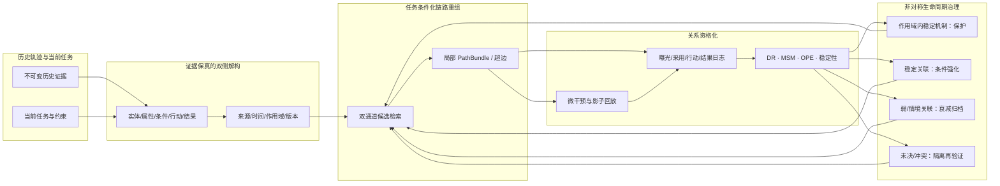

# 历史轨迹解构—因果资格化—非对称衰减：完整 Agent Memory 工程蓝图

> 本文件属于草稿与工程探索，不进入当前 Introduction，也不代表最终方法已经确定。它把用户提出的“解构记忆与任务—重组链路—区分因果与关联—保护核心骨架并分层衰减”的直觉，转换为可实现、可审计、可证伪的 Agent Memory 工作流。

## 0. 结论先行

### 0.1 总体判断

该路线能够回应 Introduction 中收紧后的核心问题：Agent Memory 的生命周期状态可能对历史轨迹中“记忆暴露—任务成功”的共现过拟合，而不是依据记忆成分对行动结果的可迁移贡献进行更新。当前判断仍为 **Conditional GO**：

1. **可实现的部分**：历史轨迹和当前任务可以被转换为带来源、时间、作用域和版本的可寻址成分；局部链路可以按任务条件重组；组件暴露可以在回放环境中接受遮蔽、替换和簇级干预；治理状态可以事务化、可恢复地更新。
2. **不能预设的部分**：图谱结构、LLM 解释或多次成功共现不能直接把一条边认证为因果关系；“因果骨架”必须是逐步获得、可以撤回且有作用域的资格状态。
3. **真正的核心模块**：不是二元地“保留因果、删除相关”，而是把组件分为已资格化机制、稳定经验关联、情境关联、未决/冲突四类，再采用不对称、风险敏感和可恢复的访问衰减。
4. **对内生性的回应**：解构降低复合记忆导致的粗粒度信用分配偏差；真实 propensity、微干预、DR/MSM/OPE 和跨环境稳定性进一步处理策略生成曝光。两者必须同时存在，才可声称缓解由共现和内生曝光造成的遗忘偏差。

### 0.2 一句话系统契约

> 给定历史交互轨迹和当前任务，系统构造带证据谱系的记忆—任务组件束，在受控暴露和跨环境证据下为关系赋予可撤回的因果或关联资格，再依据效应、不确定性、作用域和错误成本更新其未来可访问性；原始证据始终保留为审计和恢复通道。

### 0.3 不是本文方案的内容

- 不宣称从自然语言图谱中直接恢复真实结构因果模型；
- 不把高频当作强关联，也不把低频当作低价值；
- 不把“因果标签”当作永久保留许可；
- 不因抽象规则生成成功而删除原始证据；
- 不以单一二元任务成功率作为记忆价值；
- 不把当前受控模拟结果写成公开 benchmark 或 SOTA 结果。

## 1. 术语账本与治理对象

| 规范术语 | 严格含义 | 不等同于 |
| --- | --- | --- |
| 原始证据 `EvidenceRecord` | 不可变的历史对话、观察、工具结果或环境反馈，带来源与可得时间 | 摘要或抽取器生成的事实 |
| 任务表示 `TaskRecord` | 当前目标、实体、约束、所需输出、时间和工具作用域 | 只有查询文本的 embedding |
| 候选因子 `FactorRecord` | 从证据或任务中提取的实体、属性、条件、行动、结果、约束等可寻址成分 | 已确认的因果变量 |
| 关系候选 `RelationCandidate` | 因子间的时间、支持、冲突、条件依赖、关联或可能因果关系 | 图中已经成立的因果边 |
| 任务条件化链路 `PathBundle` | 围绕当前任务构造的局部因子/关系子图及其来源证据 | 全局知识图谱中的任意最短路径 |
| 因果资格 `CausalQualification` | 经处理定义、overlap、干预/调整、稳定性和作用域审计后获得的可撤回状态 | 抽取器置信度或语言模型解释 |
| 稳定经验关联 | 多个独立、高质量环境中可复现，但尚无充分因果识别证据的关系 | 应被删除的“非因果噪声” |
| 核心骨架 | 在明确作用域内具有稳定增量作用、来源可追溯的机制或约束组件束 | 跨所有用户、任务和策略普遍不变的真理 |
| 非对称衰减 | 根据误忘代价、误留代价、证据质量和不确定性设置不同的访问衰减速度 | 统一指数时间衰减 |
| 生命周期治理 | `reinforce / keep / downweight / archive / isolate / restore` 等可恢复状态转移 | 物理删除或模型参数 unlearning |

## 2. 研究问题到系统模块的映射

| 核心问题 | 方法模块 | 必须产生的可审计输出 | 失败时的回退 |
| --- | --- | --- | --- |
| 整体记忆把有效条件和表面细节绑定 | 证据保真的双侧解构 | 因子、关系、证据跨度、作用域、解析版本与置信度 | 使用原始 evidence chunk，不进入规则治理 |
| 当前任务只激活历史记忆的一部分 | 任务条件化链路重组 | 有界局部子图、路径分数、覆盖的任务约束和 token 成本 | 回退到固定 BM25/RRF 候选流 |
| 共现成功不等于增量作用 | 因果资格化与暴露日志 | treatment、propensity、overlap、效应区间、环境稳定性 | 维持关联/未决状态，不作强治理 |
| 相关记忆会被检索反馈自我强化 | 去偏证据累积 | 独立 episode 数、曝光校正证据、冲突率与多样性 | 限制强化幅度，增加探索或隔离 |
| 低频关键记忆易被错误衰减 | 非对称风险决策 | false-forgetting risk、LCB、scope 与恢复代价 | 默认保留或轻度降权 |
| 过时/刻板关联持续占据工作区 | 情境化衰减与归档 | decay rate、触发原因、状态版本和回滚指针 | 禁止物理删除，等待再验证 |

## 3. 端到端 Agent Memory 工作流

完整图见 [agent-memory-causal-decay-framework.svg](figures/agent-memory-causal-decay-framework.svg)，可编辑结构源见 [agent-memory-causal-decay-framework.mmd](figures/agent-memory-causal-decay-framework.mmd)。

### 3.1 在线数据面

一次决策从历史轨迹到状态更新依次执行：

1. **证据写入**：将用户输入、环境观察、Agent 计划、工具调用和结果以不可变事件形式写入 `EvidenceLedger`；写入 `source_id`、`available_at`、主体、任务族、工具/模型版本和权限。
2. **增量解构**：只解析新增或版本改变的证据；输出 `FactorRecord` 和 `RelationCandidate` sidecar，原始文本仍为主通道。
3. **任务解构**：将当前任务拆为目标、实体、硬约束、软偏好、要求的行动/输出、时间范围、可用工具和风险级别。
4. **双通道候选检索**：原始证据通道用 BM25/dense/RRF，因子/规则通道用实体、关系、作用域和条件匹配；两路候选共享同一预算与去重规则。
5. **链路重组**：围绕任务目标和约束，构造局部 `PathBundle`，并保留每条边到原始证据的反向指针。
6. **资格过滤与工作区编排**：依据权限、时间、作用域、治理状态、因果/关联资格和 token 预算选择暴露集合；必要时使用“规则 + 最小证据”成束暴露。
7. **安全探索或常规处理**：日志策略决定正常暴露、因子遮蔽、版本替换或簇级干预，并在行动前写入实际 propensity。
8. **Agent 行动**：冻结基础模型、prompt、工具和随机性策略，记录计划、工具调用、答案与记忆采用诊断。
9. **结果评估**：同时记录任务成功、连续效用/损失、约束违反、计划和工具参数变化、token、延迟与成本。
10. **原子日志**：由 `decision_id` 关联候选、处理、propensity、暴露、采用、行动、结果和下一状态，供回放与因果估计。
11. **轻量在线状态更新**：仅执行作用域失效、撤回、明确冲突等确定性动作；依赖效应估计的状态迁移进入离线控制面。

### 3.2 离线控制面

控制面按固定批次或证据阈值执行：

1. 校验日志缺失、候选流一致性、evaluator drift、索引延迟和 provenance 完整性；
2. 以观察日志运行 OR/IPW/DR，以安全回放或微干预补充 overlap；
3. 对多步状态运行 MSM、sequential DR 或 DR-OPE，区分单步组件效应和长期治理策略价值；
4. 估计 task/subject/time/tool 切片上的 CATE 和跨环境方向稳定性；
5. 更新关系资格和规则状态，发生作用域或效应冲突时降级而不是覆盖；
6. 根据非对称风险函数生成治理建议；
7. 事务化执行 `reinforce / keep / downweight / archive / isolate / restore`，并异步刷新索引；
8. 在独立保留集或部署回放中检查策略价值，失败则回滚上一治理版本。

### 3.3 可编辑工作流图

## 4. 模块一：历史记忆与当前任务的证据保真解构

### 4.1 输入和输出

记忆侧输入仍是历史轨迹，而不是外部提供的因果真值。单个事件建议规范化为：

$$
E_t=(O_t,A_t,Y_t,M_t),
$$

其中 $O_t$ 是观察与用户输入，$A_t$ 是 Agent 计划/工具/答案，$Y_t$ 是结果和约束反馈，$M_t$ 是来源、时间、主体、任务、权限和版本元数据。解构器输出：

$$
\mathcal D(E_t)=\left(F_t,R_t,P_t,\Gamma_t,\rho_t\right),
$$

其中 $F_t$ 为因子，$R_t$ 为关系候选，$P_t$ 为证据跨度，$\Gamma_t$ 为作用域，$\rho_t$ 为解析置信和版本。

任务侧输出：

$$
Q_t=(\mathcal E_t^q,\mathcal G_t^q,\mathcal C_t^q,\mathcal A_t^q,\Gamma_t^q,\mathcal B_t^q),
$$

分别表示任务实体、目标、硬/软约束、所需行动或输出、作用域与资源预算。

### 4.2 因子和关系本体

第一版只保留对治理和干预有直接意义的类型，避免构建无界知识图谱。

| 对象 | 最小类型 | 关键字段 |
| --- | --- | --- |
| 因子 | entity、attribute、condition、constraint、action、outcome、tool、time、permission | `factor_id`、标准化值、证据跨度、置信度、解析版本 |
| 关系 | has-attribute、requires、valid-under、supports、conflicts、precedes、updates、leads-to-action、associated-with、causal-candidate | `source_factor`、`target_factor`、方向、证据、作用域、状态 |
| 任务约束 | required、forbidden、preferred、budgeted | 强度、违反代价、验证方式 |
| 证据谱系 | derived-from、supported-by、superseded-by、revoked-by | 原始事件、版本、可得时间、权限 |

马卡龙示例不会被直接存为“坚果导致不能吃”的已确认因果边，而被拆为：主体对坚果过敏、对象含坚果、过敏条件适用于该主体、食用是候选行动、风险是候选结果，以及“两个条件共同支持行动限制”的待验证超边。

### 4.3 可实现的解析管线

建议采用“确定性预处理 + schema-constrained semantic parser + verifier”三段式实现：

1. **确定性预处理**：turn/sentence 切分、说话人、时间、工具事件、否定和版本边界；为每个跨度生成稳定 content hash。
2. **语义解析器**：按 JSON Schema 输出因子、关系、作用域和证据跨度；第一版可使用冻结 LLM，也可训练小型抽取模型，但必须保存 `extractor_version` 和原始输出。
3. **确定性验证器**：检查跨度存在、ID 引用、时间顺序、否定、作用域必填和证据回指；失败输出维持 `proposed`，不能进入因果处理。
4. **实体规范化**：在主体和任务作用域内合并别名；跨主体默认不合并。使用 exact/alias → embedding → 人工或 LLM 仲裁的分级流程。
5. **置信校准**：解析器置信不能直接使用自报概率；在 Gate A 上以温度缩放、isotonic 或分桶校准得到 `q_repr`，并报告 coverage–risk 曲线。

### 4.4 预算控制

解构开销必须显式受预算约束：

- 新证据只解析一次，以 `content_hash + extractor_version` 缓存；
- 每个事件最多输出 $K_f$ 个因子、$K_r$ 条关系，超限时优先保留硬约束、行动、结果和作用域；
- 高风险任务采用完整解析，普通任务只增量解析与当前任务实体/约束相关的跨度；
- 低置信关系不进入在线候选图，只保留在离线审计队列；
- 第一版不构建全局稠密图，只维护证据 sidecar 和按任务生成的局部子图；
- 报告每条证据的解析 token、延迟、缓存命中率和人工复核比例。

### 4.5 模块通过条件

Gate A 已预注册的最低门槛是：Factor micro-F1 的 bootstrap 95%下界不低于0.80、Relation F1不低于0.70、provenance coverage不低于0.95、scope completeness不低于0.90，否定/时间/更新错误率的95%上界不高于0.10。未通过时，系统必须退回原始证据级或 item-level 治理，停止扩大抽象层。

## 5. 模块二：任务条件化链路重组与二次解构

### 5.1 为什么使用局部超图而不是全局图

解决任务往往依赖条件合取，例如“主体过敏”和“对象含坚果”必须共同出现才能支持行动约束。普通二元边容易把这一结构错误简化为单条关联。因此，`PathBundle` 允许超边或组件束：

$$
c_k=(F_k,R_k,P_k,\Gamma_k,b_k),
$$

其中 $b_k$ 是 token/计算成本。系统只围绕当前任务建立局部超图，避免全局图的噪声传播和维护成本。

### 5.2 双通道候选生成

1. **原始证据通道**：BM25、dense 和 dev-tuned RRF 在固定 top-$K_0$ 下生成 evidence candidates；
2. **结构 sidecar 通道**：依据任务实体、约束、时间和关系模板生成 factor/rule candidates；
3. **资格过滤**：先按 subject/task/time/tool/permission scope 排除非法候选；
4. **谱系合并**：因子或规则命中只能提升其来源证据，不能无来源替代原文；
5. **公平预算**：各表示共享候选流、reader、top-$k$、token 和 evaluator，防止把更强检索器归因于治理模块。

### 5.3 局部链路构造

以任务约束节点为起点进行反向和正向有界搜索：

1. 从任务实体、目标和硬约束找到匹配因子；
2. 沿 `requires / valid-under / supports / conflicts / leads-to-action` 扩展；
3. 每条路径必须包含来源证据和作用域一致性；
4. 使用 beam search 或 top-$B$ k-shortest-path 近似，最大深度 $L$，避免组合爆炸；
5. 路径得分仅用于生成候选，不作为因果分数：

$$
s(p)=\alpha s_{semantic}+\beta s_{scope}+\chi s_{provenance}+\delta s_{validity}-\lambda c_{token}.
$$

6. 对共享证据或高度重叠路径聚类，形成簇级 treatment，降低替代记忆导致的单条效应低估。

### 5.4 对链路的二次解构

二次解构不是再次让 LLM 给图打“因果/相关”标签，而是把路径拆成可干预层级：

- Level 0：整个 `PathBundle`；
- Level 1：条件、行动规则、表面属性、时间/作用域、来源证据等关系组；
- Level 2：单个因子或关系边；
- Level 3：只对关键候选运行二阶 $2\times2$ 组合干预，检查协同或替代。

为控制 Agent 调用预算，采用 coarse-to-fine group testing：先遮蔽整组，再只对显著或冲突组细分；不计算全量 Shapley 值。每个 episode 的探索预算 $M$、最大路径数 $B$ 和最大深度 $L$ 必须预注册并进入成本报告。

### 5.5 链路输出的初始状态

所有新链路初始只允许进入以下状态：

1. `proposed-causal`：具有方向和机制假设，但尚未识别；
2. `stable-associative`：跨独立环境复现，但缺少干预资格；
3. `contextual-associative`：仅在窄作用域内可重复；
4. `unresolved/conflicted`：证据方向、作用域或版本冲突。

解析器不得直接输出 `causal-qualified`。

## 6. 模块三：因果识别、链路资格化与核心骨架

### 6.1 处理、结果与两类 estimand

对组件束 $c_k$，近端处理是其在固定候选和编排条件下的暴露、遮蔽或替换：

$$
\tau_{t,k}(h)=\mathbb E[Y_t(Z_{t,k}=1)-Y_t(Z_{t,k}=0)\mid H_t=h].
$$

该量只表示给定历史和工作区下的局部增量作用，不是组件的永久价值。长期目标是治理策略价值：

$$
V(\pi)=\mathbb E_\pi\left[\sum_{t=1}^{T}\gamma^{t-1}(r_t-\lambda c_t-\eta q_t)\right],
$$

其中 $c_t$ 是资源成本，$q_t$ 是错误遗忘、错误保留、作用域违反和不可恢复风险。

### 6.2 安全干预阶梯

| 层级 | 方法 | 适用环境 | 回答的问题 |
| --- | --- | --- | --- |
| 观察调整 | OR、IPW、AIPW/DR + cross-fitting | 有真实 propensity 和 overlap 的日志 | 去掉可观测内生曝光后，组件是否有局部增量作用 |
| 微干预 | 因子束遮蔽、版本替换、规则—证据对照 | 自动判分 benchmark 或沙盒 | 关系组是否改变行动/结果 |
| 簇级干预 | 近重复/可替代记忆共同遮蔽 | 存在替代效应 | 单条效应是否因替代记忆而被低估 |
| 二阶干预 | 少量 $2\times2$ 组合 | 高价值或冲突链路 | 两成分是否互补、抑制或冗余 |
| 影子回放 | 主线程不改变，离线分叉 | 不可冒险的真实流程 | 候选治理动作的风险和反事实方向 |
| 序贯评估 | MSM、sequential DR、DR-OPE | 状态和暴露随历史变化 | 长期治理策略是否优于单步贪心 |

安全约束、权限和不可逆工具调用进入 `non_explorable`；没有 overlap 时输出“不可识别”，默认保留或隔离。

### 6.3 最小日志契约

每个 `decision_id` 必须原子记录：

- 处理前任务、候选、治理状态、模型/工具/evaluator 版本和预算；
- `evidence → factor/relation → path/rule` 全谱系；
- 候选生成策略及候选概率；
- 日志策略、实际处理和 propensity；
- 工作区位置、token、共同暴露组件；
- 采用诊断、计划变化、工具调用和答案；
- 二元成功、连续效用、约束违反、成本和下一状态；
- 任何治理迁移和回滚 token。

propensity 必须在执行前由策略记录；事后预测概率只能作为敏感性分析，不能伪装为已知日志概率。

### 6.4 因果资格状态机

关系资格按以下顺序升级：

`proposed → auditable → estimable → supported → stable-and-scoped → causal-qualified`

任何阶段都可降级为 `conflicted / out-of-scope / non-identifiable`。升级门槛至少包含：

1. provenance 和 scope 完整；
2. treatment 内容和提示位置范围版本化；
3. propensity overlap 与有效样本量达标；
4. 效应区间方向与最小实质效应门槛一致；
5. 在预定义 task/time/subject/tool 环境中方向稳定；
6. 负对照和规则—证据对照未显示收益来自表面或无来源规则；
7. 冲突证据、撤回和版本变化已显式处理。

跨环境稳定分数可先采用：

$$
S_i=\operatorname{mean}_e\widehat\tau_i^{(e)}
-\kappa\operatorname{sd}_e\widehat\tau_i^{(e)}
-\xi\operatorname{SignConflict}_i.
$$

它只说明在已观测环境中的稳健性。核心骨架定义为通过上述门控且在作用域 $\Gamma_i$ 内 $S_i$ 达标的组件束集合，而不是不受所有任务和策略影响的普遍因果结构。

## 7. 模块四：关联证据累积与防自强化机制

### 7.1 “多做多会”何时成立

稳定关联可以保留和强化，但证据单位必须是独立、高质量和覆盖不同条件的 episode，而不是同一条记忆被重复检索的次数。关联支持度建议由以下因素构成：

- 独立来源/episode 数；
- 暴露校正后的增量预测价值；
- 跨任务、时间和表面改写的一致性；
- 冲突率与反例覆盖；
- evaluator 质量和结果连续性；
- 是否只在单一策略、提示位置或共同暴露组合下成立。

同一来源的重复摘要、同一 episode 的多次检索和高度相似的共同暴露只计一次或按相关性折扣，防止“占据位置—再次被检索—继续强化”的闭环。

### 7.2 “多会多错”如何操作化

弱关联不是因为“非因果”而衰减，而是因为它同时具有以下性质：作用域窄、证据来源单一、方向不稳定、与表面属性强绑定、冲突率高或对新任务缺乏增量预测价值。刻板印象式关联在 Subject OOD 或同名不同机制反例中会产生高 scope violation，应优先降权或隔离。

### 7.3 防自强化更新规则

1. 只有暴露机会被记录的 episode 才能更新关联证据；
2. 使用 propensity 或固定探索配额校正“被看到才有反馈”的选择偏差；
3. 成功共现只进入 association channel，不直接提升 causal qualification；
4. 每个 episode 对同一组件设置最大更新幅度；
5. 将 easy-success negative control 和 failed-protector continuous loss 同时写入 evaluator；
6. 当检索策略改变时，新旧策略分环境统计，不合并为平稳序列；
7. 关联分数增加必须伴随独立证据多样性，单纯访问频率只更新成本和可用性统计。

## 8. 模块五：不对称衰减与可恢复治理

### 8.1 候选衰减函数

第一版可以将访问权重与物理存储分离。对组件 $i$：

$$
w_i(t+\Delta)=w_i(t)\exp(-\lambda_i\Delta),
$$

其中候选衰减率不是只由时间决定，而是：

$$
\lambda_i=\lambda_0\cdot
\frac{u_i+d_i+s_i+c_i}{\epsilon+e_i+r_i},
$$

$u_i$ 是效应/表示不确定性，$d_i$ 是环境漂移或作用域失配，$s_i$ 是过时/冲突证据，$c_i$ 是资源成本，$e_i$ 是独立高质量证据和稳定效应，$r_i$ 是错误遗忘风险。该式是工程候选，需要通过消融和阈值敏感性验证，不应预先写成理论最优规则。

### 8.2 四类关系的默认策略

| 资格状态 | 默认访问策略 | 允许的强化证据 | 衰减与退出 |
| --- | --- | --- | --- |
| `causal-qualified` / 核心约束 | 在作用域匹配时保护并优先暴露最小骨架与来源 | 新干预、稳定环境复验、版本一致性 | 作用域失配时隔离；效应反转时降级；不永久免疫衰减 |
| `stable-associative` | 条件匹配时保留，按独立证据和预算调节 | 去偏的多环境复现、低冲突、表面变换稳定 | 中等衰减；证据多样性不足时不强化 |
| `contextual-associative` | 仅在原作用域触发；默认低权重 | 新作用域内的独立证据 | 较快衰减或归档；允许任务触发恢复 |
| `unresolved/conflicted` | 不作为默认建议；保留来源用于审计 | 冲突裁决或额外干预 | 隔离、轻度降权，不物理删除 |

### 8.3 非对称损失

治理动作 $a$ 应最小化：

$$
\mathcal L(a)=\mathbb E[L_{task}(a)]
+C_{FF}\Pr(\text{forget useful}\mid a)
+C_{FR}\Pr(\text{retain harmful/stale}\mid a)
+\lambda C_{resource}(a),
$$

其中安全关键约束的 $C_{FF}$ 远高于普通噪声的误留成本；高频过时记忆的 $C_{FR}$ 较高。点估计接近零且区间宽时，高 $C_{FF}$ 项会使系统选择保留或轻度降权，而不是删除。

### 8.4 跨粒度风险回退

当规则级效应和 item-level 效应冲突，或表示置信不足时，系统回退到更细粒度治理。第一版门控包含：

- $q\_repr < \theta_q$：回退；
- 规则效应与 item-level 效应符号冲突：回退；
- item-level 稳定效应下界低于负效应 veto：阻止规则保护；
- item-level 不可估计且误忘代价高：保守 keep/isolate，不将缺失估计当作负效应。

现有组噪声0.4的受控实验中，未门控联合方法 normalized utility 为0.482、stale retention 为0.254；风险门控后分别为0.815和0.007。这说明回退机制值得保留，但仍需真实置信校准和公开数据验证。

### 8.5 状态机和恢复触发

状态迁移为：

`active/protected ↔ downweighted ↔ archived ↔ isolated ↔ restored`

- `downweighted`：仍可被高相关或高风险任务恢复；
- `archived`：退出默认热索引，保留冷存储和恢复指针；
- `isolated`：因权限、冲突或作用域风险限制默认资格；
- `restore`：由任务条件匹配、新证据、漂移反转或人工审计触发；
- 物理删除由撤回、权限和保留期流程独立授权，不由效应低或衰减率高自动触发。

## 9. 工程架构、数据结构与接口

### 9.1 推荐最小栈

| 层 | 第一版实现 | 扩展条件 |
| --- | --- | --- |
| 事务存储 | SQLite 原型；正式实验用 PostgreSQL | 并发写、跨进程 runner 或大规模审计时迁移 |
| 原始检索 | BM25 + dense + RRF | 固定强基线后再引入学习排序 |
| 结构 sidecar | 关系表或 JSONB；按 task 构造 NetworkX/内存局部图 | 只有局部图成为瓶颈时再引入图数据库 |
| 解构器 | schema-constrained LLM/IE + deterministic verifier | Gate A 通过后训练/蒸馏专用 parser |
| Agent runner | 冻结 reader、prompt、工具、evaluator | 接入 LongMemEval/GoodAI-LTM/LoCoMo adapter |
| 因果估计 | 透明实现 OR/IPW/DR；MSM/OPE 独立模块 | 通过真值校准后再使用复杂异质效应模型 |
| 状态机 | active/downweighted/archived/isolated/restore | 物理删除保持独立合规服务 |
| 调度 | 在线轻量检索与日志；离线 batch qualification/governance | 数据量增加后改为事件总线和 worker |

### 9.2 核心表

| 表 | 必要字段 |
| --- | --- |
| `evidence` | `evidence_id, content_ref/hash, source_id, available_at, subject_scope, task_scope, tool/model_version, permission, status, restore_pointer` |
| `task` | `task_id, goal, entities, constraints, required_output, time_scope, tool_scope, risk_class, budget` |
| `factor` | `factor_id, evidence_id/task_id, type, normalized_value, span, extractor_version, raw_confidence, calibrated_confidence, status` |
| `relation` | `relation_id, source_ids, target_ids, relation_type, direction, scope, evidence_ids, parser_version, qualification_status` |
| `path_bundle` | `path_id, task_id, factor/relation_ids, support_evidence_ids, scope, token_cost, generation_score, version` |
| `effect_estimate` | `object_id, estimand, environment, estimator, estimate, se/CI, overlap, ESS, sign, model_version, computed_at` |
| `governance_state` | `object_id, current_state, access_weight, decay_rate, risk_costs, reason, policy_version, rollback_token` |
| `decision_log` | `decision_id, episode, step, history, candidates, behavior_action, propensity, exposure, adoption, agent_action, outcome, next_state` |

现有 `prototype/causal_memory_store.py` 已实现 evidence、factor、abstract_rule、rule_support、governance_transition 和 decision_log 的最小事务约束；后续需要补充 task、relation、path_bundle、effect_estimate、索引 outbox 和 decay scheduler。

### 9.3 服务边界

1. `EventWriter`：不可变写入、hash、可得时间和权限；
2. `DecompositionWorker`：增量解析、证据回指和置信校准；
3. `CandidateRetriever`：固定候选流和表示 sidecar 合并；
4. `PathComposer`：任务条件化局部图和簇级 treatment；
5. `WorkspacePolicy`：资格、预算和探索动作；
6. `AgentRunner`：冻结 Agent 行为接口；
7. `Evaluator`：多结果和版本化判分；
8. `DecisionLogger`：propensity 与完整序贯日志；
9. `CausalEstimator`：DR/MSM/OPE、异质性和稳定性；
10. `GovernanceController`：非对称损失、风险回退和状态迁移；
11. `IndexProjector`：outbox 异步刷新索引；
12. `Audit/Replayer`：按 decision、evidence 和 policy version 回放。

### 9.4 一致性和失败处理

- 主表状态和 outbox 同事务提交；索引延迟时以主表资格过滤兜底；
- propensity 与处理动作同事务写入；缺失样本退出 IPW/DR 主分析；
- 解析器、本体、prompt、模型、工具和 evaluator 均版本化；升级不覆盖旧记录；
- 每条规则和路径都能反向追到证据跨度；来源撤回时级联降级资格；
- 缓存键包含 content hash、作用域和 extractor version，防止跨主体缓存污染；
- 任何估计器或治理策略失败都不能破坏原始证据；默认回退 raw retrieval + conservative keep；
- 每个策略在对比实验中共享 canonical candidate-stream hash；不一致时 runner 直接失败。

## 10. 数据、baseline、benchmark 与逐环评估

### 10.1 数据组合

| 数据层 | 数据 | 对应模块 | 当前状态 |
| --- | --- | --- | --- |
| 因果真值层 | 七类可枚举 simulator：成功旁观者、失败保护者、低频条件、高频过时、替代/协同、作用域/撤回、表面变换/同名异机制 | 因果估计、衰减、恢复、策略价值 | 已有多项最小校准，需统一为正式协议 |
| 语义 Gate A | LongMemEval-S 200包，40 pilot + 160 main，418 evidence sessions | 因子、关系、provenance、scope | 资产已生成；人工双标和裁决未完成 |
| 主静态标准集 | LongMemEval-S 与 Oracle | 检索、链路重组、时间/更新/OOD | 470题强检索和表示负对照已完成 |
| 动态验证集 | GoodAI-LTM | 在线状态变化、恢复、不同跨度 | 入口可访问；许可和运行环境仍需复核 |
| 外部有效性 | LoCoMo | 长程、多跳、时间和开放域 | 仓库可访问；许可和统一 reader 待锁定 |
| 二阶段扩展 | MemBench、MemoryAgentBench | 事实/反思与 selective forgetting | 候选，不替代主结果 |

### 10.2 Baseline 体系

| 类别 | 必须比较的基线 | 排除的混淆 |
| --- | --- | --- |
| 记忆上下界 | no-memory、full context、oracle evidence、fixed window | 记忆本身与上下文容量 |
| 廉价治理 | FIFO/LRU、recency、frequency、recency$\times$frequency | 复杂方法是否有必要 |
| 固定检索 | BM25、dense、dev-tuned RRF hybrid，同 top-k/token | 检索收益不能冒充治理收益 |
| 直接衰减 | FadeMem、Oblivion（可复现版本） | 时间/频率/相关性衰减 |
| 结果反馈 | Memory Worth-like 与可运行原实现 | 共现驱动生命周期基线 |
| 决策压缩 | DeMem | 决策充分性与压缩边界 |
| 表示对照 | 整体 session、turn-max、摘要、POS-v2、因子束、仅规则、规则+证据 | 解构与抽象各自贡献 |
| 因果对照 | naive、OR、IPW、DR、item-level causal、MSM、sequential DR/OPE | 共现、静态和序贯识别差异 |
| 风险治理 | 对称阈值、硬删除、无回退、item-level fallback、完整非对称状态机 | 风险门控和可恢复性的必要性 |

CMI、MemAudit、ActMem、Trivium 应作为直接相关文献和可用时的相邻基线，但在代码、数据和协议未独立核验前，不写成已复现系统。

### 10.3 逐环指标

| 环节 | Primary | Secondary/diagnostic | 不能替代的证据 |
| --- | --- | --- | --- |
| 解构 | Factor micro-F1、Relation F1 | provenance coverage、scope completeness、否定/时间错误、校准 ECE | LLM 自述或案例展示 |
| 链路重组 | required-condition coverage、evidence recall@budget | path precision、最小性、token、延迟、scope violation | 只报最终 QA |
| 因果识别 | ATE/CATE bias、PEHE、effect-sign、CI coverage | overlap、ESS、权重尾部、负对照 | 公开集无真值时的点估计 |
| 策略价值 | policy-value bias/RMSE、排序准确率 | horizon、策略偏移、截断敏感性 | 单步 CATE |
| 分层衰减 | OOD utility 与 false-forgetting | rare-critical recall、stale adoption、false-retention、CVaR | 存储削减单指标 |
| 恢复 | restore success 与 latency | 回滚正确性、撤回传播、版本分叉 | “仍保留冷存储”描述 |
| 端到端 | 固定预算 OOD task utility | QA F1、success、token、延迟、每成功任务成本 | 不同 reader/预算的报告值 |

建议预注册 primary endpoint 为固定资源预算下的 OOD task utility，关键安全终点为 false-forgetting / rare-critical recall。

### 10.4 主实验矩阵

| 实验 | 问题 | 数据 | 核心比较 | 通过条件 |
| --- | --- | --- | --- | --- |
| E0 解构 Gate | 历史轨迹能否形成可审计组件 | Gate A | raw/turn/POS-v2/semantic parser | 达到预注册下界与错误上界 |
| E1 链路重组 | 任务条件化路径是否优于整段检索 | LongMemEval-S + 扰动层 | session、factor、rule-only、rule+evidence | 同预算条件覆盖和 OOD utility 改善 |
| E2 共现偏差 | Memory Worth-like 是否误估保护性/旁观者记忆 | 因果真值 simulator | co-occurrence、OR、IPW、DR | 效应偏差、sign 和 coverage 改善 |
| E3 序贯必要性 | 单步效应能否代表长期治理 | long-horizon simulator | static DR、MSM、DR-OPE | 目标策略排序和价值误差改善 |
| E4 关联衰减 | 强/弱关联分层能否避免自强化 | policy-shift / stereotype 场景 | frequency、MW-like、去偏证据累积 | OOD、scope violation 和 stale adoption 改善 |
| E5 风险回退 | 解析错误时能否安全退回 | decomposition noise sweep | no-gate、各单门控、完整门控 | coverage–risk 帕累托前沿改善 |
| E6 状态机 | 可恢复软治理是否优于硬删除 | drift/reversal/revocation | delete、decay、archive/restore | 更低误忘和更高恢复成功 |
| E7 公开主结果 | 是否在真实任务形成效用—风险—成本增益 | LongMemEval、GoodAI-LTM、LoCoMo | 强检索、遗忘和因果基线 | 至少一个主集有公平协议下帕累托改进 |

### 10.5 关键消融

- 去掉任务解构，只使用记忆语义相似度；
- 整体轨迹替代 factor/path treatment；
- 去掉 provenance 或 scope；
- 去掉簇级和二阶干预；
- success-only evaluator 替代多结果 evaluator；
- 成功共现替代 DR/MSM/OPE；
- 去掉真实 propensity，使用事后预测；
- 去掉跨环境稳定性；
- 把稳定关联按访问频率直接强化；
- 去掉独立 episode 去重和每 episode 更新上限；
- 对称衰减替代非对称风险；
- 去掉表示置信、跨层符号和负效应 veto；
- 硬删除替代 downweight/archive/restore；
- 规则替代来源证据，或抽象后删除原文；
- 扫描 top-k、token、探索预算、horizon 和 propensity overlap。

## 11. 现有证据如何复用

| 已有结果 | 可支持的工程判断 | 不能支持的论文结论 |
| --- | --- | --- |
| 静态真值 ATE 0.36；naive 偏差 +0.688；DR 偏差 -0.001 | 共现会在内生曝光下严重误估；propensity 和 DR 接口有价值 | 真实 Agent 日志已满足无未测混杂 |
| 序贯 OPE 20 seeds；IS/DR 排序正确率均1.0，DR MAE 0.081 | 单步和长期价值应分开；OPE 工程接口可运行 | DR-OPE 普遍优于 IS 或真实策略已可部署 |
| 解构准确率0.90时 OOD 0.898；0.60时0.609并低于0.667表面基线 | 解构质量是方法门槛，错误会被抽象放大 | LLM 解构器已达到0.90真实准确率 |
| 组噪声0.4时无门控 utility 0.482；risk-gated 为0.815 | 跨粒度回退是必要模块候选 | 公开 benchmark 已获得相同改善 |
| LongMemEval-S RRF Recall-all@5=0.861；POS-v2 sidecar只微增覆盖并损害排名 | 强检索必须作为底座；机械或浅关系切分不足 | 语义解构无价值 |
| SQLite 8项测试与统一 runner 完整日志 | 事务、谱系、状态恢复和公平 candidate stream 可实现 | 语义、因果估计和真实 Agent 行为已验证 |

## 12. 实施路线与 Go/No-Go 门槛

| 阶段 | 工程产物 | 通过条件 | 未通过动作 |
| --- | --- | --- | --- |
| P0 数据契约 | 扩展 schema、decision log、outbox、hash 和 replay | 任意决策可全链回放，测试覆盖所有不变量 | 修复底座，不进入算法比较 |
| P1 语义解构 | Gate A 双标裁决、parser、calibration curve | 达到 Factor/Relation/provenance/scope 门槛 | 回退 raw/item-level，停止抽象 |
| P2 链路重组 | 双通道 retrieval、local hypergraph、coarse-to-fine intervention | 同预算提高条件覆盖且无 scope 风险上升 | 缩小关系本体或移除重组主张 |
| P3 因果资格 | 真实 propensity、DR/MSM/OPE、overlap dashboard | 真值偏差和策略排序达标 | 降级为关联诊断，不称因果治理 |
| P4 非对称治理 | decay scheduler、risk gate、restore | 噪声/漂移下改善误忘—误留前沿 | 回退 item-level causal 或保守 keep |
| P5 公开端到端 | 三类 benchmark adapter、强基线、统一 reader | 至少一个主集出现可复核帕累托改进 | 定位为诊断/benchmark，不声称系统优越 |
| P6 论文图表 | 主图、算法、主表、消融、失败案例 | 所有主张有对应实验 | 删除无证据贡献 |

当前最优先的真实工作仍是：完成 Gate A 的40个 pilot 双人标注和裁决；在此之前继续扩大图谱或治理算法只会把未知的表示误差向后传播。

## 13. 最终可行性回答

### 13.1 能否实现既定目标

**工程闭环可以实现，论文主张仍需条件成立。** 当前原型已经证明证据写入、组件 sidecar、候选流、工作区、propensity 日志、结果评估和可恢复状态迁移能连成闭环。真正决定路线是否成立的是两点：真实语义解构能否通过 Gate A，以及在固定候选流和预算下，因果资格与非对称衰减能否超过 item-level causal 和强遗忘基线。

### 13.2 该方案如何缓解共现内生性

它通过三步缓解，而不是一步“剥离”：

1. 解构把复合记忆的 treatment 从整条轨迹缩小为有来源组件束；
2. 暴露日志和安全干预估计组件在给定作用域内的增量效应；
3. 关联通道采用去偏、独立证据累积和非对称衰减，阻止检索频率自行制造价值。

因此，论文最稳妥的技术定位是：

> 一个针对 trajectory-conditioned associational overfitting 的证据保真、因果资格化和风险敏感 Agent Memory 生命周期治理框架。

### 13.3 最重要的否证条件

若真实语义解构未达到门槛、组件暴露缺少 overlap、去掉因果资格后结果不退化、或公开集只能通过增加 token/检索能力获得改善，则当前核心方法主张不成立，应收缩为诊断协议或可恢复治理基础设施。

## 14. 图注草稿

**Figure X | Evidence-preserving decomposition, causal qualification and asymmetric lifecycle governance for Agent Memory.** Historical trajectories and the current task are decomposed into provenance-linked entities, attributes, conditions, actions and outcomes. Task-conditioned retrieval recomposes only a bounded local path bundle. Candidate relations remain associative or unresolved until controlled exposure, propensity-aware estimation and cross-environment stability provide scoped causal qualification. The governance layer protects qualified mechanism or constraint skeletons, conditionally retains stable associations, decays contextual or weak associations, and isolates conflicted relations. All actions preserve the immutable evidence ledger and feed back through an auditable, reversible lifecycle loop.

## 相关文件

- [[13-解构重组分层治理框架思路草稿|概念层思路]]
- [[03-因果推断驱动的Agent Memory遗忘框架论文方案|已有方法与实验蓝图]]
- [[05-解构抽象因果遗忘框架阶段性可行性判断|Conditional GO 证据审计]]
- [[06-解构抽象能力的学术化界定与因果架构融合|解构—抽象学术界定]]
- [[12-因果工具箱盘点与算法目录|因果算法目录]]
- [[experiments/统一AgentMemory工作流Runner初步实验报告|统一工作流 runner]]
- [[experiments/多基线遗忘治理模拟实验报告|解构噪声与风险门控]]
- [[prototype/README|事务原型入口]]
