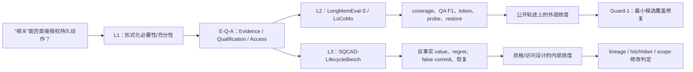

# SQCAD 教师汇报：完整实验链路、当前结论与文档导航（2026-08-17）

> 汇报定位：这是一份阶段性、可核验的汇报入口，不替代[23-SQCAD 完整实验方案](../00-论文主体/23-SQCAD完整实验方案-理论公开自建消融-20260817.md)。所有“已完成”均链接到代码、结果或审计报告；所有未完成项均保留为待办，不提前写成论文结论。

## 1. 可在本次汇报中先给出的结论

1. **理论问题已被形式化**：SQCAD 不是把 BM25、遗忘规则或检索器换一个排序函数；核心问题是，当持久 `keep/archive` 动作的长期价值在当前观测下不可识别时，系统不能把相关性分数直接当作授权，必须区分“提出候选”“资格判断”“改变访问状态”。T1/T2/P4 给出无恢复提交、普通衰减与有限探测的边界。
2. **公开集复现完成，并定位到真实 bad case**：原 SQCAD 的主要短板是证据没有进入一次性暴露池，而不是资格层排序本身失效。最小修复 Guard-1 只将至多一个 BM25 候选加入当前读取池，不改变持久写入授权；LoCoMo token-F1 从 0.0344 提升到 0.0455，略高于 BM25 的 0.0454。
3. **自建集 MVP 和首轮基线矩阵已完成**：SQCAD-LifecycleBench 有 1,380 个 keep/archive 同源反事实 episode，公开层、policy 日志层与隐藏真值层分离；远端 AutoDL 重建 hash 与本地一致。该集能直接测量 lifecycle value、regret、false commit、probe 与恢复，而公开数据集不能单独回答这些问题。FadeMem、Oblivion、Memory Worth、DeMem、SimpleMem 的具名基线扩展按代理/官方复现分栏，仍是下一工作包。
4. **数据集审计不是只报一个平均分**：R1–R5、R7 已完成；R2 发现 GAMMA=0.7 与 TAU_TOL=1.0 下标签脆弱，结论已诚实重定位到冻结参数的有效域。R6 人类锚定已导出 28 个盲化 case，尚待外部判官。
5. **本轮框架确有三个可检验的修改结论**：
   - lineage conflict 应从保守 keep 改为 archive；相较原证书规则，平均 lifecycle value 增加 8.62；
   - 仅有 hitchhiker association 的 unresolved 情形不应默认 keep；需经有限 probe 后再定，探测失败则 archive/defer；
   - 未来落在不同 scope 的情形显示“只看决策时局部 scope”不足，需加入受限的 scope 前瞻；该项留给 Phase B 验证，不能宣称已解决。

## 2. 当前结果一览

### 2.1 公开数据：外部效度（L2）

在相同 chronological stream、workspace budget、reader、evaluator 和成本记录合同下，AutoDL 的 RTX 4080 SUPER 复核与本地结果一致。数据、模型缓存、日志均存放于 AutoDL 数据盘 `/root/autodl-tmp/SQCAD/database`；云端工作已结束并完成关机。

| 方法 | LongMemEval-S Hit | LongMemEval-S Recall | LoCoMo 官方 token-F1 | 解释 |
|---|---:|---:|---:|---|
| BM25 | 0.967 | 0.323 | 0.0454 | 静态检索覆盖强，是覆盖上界/成本对照，不是持久治理方法 |
| 原 SQCAD | 0.785 | 0.118 | 0.0344 | 持久存储低，但候选覆盖不足 |
| Guard-1 | 0.915 | 0.153 | 0.0455 | 推荐的最小 coverage 修复 |
| Guard-2 | 0.929 | 0.179 | 0.0465 | 更高覆盖，更多 probe |
| Guard-4 | 0.950 | 0.224 | 0.0475 | 覆盖更高，成本也更高 |

公开集可支持的表述是：**受限、一次性的 candidate guard 能修复证据覆盖 bad case，并保持资格授权边界。**它不能单独证明 keep/archive 的长期因果价值，不能据此声称优于所有 Agent Memory SOTA。完整数值、bad case 和成本在[19-AutoDL 公开集复现报告](19-AutoDL公开集复现与Candidate-Guard调整报告-20260816.md)。

### 2.2 自建数据：内部效度（L3）

SQCAD-LifecycleBench MVP 已完成：1,380 episodes；六个机制家族、三个 control 家族和 15 组观测等价配对；group split 为 train/dev/test = 818/354/208。每个 episode 都有同一未来流下的 keep/archive 两支 rollout，真实长期 outcome 只在隐藏层，public trace 不含 oracle 标签。

| 策略 | 平均 lifecycle value | regret | oracle 一致率 | false-commit |
|---|---:|---:|---:|---:|
| oracle_policy（上界） | +0.964 | 0.015 | 1.000 | 0.000 |
| probe_willing | +0.865 | 0.115 | 0.906 | 0.072 |
| SQCAD + lineage conflict→archive | −0.278 | 1.258 | 0.744 | 0.228 |
| archive_all | −2.790 | 3.770 | 0.459 | 0.000 |
| storage12 / Memory-Worth proxy | −3.476 | 4.455 | 0.703 | 0.181 |
| 原 SQCAD certificate / event rule | −8.901 | 9.880 | 0.663 | 0.409 |
| keep-all / recency2 | −10.280 | 11.260 | 0.541 | 0.409 |

这一结果不是“已完成系统优于一切方法”。它的作用是定位：reference SQCAD 的 public-layer certificate 在当前规则世界中等价于可见事件规则；加入 lineage conflict 后显著改善，但仍落后于 probe-willing。详见[20-LifecycleBench 公允性审计与基线矩阵](20-SQCAD-LifecycleBench公允性审计与基线矩阵报告-20260817.md)。

## 3. 完整实验链路：问题、证据、判定

| 环节 | 要回答的科学问题 | 数据与指标 | 已完成证据 | 下一判定 |
|---|---|---|---|---|
| 1. Gap | 相关性、频率、局部效应能否替代长期动作价值？ | L1 命题与受控反例 | [01/02 Gap 报告](01-Gap证明实验报告-v2-20260812.md)、[理论 12](../01-research-gap/研究逻辑与理论证明/12-必要性证明与识别路线分类学-20260813.md) | 已作为问题定义，不单独宣称系统优越 |
| 2. 理论 | 何时必须审查、恢复、探测或弃权？ | T1/T2/P4、regret 下界、识别集合 | [理论 11](../01-research-gap/研究逻辑与理论证明/11-形式化定理陈述与证明.md)、[理论 15](../01-research-gap/研究逻辑与理论证明/15-self-obscuring形式定理与严格证明-20260813.md)、[理论 16](../01-research-gap/研究逻辑与理论证明/16-T2严格reduction-separation与P4minimax探测下界-20260813.md) | 冻结为框架最小条件 |
| 3. 框架 | 如何把理论约束落实为系统接口？ | E-Q-A、证书区间、competitive access | [21-资格证书与访问控制](../00-论文主体/21-资格证书与价值信息访问控制方案-20260817.md)、`src/sqcad/qualification_access.py` | 按本轮三项发现修改 |
| 4. 公开集 | 不泄漏金标时，候选覆盖、QA 与成本是否可用？ | Hit、recall、F1、token、probe、restore | [16-统一合同](16-公开数据集统一合同主表与显著性判定-20260814.md)、[19-AutoDL](19-AutoDL公开集复现与Candidate-Guard调整报告-20260816.md)、[25-复现与修复](25-第二次AutoDL完整复现与复现性修复报告-20260818.md) | Guard-1 作为主配置；dense/RRF 已补齐（25-），数值以 25- 修复后为准 |
| 5. 自建集 | keep/archive 的反事实长期价值是否可验证？ | value、regret、commit、probe、restore | [22-数据集方案](../00-论文主体/22-SQCAD-LifecycleBench数据集构建方案-20260817.md)、[20-审计与矩阵](20-SQCAD-LifecycleBench公允性审计与基线矩阵报告-20260817.md) | R6 人类锚定、Phase B 端到端 |
| 6. 消融 | 每个资格/访问部件是否必要？ | 模块去除、配对 bootstrap | [18-overlay](18-半合成chronological-overlay治理目标实验-20260814.md)、[20 §5/§7](20-SQCAD-LifecycleBench公允性审计与基线矩阵报告-20260817.md) | 将零触发开关重设计为可触发的 Phase B 对照 |
| 7. 复现与纪律 | 结果能否重建、结论是否越界？ | hash、测试、审计、声明边界 | [20 §1/§6/§8](20-SQCAD-LifecycleBench公允性审计与基线矩阵报告-20260817.md)、[23 §9/§12](../00-论文主体/23-SQCAD完整实验方案-理论公开自建消融-20260817.md) | 公开发布包与判官结果归档 |

## 4. 当前完成状态与下一轮实验

| 工作包 | 状态 | 能得出的结论 | 不能得出的结论 / 下一步 |
|---|---|---|---|
| 基线与公开集复现 | 已完成 | candidate guard 修复 coverage，Guard-1 是最小配置 | 不代表 SOTA；dense/RRF 已补（25-），Guard-1 官方 F1 与 BM25 持平 |
| AutoDL 可复现性 | 已完成 | 数据盘执行、hash 一致、GPU 结果可复核 | 云端已关机，无需继续占用资源 |
| LifecycleBench 构建 | 已完成 | 有可核验的 keep/archive 反事实、公开/隐藏分层 | 不等于真实部署分布 |
| R1–R5、R7 审计 | 已完成 | 无 public-trace 评价捷径越界；真值可独立实现；机制边界已记录 | R2 脆弱参数只能在有效域内解释 |
| R6 人类锚定 | 待外部执行 | 已具备盲化材料和打分器 | 未取得 κ，不能声称人类标签一致 |
| L3 基线矩阵 | 已完成 | 三个框架修改点有定量依据 | reference 证书仍是规则代理，需 Phase B |
| 核心具名基线扩展 | 待办 | — | FadeMem、Oblivion、Memory Worth、DeMem、SimpleMem 按统一合同补跑；代理与官方复现分栏 |
| Phase B 端到端 | 待办 | — | 冻结 LLM/reader/tools，只切换持久状态，验证 scope 前瞻与 probe 是否真实触发 |
| 消融 | 部分完成 | no-censoring、公开集 restore/probe 有差异 | LifecycleBench 中部分开关零触发，必须不当作“模块无效” |

### 建议的 Phase B 最小方案

从已审计的 L3 episode 中抽取 `lineage_conflict`、`hitchhiker_pair`、`future_in_s2`、`rare_bridge`、`harmful_stale` 五类，各冻结若干条代表样本。固定 reader、LLM、prompt、工具、预算、评测器和随机种子，只切换 persistent memory state / qualification-access policy；外部 evaluator 判定后续任务 outcome。主指标为 paired lifecycle regret，辅以 false commit、probe action-change、restore precision 和 token/probe 成本。此设计直接检验本轮三项修改，避免把规则世界结果误写成端到端结论。

## 5. 向老师汇报时的推荐阅读顺序

1. 本文 §1–§4：先获得当前结论、数值和未完成事项。
2. [23-SQCAD 完整实验方案](../00-论文主体/23-SQCAD完整实验方案-理论公开自建消融-20260817.md)：完整实验矩阵、基线、指标、声称纪律。
3. [25-复现与复现性修复](25-第二次AutoDL完整复现与复现性修复报告-20260818.md)：复现缺陷修复与确定性验证，公开集数值以此为准；[19-AutoDL 公开集报告](19-AutoDL公开集复现与Candidate-Guard调整报告-20260816.md)：bad case 与 Guard-1 归因。
4. [20-LifecycleBench 审计与矩阵](20-SQCAD-LifecycleBench公允性审计与基线矩阵报告-20260817.md)：自建集、审计、基线矩阵及三项修改的证据。
5. [21-资格与访问方案](../00-论文主体/21-资格证书与价值信息访问控制方案-20260817.md) 与 [22-LifecycleBench 构建方案](../00-论文主体/22-SQCAD-LifecycleBench数据集构建方案-20260817.md)：方法和数据集细节。
6. 需要追问理论时，再读[理论证明入口](../01-research-gap/研究逻辑与理论证明/README.md)与四份核心证明；需要核对文档用途时，读[文档分类索引](../00-论文主体/02-论文主体草稿与证据文档分类-20260817.md)。

## 6. 汇报中的声称边界（建议直接照此表述）

- 可以说：SQCAD 的创新在于把长期价值的**资格判断**与短期关联的**候选提出**分离，并把 archive、restore、probe 看作受识别条件约束的行动；公开集和自建反事实集分别提供外部与内部证据。
- 可以说：Guard-1 是不放宽持久授权前提下的最小 candidate coverage 修复；LifecycleBench 已使 keep/archive 的长期动作价值可被直接评分。
- 必须说：当前 LifecycleBench 的 reference certificate 在该规则世界与 visible event rule 完全代理；R2 有参数敏感区；R6 与 Phase B 未完成。
- 不能说：已在真实 Agent Memory 部署中证明因果收益；已系统性胜过所有 SOTA；BM25 或 LLM 相关性本身构成资格证据；公开 QA F1 直接证明长期 lifecycle value。
